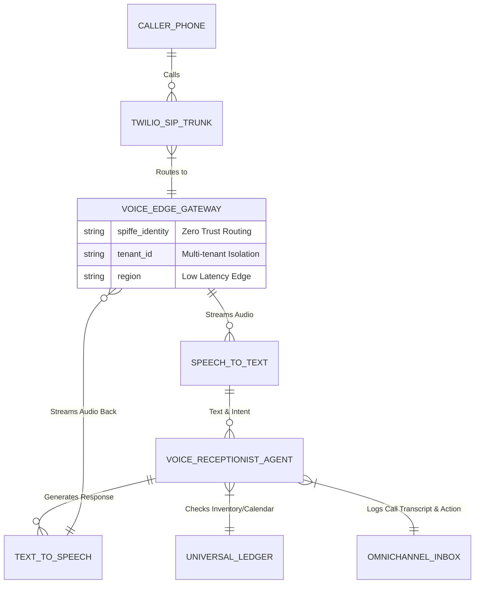

# [architecture] Autonomous Multi-Lingual AI Voice Receptionist

## Title
Autonomous Multi-Lingual AI Voice Receptionist

## Problem Statement
Small business owners like Carlos (the handyman on a ladder) and Fatima (the food cart operator managing a busy lunch rush) constantly miss phone calls. When a potential customer calls to ask for a quote or pre-order food, and the call goes to voicemail, that customer often calls the next competitor on Google Maps. Lost calls equal lost revenue. Current solutions involve paying hundreds of dollars a month for human answering services or relying on archaic voicemails. They need an invisible, always-on AI voice receptionist that answers calls instantly in the caller's language, understands context (menu, calendar, pricing), books appointments, takes orders, and only routes urgent issues to the owner.

## Research Report
*   **Shopify/Wix:** Rely entirely on text-based web chat or email. No native voice answering capabilities.
*   **Grasshopper/Google Voice:** Offer routing, IVR (press 1 for sales), and voicemail transcription, but no intelligent, conversational agent capable of completing business transactions.
*   **Specialized AI Call Agents (e.g., Bland AI, Vapi):** Powerful APIs exist, but require developers to stitch them into business logic (inventories, calendars).
*   **OneHumanCorp (OHC) Differentiation - "Invisible Autonomy":** OHC integrates the AI Voice Receptionist natively into the platform's Universal Capacity and Inventory Ledger and Unified Booking Engine. The AI agent answers with sub-second latency, converses naturally (handling interruptions and accents), takes the order or books the calendar slot directly in the OHC system, and sends a quick SMS summary to the owner.

## Design Doc

### Architecture Diagram

### UI Wireframes / Screen Flow Description (375px)
The Voice Receptionist is configured via a simple "Settings" toggle; it is mostly invisible to the owner after setup.
*   **Screen 1 (Home/Inbox):** A new "Missed Calls Handled" widget appears at the top.
*   **Screen 2 (Call Detail):** Tapping a handled call shows a WhatsApp-style chat interface of the call transcript.
    *   *Top:* Audio playback bar.
    *   *Middle:* Transcript (e.g., "AI: Hello! Carlos Handyman. How can I help?" -> "Caller: Do you fix fences?").
    *   *Bottom Action Card:* "Agent booked quote for Tuesday 2 PM. [View Calendar]"
*   **Screen 3 (Voice Settings):** A single toggle: "AI Receptionist [ON/OFF]". Sliders for "Tone: Professional <-> Friendly" and "Language Support: [Auto-Detect]".

### Mobile UX Flow
1.  **Notification:** Owner receives a push notification: "AI booked a $150 repair quote with John (Fence)."
2.  **Review:** Owner taps notification, opening the OHC app to the Call Detail screen.
3.  **Context:** Owner reads the 3-line summary generated by the AI (no need to listen to audio unless desired).
4.  **Action:** Owner accepts the calendar slot with one tap.

### AI Agent Integration Points
*   **Ingestion:** Real-time WebRTC/SIP streaming from a telephony provider (e.g., Twilio) to the edge worker.
*   **LLM Processing:** Fast, conversational LLM (e.g., Llama 3 or GPT-4o-realtime) maintaining context of the business's `tenant_id`.
*   **Execution:** Agent executes internal tools (GraphQL mutations) to `createBooking` or `createOrder`.

### Key Design Decisions
*   **Sub-500ms Latency:** Critical for natural conversation. Requires edge deployment of the STT/TTS and LLM routing.
*   **Full Context Access:** The agent must have real-time read access to the business's specific inventory and calendar ledgers to prevent double-booking.
*   **Graceful Fallback:** If the agent cannot handle the request, it states: "Let me SMS you a link to our custom order form, or I can try ringing the owner directly."

## Implementation Prompt
**Context:** We need to implement the core orchestration for the Autonomous AI Voice Receptionist.
**Task:** Create the edge-compatible routing service that receives real-time audio streams (via WebSockets from our telephony provider), passes them to our conversational AI service, and routes the AI's intended actions (e.g., booking an appointment) to the internal `Universal Ledger` APIs.
**Acceptance Criteria:**
1. Service successfully accepts incoming WebSocket connections containing audio streams.
2. Identifies the correct `tenant_id` from the inbound phone number.
3. Maintains session state for the duration of the call.
4. Correctly invokes internal booking/ordering APIs based on the AI's structured tool-call outputs.
5. Emits a final `CallSummaryEvent` to the NATS event mesh upon call completion, containing the transcript and actions taken.

## Priority
P1

## Estimated Scope
Large
