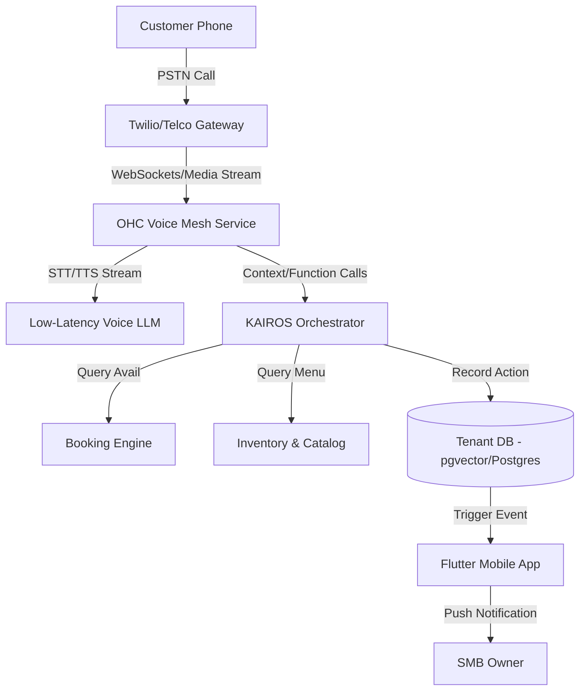

# [architecture] Autonomous AI Voice Receptionist and Ordering Engine

## Title
Implement Autonomous AI Voice Receptionist & Telephony Engine for SMBs

## Problem Statement
Small business owners like **Carlos (Handyman)** and **Fatima (Food Cart Operator)** spend a significant portion of their day with their hands tied—driving, cooking, or fixing things. When a potential customer calls their business phone, they often cannot answer. Missed calls mean lost revenue. Existing solutions (voicemail, answering services) are either passive, frustrating for customers, or prohibitively expensive. Non-technical owners need an invisible AI agent that can answer live phone calls, speak in multiple languages (e.g., Arabic and English for Fatima), answer business questions, take food pre-orders, or book appointments directly into their calendar, all without requiring the owner to configure complex IVR trees.

## Research Report
- **Market Gap:** Current platform builders (Shopify, Wix, Squarespace) focus almost entirely on web and text-based commerce. They offer zero native telephony integration. Small businesses hack together Google Voice or expensive third-party tools like Ruby Receptionists, which do not integrate with their backend inventory or calendar.
- **Competitor Analysis:**
  - *Shopify*: No native voice agents. Relies on text-based "Shopify Inbox".
  - *Wix / Squarespace*: Web-based booking and forms only.
  - *GoDaddy*: Offers a virtual phone number but no AI conversational agent.
- **Opportunity:** By integrating WebRTC and modern low-latency Voice AI (e.g., Twilio Voice + Gemini/OpenAI Realtime API), OHC can provide a unique phone number to each tenant. The "Sales & Acquisition" and "Customer Success" AI departments can handle the call, access the tenant's exact inventory, pricing, and availability, and process requests dynamically.
- **Persona Alignment:**
  - *Fatima*: Needs an agent that speaks Arabic and English to take phone pre-orders and push them to her tablet's order queue.
  - *Carlos*: Needs an agent to answer calls from older demographics, give price estimates for simple repairs, and book a time slot on his calendar.

## Design Doc

### Architecture Diagram

### UI Wireframes & Mobile UX Flow (375px)
1. **Settings / Voice Agent Tab:**
   - A minimalist glassmorphism card: "Your Business Phone Number: (555) 123-4567".
   - Toggle switch: "AI Receptionist (On/Off)".
   - Dropdown for "Primary Language" (e.g., English, Arabic, Spanish).
2. **Behavior Configuration:**
   - Simple text area: "What should the agent know? (e.g., 'Tell callers to park in the back')".
   - Toggles for allowed actions: "Allow taking orders", "Allow booking appointments".
3. **Call History & Transcripts:**
   - A list view of recent calls showing contact name, duration, and AI-generated summary (e.g., "Booked plumbing estimate for Tuesday").
   - Tap to expand a card and read the full transcript or listen to the recording.

### AI Agent Integration Points
- **Department**: Customer Success (The Ambassador) & Sales (The Salesperson).
- **Memory**: RAG lookup on past customer interactions based on Caller ID.
- **Tools**: `book_appointment()`, `add_to_cart()`, `process_order()`, `check_business_hours()`.

### Key Design Decisions
- **No IVR Trees**: We will not ask users to build "Press 1 for Sales" trees. The system uses a system prompt injected with the business's context and relies entirely on natural language understanding.
- **Real-time Latency**: Must use streaming STT/TTS (e.g., Deepgram + ElevenLabs or OpenAI Realtime API) to keep response latency under 800ms.
- **Graceful Fallback**: If the AI cannot fulfill the request or the customer asks for a human, the agent will say "Let me take a message for [Owner Name]" and immediately send a high-priority push notification to the owner.

## Implementation Prompt
**Task for Implementer Agent:**
Implement the Voice Agent settings and Call Log UI for the OHC mobile app, along with the foundational backend API for webhook handling from Twilio.
1. Create a `VoiceAgentConfig` data model supporting the fields: `phone_number`, `is_enabled`, `primary_language`, and `custom_instructions`. Apply strict multi-tenant row-level security.
2. Build the backend endpoint `POST /api/webhooks/voice/incoming` that accepts Twilio webhooks, verifies the signature, and initializes a KAIROS state machine session for the call.
3. In the Flutter frontend, implement a new `Voice Agent` dashboard card adopting the OHC Premium Token library (Glassmorphism, 20px blur).
4. Implement E2E Playwright tests that simulate a user toggling the AI Voice Agent on, saving custom instructions, and verifying the state persists.

## Priority
P1

## Estimated Scope
Large
