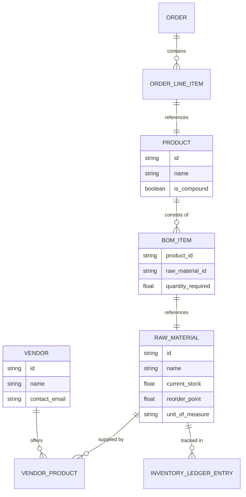

# Issue Brief: Autonomous Bill of Materials (BOM) & Predictive Restock Engine

## Title
[Architecture] Autonomous Bill of Materials (BOM) & Predictive Restock Engine

## Problem Statement
Physical product and food businesses (like Maya the baker and Fatima the food cart) sell *finished goods* (e.g., a custom cake, a halal platter) but they purchase *raw materials* (flour, eggs, chicken, packaging). Existing platforms like Shopify and Square track finished goods inventory well, but fail entirely at tracking raw materials without expensive, complex third-party MRP (Material Requirements Planning) apps. When Maya receives an order for 5 custom vegan cakes for next week, she currently has to manually calculate if she has enough vegan butter and specialty boxes. If she forgets, she faces a catastrophic stockout. Small business owners need an invisible system that understands the "recipe" (Bill of Materials) of their products, automatically deducts raw materials when a product is sold or pre-ordered, predicts future stockouts based on calendar bookings, and drafts vendor purchase orders—all without requiring a degree in supply chain management.

## Research Report
- **Current Capabilities:** OHC has a `universal_capacity_and_inventory_ledger` for finished goods and service timeslots, but lacks a relational mapping for compound products (BOMs) and raw material vendor purchasing.
- **Competitor Analysis:**
  - *Shopify / Wix:* Only track finished SKUs natively. Requires clunky workarounds (bundles) or expensive apps like Katana or Stocky to manage raw materials and purchase orders.
  - *Square / Toast:* Toast has decent restaurant inventory, but it's famously difficult to set up. Square requires the "Square for Retail Plus" or "Square for Restaurants" tier to get even basic vendor management, which is too complex for a solo baker or food cart.
- **Gap Identified:** A lightweight, AI-driven BOM and restock engine. Instead of forcing the user to manually enter exact grams and ounces for recipes, the AI Operations Agent infers the BOM from natural language (e.g., Maya says, "Each vegan cake uses about half a block of vegan butter and one custom pink box"). The engine then proactively monitors the raw material ledger and suggests restocking when predictive levels run low.
- **Strategic Advantage:** By solving the "raw materials vs. finished goods" problem invisibly, OHC captures the critical food & beverage and maker/crafter markets that are currently underserved by basic e-commerce platforms.

## Design Doc

### Architecture Diagram

### Mobile UX Flow (375px First)
1. **Natural Language Setup:**
   - Maya is on the "Vegan Cake" product screen. She taps a section called "What goes into this?".
   - Instead of a complex spreadsheet, she sees a chat-like interface or simple input: "Tell us what you use to make this."
   - Maya types or speaks: "I use 1 pink box, half a block of vegan butter, and 2 cups of gluten-free flour."
   - The AI Agent instantly parses this and creates the underlying `BOM_ITEM` records linked to `RAW_MATERIAL` entities, asking for confirmation via simple cards.
2. **Predictive Restock Alert (Activity Feed):**
   - On her daily dashboard, an action card appears: "Low Stock Warning: You have 5 Vegan Cakes ordered for next week, but you only have 1 block of Vegan Butter left."
3. **1-Tap Purchase Order:**
   - The card offers a button: "Draft order for Vegan Butter".
   - Tapping it opens a clean half-sheet modal showing a pre-filled email/SMS draft to her saved vendor (or a link to her preferred supplier), requesting 10 blocks of butter. She taps "Send".

### AI Agent Integration Points
- **Operations Agent:** Parses natural language descriptions of recipes/materials into structured BOM data. Uses conversational memory to recall preferred vendors.
- **Supply Chain Agent:** Runs a background job listening to the event mesh for `OrderCreated` or `BookingConfirmed` events. It calculates required raw materials against current stock and predictive demand, generating alerts if a stockout is projected before the fulfillment date.

### Key Design Decisions
- **Invisible BOM:** Hide the concept of "Bill of Materials" and "SKUs" completely. Frame it to the user as "Ingredients" or "Parts used" to pass the grandmother test.
- **Predictive over Reactive:** Don't just alert when stock is zero. Alert when *future booked orders* will cause stock to hit zero, giving the user lead time to reorder.
- **Multi-Tenant Isolation:** Ensure raw material catalogs and vendor details are strictly isolated per tenant using the standard OHC zero-trust identity boundaries.

## Implementation Prompt
Implement the Autonomous BOM & Predictive Restock Engine. Create the underlying data models to support compound products (products made of raw materials). Build the AI parser that converts natural language input into structured ingredient/material relationships. Implement the background job that listens to new orders/bookings, calculates future raw material drawdowns, and pushes predictive restock alerts to the user's mobile dashboard with a 1-tap action to draft a vendor reorder. Ensure the UI hides all technical supply-chain jargon and feels like a simple, helpful assistant with premium macOS-style Translucent Glass aesthetics.

## Priority
P1

## Estimated Scope
Large
