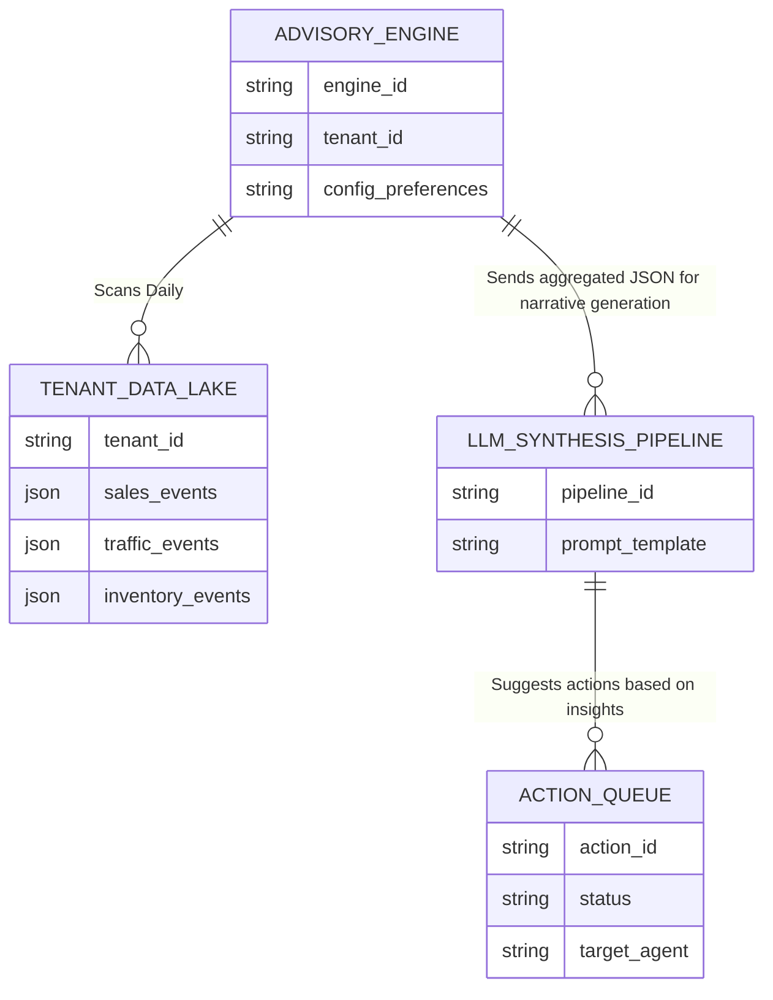
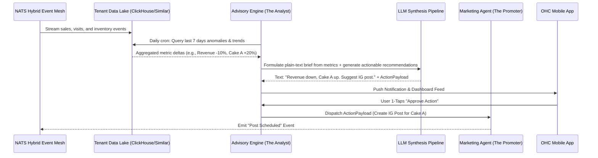

# Architecture Brief: Autonomous Business Advisory Engine

## 1. Title
Implement the Autonomous Business Advisory Engine (Conversational Analytics Briefing)

## 2. Problem Statement
Non-technical small business owners like Maya (baker) and Priya (boutique owner) are overwhelmed by complex analytics dashboards provided by legacy platforms like Shopify and Wix. They do not have the time or expertise to interpret charts, track conversion rates, or analyze foot traffic versus online sales. They are starving for actionable insights but drowning in raw data. When they log in and see a drop in revenue, they don't know *why* or *what to do next*. They need a system that translates complex metrics into plain-language, daily or weekly advisory messages that tell them exactly what is happening and what specific actions they should take with a single tap.

## 3. Research Report
### The Dashboard Overload Problem
Our analysis of competitor platforms reveals a critical gap in how data is presented to micro-merchants:
- **Shopify:** Provides robust, multi-layered dashboards (Sales, Acquisition, Behavior) that are designed for dedicated eCommerce managers, not a solo baker covered in flour.
- **Wix:** Relies on a generic overview that fails to synthesize data across different channels (e.g., combining offline POS and online bookings).
- **Squarespace:** Offers basic charts that show trends but fail to provide actionable recommendations.

### The OHC Opportunity: "The Business Advisor"
As outlined in the *OHC AI Differentiation Manifesto*, OHC must shift from "Tools" to "Teammates." The Autonomous Business Advisory Engine acts as the "Analyst." Instead of forcing the user to load a dashboard, the Engine proactively sends a brief, human-readable notification (SMS or Push).

**Example Competitor (Shopify):** User logs in, clicks "Analytics," sets a date range, sees a line chart dipping down by 15% in the last 3 days, and clicks a pie chart to see top products.
**Example OHC (Advisory Engine):** Maya receives a push notification: *"Good morning Maya! Your revenue dipped 15% this week because IG traffic is down. However, your 'Vegan Red Velvet Cake' has a 40% higher conversion rate. Let's auto-generate a new Instagram post highlighting it. [1-Tap Approve]"*

## 4. Design Doc

### Architecture Diagram

### AI Department Coordination Flow

### Mobile-First UX Flow (375px Viewport)
1.  **Lock Screen Notification:** Clean push notification using iOS/Android native APIs. Example: *"📊 Weekly Brief: You made $400 more this week. Tap to see why."*
2.  **Home Dashboard (The Feed):** The primary UI is a unified "Action Feed" (macOS Translucent Glass style over a clean background). No charts initially.
3.  **Insight Card:** A card titled "Weekly Insights."
    -   **Content:** Large, highly readable text (Inter or system-ui). e.g., *"Your vegan cake is trending. Boosting your social spend by $5 could double weekend sales."*
    -   **Action Area:** A prominent primary button underneath: "[🚀 Boost for $5]".
    -   **Secondary Action:** A subtle "Dismiss" or "Advanced Settings" (to view the actual chart, hiding developer terms).
4.  **1-Tap Execution:** Tapping the button transitions to a quick success animation (haptic feedback + green checkmark), immediately triggering the corresponding Agent via the `ACTION_QUEUE`.

### Key Design Decisions & Integrity Rules
*   **Zero-Trust Isolation:** The `ADVISORY_ENGINE` must query the `TENANT_DATA_LAKE` using strictly scoped tenant IDs authenticated via SPIFFE/SPIRE. Cross-tenant data mixing is physically impossible by design at the query layer.
*   **Performance:** The LLM synthesis occurs asynchronously in a background job queue. The mobile app *never* waits for the LLM to generate the report; it simply pulls the pre-generated brief from edge cache (targeting < 50ms latency for the initial feed load).
*   **Offline Tolerance:** The generated briefs and queued actions are synced locally. If the user approves an action while in a subway (offline), it queues locally and dispatches via background sync when connection is restored.

## 5. Implementation Prompt
**Objective:** Implement the backend services and mobile UI components for the Autonomous Business Advisory Engine.
**Acceptance Criteria:**
1.  A daily scheduled job aggregates tenant data (sales, traffic) and passes the deltas to an LLM pipeline to generate a plain-text, conversational insight.
2.  The insight must include at least one actionable recommendation that can be executed by another Agent (e.g., Marketing).
3.  The mobile UI must render the insight as a simple card on a 375px viewport with a single 1-tap approval button. No complex charts visible by default.
4.  Approving the action successfully dispatches the command to the target Agent via the event mesh.
5.  Strict multi-tenant isolation must be demonstrated in the data query layer.
6.  The UI components must adhere to the macOS translucent glass and Ubiquiti modular card design tokens.

**Note to Implementers:** Do not prescribe specific database schemas (e.g., exact SQL DDL) or specific library choices unless dictated by existing platform standards. Focus on the data flow, the prompt engineering for the LLM, and the event-driven coordination between the Advisory and Marketing agents.

## 6. Priority & Scope
*   **Priority:** P0 (Critical path for AI Differentiation)
*   **Estimated Scope:** Large
