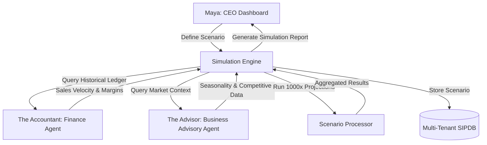
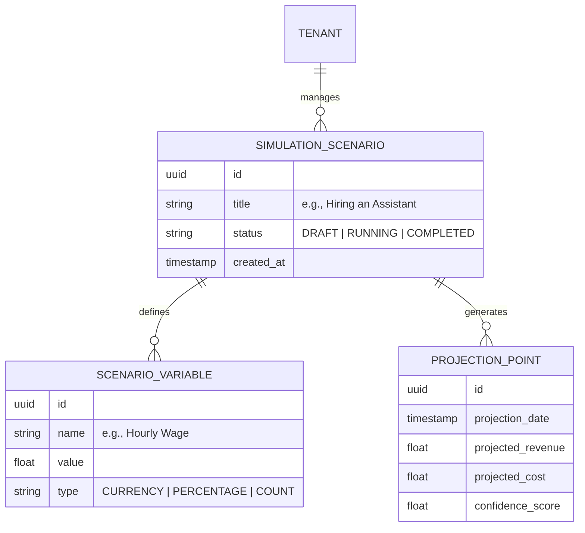

# [Architecture] Autonomous Business Simulation & Strategic Forecasting Engine

## 1. Title
**Autonomous Business Simulation & Strategic Forecasting Engine: The "What-If" Business Lab**

## 2. Problem Statement
Small business owners like **Maya (baker)** and **Carlos (handyman)** often hesitate to make critical growth decisions—like hiring a first employee, raising prices, or expanding to a second location—because they cannot visualize the financial impact. Traditional spreadsheets are too complex and "static," and existing analytics tools (Shopify, Wix) only show what happened in the past, not what *could* happen in the future.

Business owners suffer from "Decision Paralysis": they don't know if a 10% price increase will drive away customers or if the cost of a new delivery van will be covered by increased volume. OHC needs an autonomous simulation engine that leverages historical data to run thousands of "What-If" scenarios, presenting the owner with a clear, visual projection of their business's future state.

## 3. Research Report
### Competitive Landscape
*   **QuickBooks / Xero:** Offer basic "Cash Flow Forecasting," but it is largely based on scheduled invoices and bills. It lacks the agentic "intelligence" to simulate external variables like seasonality or market trends.
*   **LivePlan / Brixx:** Dedicated business planning and forecasting software. Highly powerful but suffers from high friction; they require manual data entry of hundreds of variables and are designed for "Bank Loans," not "Daily Operations."
*   **Shopify/Wix Analytics:** Excellent at "Retrospective" reporting (last week's sales). They have almost zero "Prospective" simulation capabilities out of the box.

### The OHC Advantage: The Agentic "What-If" Lab
OHC leverages the existing "Accountant" (Finance) and "Advisor" (Strategy) departments to create a dynamic simulation loop:
1. **The Accountant** provides the ground-truth historical ledger and sales velocity.
2. **The Advisor** provides the market context (seasonal trends, competitor pricing).
3. **The Simulation Engine** runs Monte Carlo simulations based on user-defined variables (e.g., "What if I hire an assistant?").
4. **The Results** are presented not as complex charts, but as plain-language "Future Briefings."

## 4. Design Doc

### Architecture Diagram (Mermaid.js)


### Sequence Diagram: Running a "What-If"
```mermaid
sequenceDiagram
    participant User as Maya (Mobile 375px)
    participant Sim as Simulation Engine
    participant Acc as The Accountant
    participant Adv as The Advisor

    User->>Sim: "What if I raise my cake prices by 15%?"
    Sim->>Acc: Fetch historical price elasticity & volume
    Acc-->>Sim: Return: Avg 50 cakes/mo @ $40 (Margin 30%)
    Sim->>Adv: Analyze competitive landscape for "Cakes"
    Adv-->>Sim: Return: Market average is $48; 15% hike is safe.
    Sim->>Sim: Run Simulation (Adjust volume for price sensitivity)
    Sim-->>User: Projection: "Revenue up 12%, Profit up 25%. Volume may dip 3%."
```

### Data Model & Invariants


### AI Agent Integration
*   **The Accountant (Finance):** Provides the "Budget Baseline." It ensures simulations are grounded in actual cash flow reality.
*   **The Advisor (Strategy):** Acts as the "Scenario Architect." It suggests variables Maya might have missed (e.g., "Don't forget the payroll tax for that new hire").
*   **The Simulation Lab (Core Engine):** A specialized background service that performs the math and generates the visual projections.

### Mobile UX Flow (375px First)
1. **The "Simulation Lab" Entry:** A new card on the Advisory Dashboard: *"Want to grow? Run a simulation."*
2. **The "What-If" Slider:** Maya sees a beautiful, translucent glass card with a single slider: `[ Price Adjustment: +15% ]`.
3. **Real-time Projection:** As she moves the slider, a simple "Future Revenue" line chart (UniFi style) glows and shifts in real-time.
4. **The AI Verdict:** A text block below the chart: *"The Advisor says: This move is high-confidence. You'll cover the cost of your new mixer in 2 months."*

## 5. Implementation Prompt
**Objective:** Build the backend infrastructure for the "Autonomous Business Simulation & Strategic Forecasting Engine."

**Core User Journey (CUJ):**
1. Maya selects a "Growth Scenario" (e.g., Hiring an Assistant).
2. The system fetches her last 6 months of financial data from the `FinanceAgent` (The Accountant).
3. The system allows Maya to adjust variables (Assistant's wage, expected increase in cake volume).
4. The simulation engine generates a 12-month projection of Revenue, Cost, and Profit.
5. The results are summarized by `BusinessAdvisoryAgent` (The Advisor) into plain-language advice.

**Acceptance Criteria:**
* **Scenario Persistence:** Implement a multi-tenant isolated `SimulationScenario` and `ScenarioVariable` data model.
* **Accountant Handoff:** Create a service interface to request historical "Aggregated Financial Baselines" from the Finance Department.
* **Monte Carlo Core:** Implement a basic simulation service that can project linear or seasonally-adjusted trends based on input variables.
* **Confidence Scoring:** Projections must include a `confidence_score` based on the density of historical data available.
* **Mobile Payload:** Ensure the simulation results payload is optimized for a 375px line chart and a 2-sentence summary.
* **Security:** All simulation data and business projections must be strictly isolated via `tenant_id`.

## 6. Priority
`P2` (Strategic differentiator for the "Advisor" tier).

## 7. Estimated Scope
Large (Requires deep integration with the Finance Ledger and the Advisory Agent).
