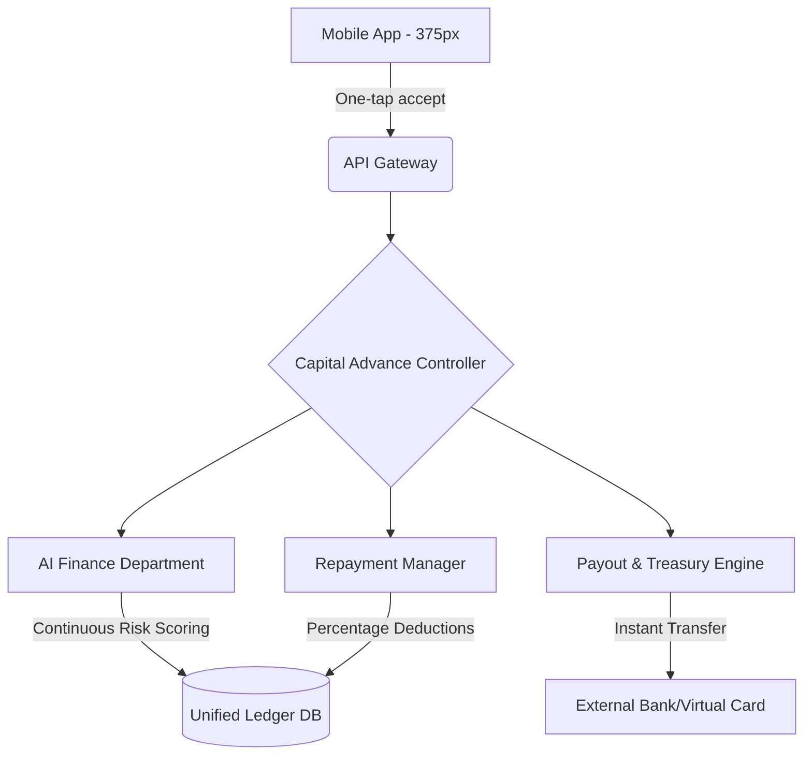

# [Architecture] Autonomous Capital Advance & Cashflow Engine

## Title
Implement the Autonomous Capital Advance and Cashflow Engine

## Problem Statement
**The Small Business Owner's Dilemma**
For owners like Carlos (handyman) or Priya (boutique owner), cash flow is the difference between survival and failure. When a large invoice is unpaid, or sudden inventory needs arise, waiting 3-5 days for payouts or dealing with traditional banks for loans is too slow and bureaucratic. They need instant liquidity to buy materials, pay staff, or seize an opportunity, but traditional banks require weeks of paperwork and code-heavy integrations are too complex. They need a system that understands their business health automatically and offers an instant, one-tap cash advance directly on their phone, exactly when they need it most.

## Research Report
**Market & Competitor Analysis**
- **Shopify Capital**: Offers cash advances and loans based on store sales history. Highly successful, but limited to merchants selling primarily physical goods on their platform. Payouts take 1-3 business days.
- **Square Capital**: Excellent integration for in-person businesses. Offers proactive loans based on processing volume. Repayment is a fixed percentage of daily card sales.
- **Wix & Squarespace**: Limited native financial services; heavily reliant on third-party app stores which breaks the seamless user experience.
- **GoDaddy**: Basic payment processing, no native capital advance features.

**OneHumanCorp Opportunity**
By leveraging our deep knowledge of the merchant's unified ledger (invoices, bookings, catalog sales), we can accurately underwrite risk invisibly using an AI-driven background model. OHC can offer instant capital advances where repayment is automatically deducted as a small percentage of future incoming revenue, completely removing the stress of manual loan repayments.

## Design Doc

### Architecture Diagram

### UI Wireframes & Mobile UX Flow (375px first)
1. **The Pulse Dashboard (Home)**: The user sees their daily sales. If they qualify, a premium translucent glass card appears: *"You're approved for a $1,500 advance to grow your business."*
2. **Offer Details Screen**:
   - Clean, modular UniFi-style card.
   - **Amount**: Slider to choose between $500 and $1,500.
   - **Terms**: "We’ll automatically deduct 8% of your daily sales until $1,650 is repaid. No hidden fees."
   - **Action**: A prominent, single button: *"Get Funds Instantly"*.
3. **Success State**: Confetti animation. Funds are instantly added to their OHC Virtual Wallet or pushed to their debit card.

### AI Agent Integration Points
- **AI Finance Agent (Background)**: Continuously scans the unified ledger (daily volume, refund rates, booking consistency) to update the merchant's risk score and advance eligibility.
- **AI Operations Agent**: Monitors when a merchant hits an inventory low or has a sudden spike in large quotes, proactively nudging the Finance agent to present the offer right when capital is needed most.

### Key Design Decisions and Why
- **Proactive rather than Reactive**: Small business owners are busy. The system must do the underwriting invisibly and present the offer *before* the merchant realizes they need a loan, removing friction.
- **Revenue-based Repayment**: Fixed monthly payments kill small businesses in slow months. A percentage-based daily deduction aligns OHC's success with the merchant's success.
- **Mobile-first, One-Tap Execution**: Adhering to the "grandmother test", there are no forms to fill out. Identity and business health are already known. It must be a single button tap to accept.

## Implementation Prompt
**User Journey & Outcome**
The implementer must build the end-to-end flow where an eligible merchant sees a pre-approved capital advance offer on their dashboard, can adjust the amount via a slider, and accept it with a single tap. The system must instantly disburse funds and set up an automated repayment hook that intercepts future incoming payments to deduct a specified percentage until the advance is fully repaid.

**Acceptance Criteria**
- The system periodically evaluates merchant eligibility based on their transaction history.
- Eligible merchants receive a dashboard notification with an advance offer.
- The UI perfectly matches the macOS-style translucent glass and UniFi modular card design system on a 375px viewport.
- Accepting the offer instantly updates the merchant's available balance.
- All future incoming payments automatically route a defined percentage to the repayment ledger before the remainder hits the merchant's available balance.
- The merchant can view their repayment progress at any time.

## Priority
P1

## Estimated Scope
Large
