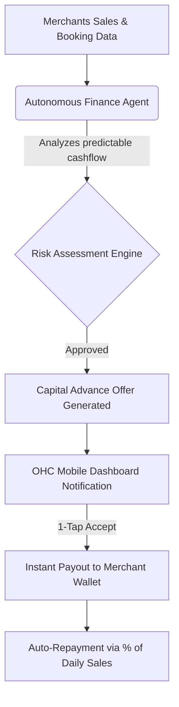

# [Architecture] Autonomous Capital Advance Engine

## Title
Autonomous Capital Advance Engine (Instant Cash Flow)

## Problem Statement
Small business owners (like Carlos the handyman or Priya the boutique owner) often face severe cash flow gaps. They need capital to buy inventory for a big upcoming order or repair a broken tool immediately, but traditional bank loans take weeks and require complex paperwork. When Carlos lands a $5,000 basement remodel, he needs $1,500 for materials *today*. A 3-week loan approval process means he loses the job. OneHumanCorp (OHC) currently handles payments, but doesn't solve the timing gap between expenses and revenue.

## Research Report
*   **Competitor Landscape:**
    *   **Shopify Capital:** Offers merchant cash advances based on historical sales data. Highly successful, extremely fast.
    *   **Square Loans:** Similar model, deeply integrated into the Square POS dashboard. "1-click" acceptance.
    *   **Stripe Capital:** White-label lending API that platforms use to offer financing.
*   **Persona Pain Points:**
    *   **Carlos (Handyman):** "I have the skills and the client, but I don't have the cash to buy the lumber upfront. I had to put it on a personal credit card with 25% APR."
    *   **Priya (Boutique):** "Holiday season is coming. I need to triple my inventory *now*, but my cash is tied up in current stock."
*   **Data Opportunity:** Because OHC handles the entire lifecycle (booking, quoting, invoicing, multi-currency engine), we have an unprecedented real-time view of a merchant's health, predictable revenue, and outstanding invoices.

## Design Doc
*   **Architecture Diagram:**

*   **Mobile-First UX Flow (375px):**
    *   A clean, translucent card appears on the main dashboard: "You're pre-approved for a $2,500 advance to buy inventory."
    *   Tapping the card opens a bottom sheet with a simple slider (choose amount: $500 - $2,500) and a plain-English explanation: "We'll deposit $2,500 instantly. We'll automatically deduct 10% from your daily sales until $2,750 is repaid."
    *   A massive, thumb-friendly "Accept & Get Funded" button at the bottom. No complex terms sheets visible unless "Advanced Terms" is clicked.
*   **AI Agent Integration:**
    *   **Finance Department Agent:** Continuously monitors ledger health, booking volume, and historical refund rates to dynamically adjust pre-approved offer amounts.
    *   **Risk/Operations Agent:** Flags sudden drops in sales or spikes in chargebacks to temporarily pause offers.
*   **Key Design Decisions:**
    *   **Zero-Application Process:** Offers must be pre-approved based on platform data. The user never "applies"; they only "accept".
    *   **Invisible Repayment:** Repayment must be an automated percentage of daily sales, not a fixed monthly bill. This aligns OHC's success with the merchant's success and prevents default anxiety during slow weeks.

## Implementation Prompt
Implement the Autonomous Capital Advance Engine.
*   **Acceptance Criteria 1 (Data Aggregation):** Create a background job queue that securely aggregates a tenant's historical 90-day GMV, upcoming booking deposits, and refund rate to calculate a "Capital Health Score".
*   **Acceptance Criteria 2 (Offer Generation):** Build the logic to generate a dynamic capital offer based on the Health Score.
*   **Acceptance Criteria 3 (Mobile UI):** Develop a mobile-first (375px) dashboard component that surfaces this offer using macOS-style translucent glass cards, featuring a slider for the amount and a 1-tap acceptance button.
*   **Acceptance Criteria 4 (Ledger Integration):** When accepted, the system must interact with the OHC Treasury Ledger to instantly disburse funds to the merchant's wallet, and set up a rule in the multi-party split payments ledger to automatically sweep X% of future transactions for repayment.

## Priority
P0

## Estimated Scope
Large