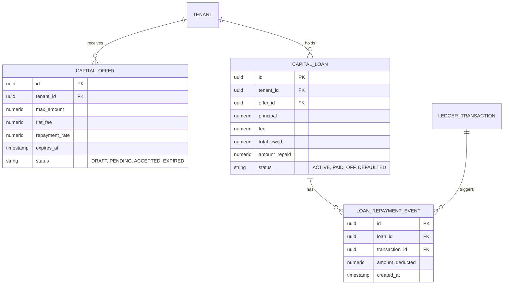

# [architecture] Autonomous Capital & Cashflow Engine

## Title
Autonomous Capital & Cashflow Engine

## Problem Statement
Micro-SMBs (like Maya the baker wanting to upgrade her oven, or Fatima the food cart owner looking to open a second cart) struggle to access traditional credit. They lack formal credit histories, find bank loan applications overly complex, and often require small amounts of capital ($500 - $10k) that banks won't underwrite. This barrier significantly stymies growth and survival. The OneHumanCorp platform must offer frictionless, instant working capital seamlessly integrated into their daily cashflow.

## Research Report
*   **The Gap**: Traditional banks rely on FICO and manual underwriting. Micro-businesses are either rejected or the process takes weeks.
*   **Competitors**:
    *   **Square Loans**: Offers proactive loans based on payment processing volume. Repayment is a fixed percentage of daily sales. Very successful due to invisibility.
    *   **Shopify Capital**: Uses machine learning on store sales history to pre-qualify merchants for cash advances. Automatic repayment through sales.
    *   **Stripe Capital**: Provides API-first access to capital, heavily integrated into Stripe's ledger, using revenue as the primary underwriting signal.
*   **OHC Advantage**: Because OHC acts as the system of record (inventory, booking, POS, invoices), our AI agents have a 360-degree view of business health beyond just payment processing. We can predict future revenue (e.g., booked appointments for Leo) and underwrite faster and more safely.

## Design Doc

### Business Journey Mapping
1.  **Acquisition / Activation**: Invisible. The user doesn't apply.
2.  **Trigger**: The AI Risk & Finance Agent analyzes 90 days of ledger activity. It identifies consistent revenue and triggers an offer.
3.  **Offer**: A simple card appears on Maya's mobile dashboard: "Need a new oven? Get $2,000 instantly. Repay automatically with 8% of daily sales."
4.  **Acceptance**: Maya taps the card. The AI agent generates a plain-language summary of terms. She accepts with biometric auth (FaceID).
5.  **Funding**: Funds are instantly credited to her OHC Ledger / payout balance.
6.  **Repayment**: Every sale made via OHC automatically deducts 8% toward the loan balance until repaid. Zero manual intervention.

### Multi-Tenant Data Model & Invariants

*   **Invariants**:
    *   Total Owed = Principal + Fee. No compounding interest.
    *   `amount_repaid` must never exceed `total_owed`.
    *   Every `LOAN_REPAYMENT_EVENT` must be atomically tied to a `LEDGER_TRANSACTION` to guarantee multi-tenant data integrity.

### Mobile-First UX Flow (375px)
*   **Dashboard Card**: Unified Home view. A sleek, translucent card (macOS glassmorphism style) appears: "Pre-approved for $2,000 Capital."
*   **Offer Screen**: Clean typography. Slider to adjust loan amount ($500 to $2,000). As slider moves, the fee and "You'll repay" numbers update instantly. No jargon.
*   **Acceptance Flow**: "Swipe to accept." FaceID/TouchID prompt.
*   **Active Loan View**: Progress ring showing amount repaid vs total. "Paid $450 of $2,160".

### AI Department Coordination
*   **Finance/Risk AI Agent**: Background job runs nightly via the NATS Hybrid Event Mesh. Analyzes ledger, predicts churn, calculates risk score, and generates `CAPITAL_OFFER` rows.
*   **Legal AI Agent**: Generates the terms of service customized to the user's jurisdiction dynamically at acceptance.
*   **Operations AI Agent**: Handles the atomic deduction during payment processing and updates the ledger.

### Technical Integrity & Security
*   **Zero-Trust**: Offers and Loans are scoped strictly to the `tenant_id`. AI agent access to ledger data is mediated via SPIFFE/SPIRE authenticated mTLS connections.
*   **Performance**: Repayment deduction calculation must add <5ms overhead to the payment processing path.

## Implementation Prompt
**Context**: Implement the autonomous capital engine where eligible users receive proactive cash advance offers based on their ledger history.
**Outcome**: A user can see an active capital offer on their dashboard, adjust the amount, accept it, and have the funds instantly credited to their ledger. Future sales should automatically deduct the specified percentage.
**Acceptance Criteria**:
1. Implement the database schema for Offers, Loans, and Repayment Events.
2. Create an internal API for the Finance AI Agent to create offers.
3. Build the frontend mobile components (slider, acceptance flow) using the existing design system tokens.
4. Modify the core payment processing ledger entry to atomically calculate and record a repayment deduction if an active loan exists.
5. All ledger operations must be strictly isolated by `tenant_id`.

## Priority
P1

## Estimated Scope
Large
