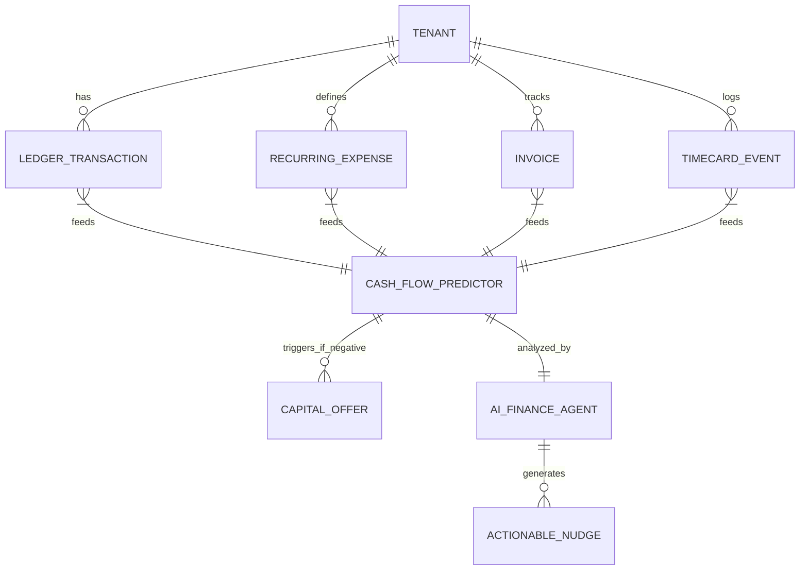
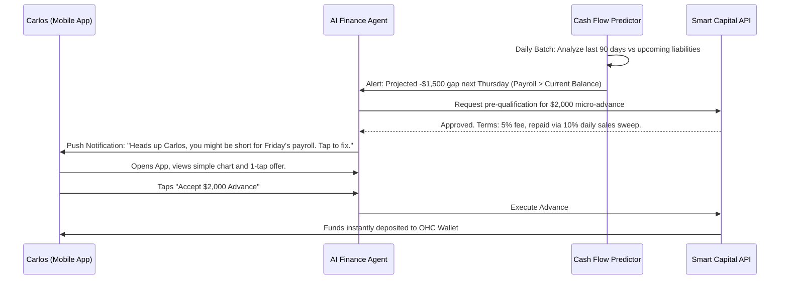

# [Architecture] Invisible Cash Flow Forecasting & Smart Capital Engine

## Problem Statement

Small business owners—especially those with seasonal fluctuations or tight margins like Carlos (Handyman) and Priya (Boutique Owner)—frequently struggle with cash flow management. They lack the time and financial expertise to project upcoming expenses (rent, payroll, supplier invoices) against expected revenue (booked jobs, average daily sales).

This opacity leads to a reactive financial posture: missing payroll, failing to order sufficient inventory before a rush, or resorting to high-interest payday loans to cover short-term gaps. Current solutions require exporting data to complex spreadsheets or using external accounting software like QuickBooks, which is disconnected from their daily operations and requires manual data entry.

OHC needs a **Zero-Friction, Predictive Cash Flow Engine** that invisibly analyzes transactions, payroll, and inventory needs, provides simple, proactive warnings, and offers 1-tap micro-capital access when a gap is identified.

## Research Report

### Competitive Analysis

| Platform | Cash Flow Visibility | Capital Access | Strengths | Weaknesses (The OHC Opportunity) |
|---|---|---|---|---|
| **Shopify** | Basic reports | Shopify Capital | Integrated funding | E-commerce focused; ignores offline expenses; reactive, not predictive. |
| **Square** | Sales reports | Square Loans | Seamless repayment via sales | Tied to Square POS volume; lacks deep expense/payroll context. |
| **QuickBooks** | Complex cash flow projections | QuickBooks Capital | Powerful accounting integration | Too complex for our personas ("Grandmother Test" failure); requires manual entry. |
| **OHC (Target)** | **Autonomous predictive forecasting** | **1-tap dynamic micro-credit** | **Invisible AI context (knows bookings, payroll, and sales)** | **Must abstract accounting complexity into plain-language actionable nudges.** |

### Persona Pain Points

*   **Carlos:** "I have three big jobs next week, but I need $2,000 for materials today. My bank won't give me a loan that fast, and putting it on a personal credit card is risky."
*   **Priya:** "I always guess how much inventory to order for the holidays. Sometimes I overspend and can't pay myself that month. I just wish my system told me 'You have $5k safe to spend right now'."
*   **Maya:** "I hate looking at spreadsheets. Just tell me if I have enough money to cover my assistant's wages this Friday."

### Key Architectural Findings

To truly solve this, OHC must shift from being a *reporting* tool to a *predictive* engine. The engine must ingest data from across the OHC mesh (Sales, Invoicing, Payroll/Staff Mesh, Inventory) and utilize the AI Finance Department to generate a 30-day forward-looking cash flow graph. Crucially, if a negative balance is projected, the system should autonomously pre-qualify the merchant for a micro-loan (Smart Capital) and present it as a 1-tap solution.

## Design Doc

### Architecture Diagram

### UI Wireframes & Mobile UX Flow (375px First)

**Screen 1: The Daily Briefing (Dashboard Nudge)**
- **Top:** Clean translucent glass card at the top of the Home tab.
- **Content:** "⚠️ Cash Flow Alert: Based on upcoming payroll and scheduled material purchases, your balance may drop below $0 next Thursday."
- **Action:** A primary button `[ View Options ]`.

**Screen 2: Cash Flow Radar (Simple View)**
- **Visual:** A minimalist, color-coded line graph showing balance projection over the next 30 days. Green = Safe, Red = Risk Zone.
- **Plain Language Summary:** "You expect $4,000 in income, but have $5,500 in upcoming bills (Rent, Wages)."
- **No Complex Accounting:** Hides terms like "Accounts Receivable" or "Accrued Liabilities" behind an "Advanced Settings" switch.

**Screen 3: 1-Tap Smart Capital Offer**
- **Header:** "Bridge the Gap"
- **Offer Card:** "Get $2,000 instantly to cover next week. You'll repay $2,100 automatically by dedicating 10% of your daily sales. No hidden fees."
- **Interaction:** A slider to adjust the needed amount, and a large `[ Accept & Deposit Now ]` button using biometric verification (FaceID/TouchID).

### AI Agent Integration Points

- **AI Finance Agent:** The core brain analyzing the incoming streams from the OHC ecosystem. It recognizes patterns (e.g., "Rent is usually paid on the 1st," "Fridays are high sales days"). It translates complex financial projections into "Grandmother Test" passing plain-language summaries.
- **AI Operations Agent:** Feeds data regarding necessary inventory restocks to the Finance Agent to anticipate future cost of goods sold (COGS).
- **AI Sales Agent:** Feeds probability-weighted data on outstanding quotes and invoices to project incoming revenue.

### Key Design Decisions and Why

1.  **Predictive, not Reactive:** We don't wait for an overdraft. We use the mesh data to warn the user days in advance.
2.  **Integrated Solution (Capital):** Warning a user they will run out of money without offering a solution is frustrating. Bundling pre-qualified micro-capital transforms a stressful alert into a seamless, 1-tap relief mechanism.
3.  **Sweep Repayment:** Repayment via a percentage of daily sales (rather than fixed monthly payments) aligns with the variable cash flow of SMBs, reducing stress.
4.  **Extreme Simplicity:** The UX hides the immense backend complexity of cash flow modeling. The user sees a single line going up or down and a clear action to take.

### Technical Integrity & Mobile-First Review

*   **Performance & Offline Targets:**
    *   **Latency:** The Cash Flow Predictor must process daily batch updates within 50ms per tenant to ensure the dashboard push notification feels instant upon waking.
    *   **Payload Size:** The initial 30-day projection JSON payload must be under 15KB uncompressed, allowing instant render over 3G cellular connections.
    *   **Offline Capability:** The pre-qualified capital offer must be locally cached securely. The user can view the offer offline, though accepting it requires network connectivity to finalize the transfer and sweep rules.
*   **Zero Trust & Security:**
    *   **SPIFFE/SPIRE Identity:** All microservices involved (Cash Flow Predictor, Smart Capital API, OHC Wallet) must authenticate strictly via SPIFFE/SPIRE mTLS identities.
    *   **Multi-Tenant Isolation:** `CASH_FLOW_PREDICTOR` instances must operate within strict tenant-bound database views. No cross-tenant data aggregation is permitted for the individual predictive model.

## Implementation Prompt

**Implementer Agent Task:**
Implement the core `CashFlowPredictor` and `SmartCapital` module within the OHC financial ecosystem.

**Customer-User Journey (CUJ):**
1. The AI Finance Agent detects a projected negative cash flow event 7 days in the future for a merchant based on historical trends and known upcoming liabilities (invoices, payroll).
2. The Agent generates a pre-qualified Smart Capital offer to bridge the gap.
3. The merchant receives a push notification, views a simplified cash flow graph, and accepts the offer with one tap.
4. Funds are instantly credited to the merchant's OHC Wallet, and a sweep repayment rule is established on future sales.

**Acceptance Criteria:**
- Define the `CashFlowProjection` data model that aggregates known inputs (Invoices, Subscriptions, Payroll) and outputs a 30-day daily balance array.
- Implement the threshold logic for the AI Finance Agent to trigger a `ActionableNudge` when a projection drops below $0.
- Create the `CapitalOffer` entity and the logic to simulate an instant advance and configure a `RepaymentSweep` rule on the merchant's tenant configuration.
- Develop the 375px mobile UI for the Cash Flow Radar and the 1-Tap Offer acceptance flow using macOS-style Translucent Glass materials.
- Ensure all financial calculations guarantee transactional integrity and strict multi-tenant isolation.
- Do not prescribe specific external banking APIs; design the internal abstractions and interfaces required to support this engine.

**Priority:** P1
**Estimated Scope:** Large
