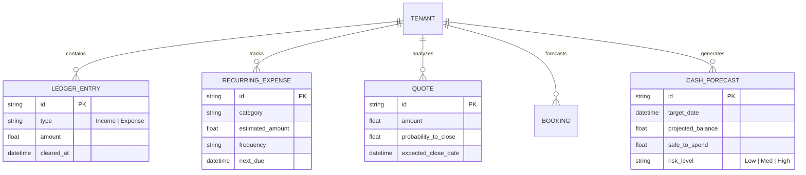
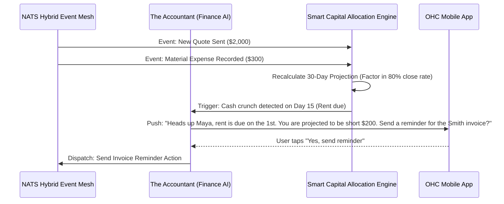

# Title: Autonomous Cash Flow Forecasting & Smart Capital Allocation

## Problem Statement
Small business owners, especially those running service or hybrid businesses (e.g., Maya the Baker, Carlos the Handyman), operate in a state of "Financial Fog". They constantly ask: "Can I afford to buy this new equipment right now?" or "Do I have enough cash saved to cover taxes next quarter?". They manage cash by checking their raw bank balance, which does not account for upcoming bills, pending deposits, deferred tax liabilities, or seasonal dips. Existing accounting platforms (like QuickBooks) are retrospective, complex, and require manual data entry. Business owners need a proactive, intelligent system that acts as a CFO—translating complex ledgers into a simple, predictive "Safe to Spend" metric in plain language.

## Research Report
*   **Current Capabilities:** OHC has foundational transaction ledgers and invoicing engines, but lacks a predictive intelligence layer that synthesizes upcoming revenue, recurring expenses, and historical trends into an actionable forecast.
*   **Competitor Analysis:**
    *   *QuickBooks / Xero:* Powerful for compliance and historical reporting, but forecasting requires complex manual setups or expensive third-party plugins. They are not mobile-first.
    *   *Novo / Relay (SMB Banking):* Good at auto-setting aside tax reserves, but they lack deep context into the *business operations* (e.g., they don't know Carlos just sent a $2,000 quote that has a 80% likelihood of converting next week).
    *   *Shopify:* Strong on revenue analytics, but weak on operational expense forecasting (rent, materials, labor) and overall cash flow predictions.
*   **Gap Identified:** A real-time, event-driven Cash Flow Forecasting Engine that integrates deeply with OHC’s Omni-Channel AI Inbox, Booking/Quoting Engine, and unified Ledger to provide a true, forward-looking "Safe to Spend" balance.
*   **Strategic Advantage:** By knowing both the operational state (quotes, bookings, inventory needs) and financial state (ledger, invoices), OHC's AI Finance Agent can predict cash crunches weeks before they happen and proactively suggest actions (e.g., "Offer a 10% discount to collect an invoice early").

## Design Doc

### Architecture Diagram

### Mobile UX Flow (375px First)
1.  **Dashboard Integration:** The primary dashboard card shows a simple, friendly number: **"Safe to Spend: $1,250"** (instead of a raw bank balance of $3,000, which includes tax liabilities and upcoming rent).
2.  **The "Can I Afford It?" Chat:** A user taps the Finance AI agent icon and types: "Can I afford the $800 KitchenAid mixer this week?"
3.  **The Plain-Language Response:** A modal pops up. The AI Accountant replies: "If you buy the mixer for $800, your 'Safe to Spend' drops to $450. Since your quarterly taxes ($600) are due in 2 weeks, I recommend waiting until the pending $500 wedding cake deposit clears on Tuesday."
4.  **Proactive Alerts:** Clean, translucent notification cards appear on the lock screen for upcoming capital allocation needs (e.g., "Setting aside 15% of your last 5 sales for taxes. Approve? [Yes] [Adjust]").

### AI Agent Integration Points
*   **The Accountant (Finance & Legal):** Aggregates historical data, pending quotes, and recurring bills to continuously calculate the "Safe to Spend" metric. Speaks in plain language, avoiding jargon like "Accounts Receivable" or "EBITDA".
*   **The Vigilant Manager (Operations):** Feeds the Finance Agent data on upcoming material needs or inventory restocks that will require cash.
*   **The Business Advisor:** Summarizes the 30-day cash outlook in the plain-language daily business briefing.

### Performance & Security Integrity
*   **Zero Trust Isolation:** All financial forecasting data is strictly partitioned by `tenant_id` utilizing SPIFFE/SPIRE identity propagation.
*   **Offline Tolerance:** The "Safe to Spend" metric is cached locally on the mobile device. If offline, the app clearly indicates the last synced time.
*   **Low Latency Computations:** The forecasting engine listens to the NATS event mesh asynchronously, updating materialized views/cache so that dashboard loads remain under 50ms.

## Implementation Prompt
Implement the Autonomous Cash Flow Forecasting & Smart Capital Allocation Engine.
The system must aggregate data from the unified ledger, pending invoices, accepted quotes, and recurring expenses to continuously calculate a real-time "Safe to Spend" metric.
Create an API surface for the Finance AI Agent to query this forecasting engine to answer user questions like "Can I afford X?".
Ensure the UI components follow the macOS-style Translucent Glass materials and mobile-first card layouts. All accounting jargon must be translated into plain English.
Acceptance criteria include: successful calculation of the 'Safe to Spend' metric reflecting future liabilities, event-driven recalculation upon new ledger entries or quote approvals, and mobile-first, proactive alerts for upcoming cash crunches.

## Priority
P0

## Estimated Scope
Large
