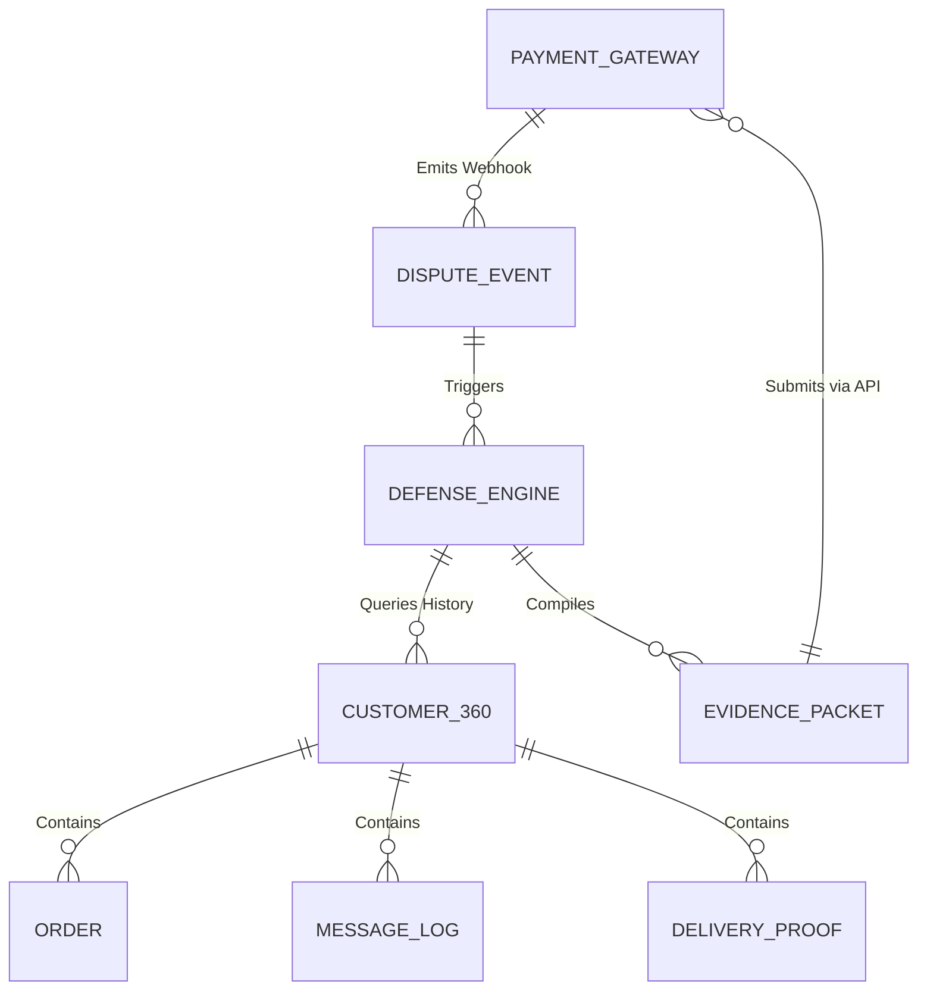

# Title: Autonomous Chargeback & Dispute Defense Engine

## Problem Statement
Small business owners—especially solopreneurs like Maya (custom cakes) and Carlos (handyman)—are particularly vulnerable to friendly fraud and chargebacks. When a customer disputes a transaction (e.g., claiming "Item not received" or "Service not rendered"), the burden of proof falls entirely on the business owner. Gathering evidence (chat logs, delivery photos, signed quotes) and formatting it into a compelling response for payment gateways like Stripe or PayPal takes hours they don't have. If they miss the tight deadline or fail to provide the correct format, they lose the revenue and pay a dispute fee. They need an invisible, proactive system that automatically intercepts dispute webhooks, compiles the necessary evidence from their existing OHC platform data, and submits a defense on their behalf, turning a stressful, time-consuming process into a simple notification.

## Research Report
*   **Current Architecture Limits:** Small businesses typically rely on their payment processor's default dispute dashboard, which requires manual data entry and document uploading. Existing platforms like Shopify provide dispute management tools but still require the merchant to actively collect and submit the evidence.
*   **Competitor Analysis:**
    *   *Shopify:* Provides a "Chargeback protection" feature (Shopify Protect) but only for eligible Shop Pay transactions. For other processors, it's manual.
    *   *Stripe:* Excellent API for dispute management, but merchants must build their own integration to automate evidence collection.
    *   *Chargehound/Midigator:* Expensive third-party services focused on enterprise/mid-market companies, not accessible or simple enough for solopreneurs.
*   **Discovery:** OHC has a unique advantage: it acts as the central hub for the entire business journey (quoting, communication, invoicing, delivery). By leveraging the KAIROS Orchestrator and the Omnichannel Inbox, OHC can autonomously compile a comprehensive evidence packet (e.g., WhatsApp confirmation of a cake delivery, an approved digital quote for a handyman service) and interface directly with the payment processor's dispute API without human intervention.

## Design Doc

### Architecture Diagram

### UI Wireframes & Mobile UX Flow (375px)
*   **Owner View (OHC Mobile App - 375px):**
    *   **Action:** A dispute is filed against a transaction.
    *   **Notification:** Maya receives a push notification: "Dispute opened for Order #102. OHC is compiling evidence."
    *   **Dashboard Card:** A clean, Unifi-style card in the Activity Feed shows the dispute status.
    *   **Review/Approve Screen:** If the AI confidence is high, it automatically submits. If the confidence is lower, the card asks for a 1-tap approval: "Review generated dispute defense. [Approve & Submit] [Edit Evidence]". The screen shows a beautifully formatted timeline of the interaction (Order placed -> Quote signed -> Delivery photo taken).
    *   **Outcome Notification:** "Dispute won! Funds returned to your wallet."

### Key Design Decisions
*   **Event-Driven Trigger:** The Defense Engine listens directly to the Hybrid Event Mesh for `DisputeCreated` events originating from the payment processor integration.
*   **Contextual Evidence Gathering:** The AI Legal/Finance Agent queries the `Customer360` profile, correlating the disputed `transaction_id` with associated orders, chat logs (from the Omnichannel Inbox), signed digital quotes, and delivery/fulfillment events.
*   **Automated Formatting:** The engine formats the gathered data into the specific JSON/document structure required by the target payment gateway's dispute API (e.g., Stripe's Evidence Object).
*   **Confidence Thresholds:** If the agent finds conclusive evidence (e.g., a photo of the delivered item and a "Thank you" message from the customer), it can be configured to auto-submit the defense. Otherwise, it prepares a draft for a 1-tap manual approval.

### AI Agent Integration Points
*   **Legal/Finance Agent:** Orchestrates the evidence gathering, formats the dispute response, and interacts with the payment gateway API.
*   **Customer Success Agent:** Provides the contextual chat history from the Omnichannel Inbox to prove the customer authorized the transaction or received the good/service.
*   **Operations Agent:** Provides proof of fulfillment (tracking numbers, delivery photos, or service completion logs).

## Implementation Prompt
Implement the Autonomous Chargeback & Dispute Defense Engine. The system must listen for dispute webhooks from connected payment gateways (e.g., Stripe). Upon receiving a dispute, it must autonomously trigger the Legal/Finance AI Agent to compile an evidence packet by querying the Omnichannel Inbox, Order History, and Fulfillment logs associated with the transaction. The agent must format this evidence according to the gateway's requirements and either submit it automatically (based on a confidence threshold) or present a drafted response to the business owner for 1-tap approval via the mobile dashboard. Ensure strict multi-tenant isolation so evidence is only gathered from the affected tenant's data.

## Priority
P1

## Estimated Scope
Large
