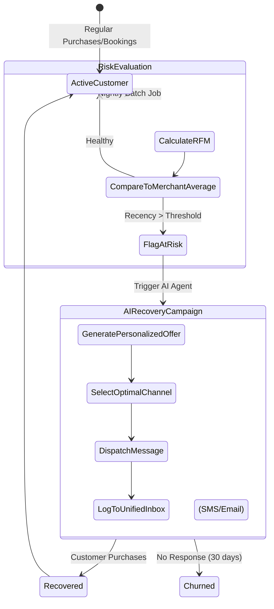

# Title: [Architecture] Autonomous Churn Prediction and Recovery Engine

## Problem Statement
Small business owners like Leo (music tutor) and Priya (boutique owner) struggle to keep track of their repeat customers. Leo often loses students who quietly stop booking lessons, while Priya has customers who haven't visited her online store in months. They lack the time and analytical skills to identify which customers are at risk of churning, let alone design and execute targeted recovery campaigns. Competitors offer complex CRM tools that require manual list segmentation and campaign building, which is overwhelming for non-technical users. OHC needs an invisible, proactive engine that automatically identifies at-risk customers based on their purchase/booking history and seamlessly deploys AI-crafted, personalized recovery messages (e.g., discounts, check-ins) across SMS, Email, or WhatsApp, effectively saving revenue without the merchant lifting a finger.

## Research Report

*   **Current Architecture Limits:** OHC currently records transactions and bookings but lacks a predictive analytics layer to monitor customer lifecycle health automatically. The CRM module is passive, requiring merchants to manually check customer profiles.
*   **Competitor Analysis:**
    *   *Shopify:* Offers basic customer segmentation and automated emails, but requires the merchant to manually create the "At Risk" segment and design the recovery workflow.
    *   *Klaviyo / Mailchimp:* Powerful predictive analytics for churn, but are complex enterprise-grade tools that are far too complicated for our personas and require separate integrations.
    *   *Wix:* Has basic automated emails, but no intelligent churn prediction.
*   **Discovery:** OHC must implement an "Autonomous Churn Prediction and Recovery Engine". This engine will use background jobs to analyze customer interaction frequency (Recency, Frequency, Monetary - RFM analysis) against the merchant's historical averages. When a customer slips past their predicted re-engagement window, the `Customer Success` AI agent automatically drafts and sends a personalized, multi-channel recovery message, logging the interaction in the unified inbox.

## Design Doc

### Architecture Diagram

### UI Wireframes & Mobile UX Flow (375px)
*   **The "Invisible" Flow:**
    *   The primary experience is completely invisible to the merchant. The system works in the background.
*   **The Daily Briefing Integration (375px):**
    *   **Action:** Leo opens his daily OHC brief.
    *   **UI:** A UniFi-style glassmorphism card appears: "We noticed 3 students haven't booked in a month. We sent them a 10% off welcome-back text. 1 already rebooked!"
    *   **Button:** "View details" (leads to the AI's activity log).
*   **Advanced Settings (If accessed):**
    *   Simple toggles for "Enable Auto-Recovery", "Max Discount % Allowed", and preferred channels (SMS/Email). No complex logic builders.

### Mobile UX Flow
1.  System detects a customer hasn't purchased/booked within their normal timeframe (e.g., usually buys coffee every 3 days, now it's been 10 days).
2.  Customer Success Agent checks the merchant's allowed discount rules.
3.  Agent drafts a friendly, personalized message: "Hey [Name], we missed you at Maya's Bakery! Here's 10% off your next custom cake order."
4.  Message is sent via the customer's preferred channel (SMS/Email).
5.  Merchant sees a summary in their daily brief and the full interaction in the Unified Inbox if they choose to look.

### AI Agent Integration Points
*   **Customer Success Agent ("The Ambassador"):** Responsible for crafting the personalized message based on past purchase history and executing the send via the `Communications` module.
*   **Business Advisory Agent ("The Advisor"):** Responsible for summarizing the success rate of the recovery campaigns in the daily/weekly business briefing.
*   **Finance Agent ("The Accountant"):** Responsible for generating the unique, single-use discount codes (if authorized) to include in the recovery message.

### Key Design Decisions
1.  **Invisible by Default:** The system must run autonomously without requiring the merchant to build segments or workflows.
2.  **Adaptive Thresholds:** The definition of "churn risk" must be dynamic per merchant. A coffee shop (daily visits) has a different risk window than a handyman (annual visits). The engine must calculate the merchant's specific average return rate.
3.  **Cross-Channel Support:** The recovery message must route through the customer's preferred communication channel (SMS, Email, WhatsApp) to maximize conversion.

## Implementation Prompt
**For Implementer Agent:**
Implement the core logic for the Autonomous Churn Prediction and Recovery Engine. Focus on the backend background job that evaluates customer health and triggers the AI agent.

1.  **Define the Schema:** Create a data model (or update the existing Customer model) to store `last_interaction_date`, `average_interaction_interval`, and `churn_risk_status`. Ensure strict multi-tenant isolation.
2.  **Nightly Evaluation Job:** Implement a worker (using PostgreSQL SKIP LOCKED or standard cron if simpler) that runs nightly to evaluate all customers for a given tenant. It should flag customers whose `last_interaction_date` exceeds their `average_interaction_interval` by a configurable threshold (e.g., 2x).
3.  **Trigger AI Recovery:** When a customer is flagged as "At Risk", trigger the `Customer Success Agent` to draft and send a recovery message. For this implementation, simulate the message generation and dispatch by logging the action and creating an entry in the `UnifiedInbox` (if available) or a generic notification table.
4.  **Acceptance Criteria:**
    *   A nightly job correctly identifies "At Risk" customers based on interaction history.
    *   The system automatically triggers a simulated AI recovery message without manual intervention.
    *   The merchant's daily brief (or a test endpoint) reflects the number of recovery attempts made.
    *   Include comprehensive unit tests and at least one Playwright E2E test verifying the merchant can see the automated recovery action in their activity feed.

## Priority
P1

## Estimated Scope
Medium
