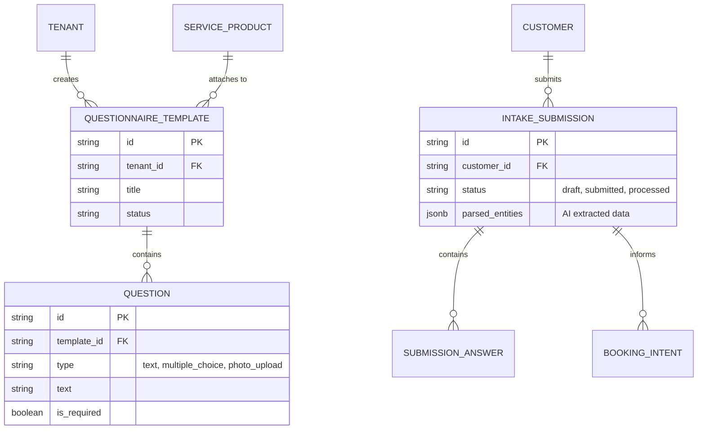
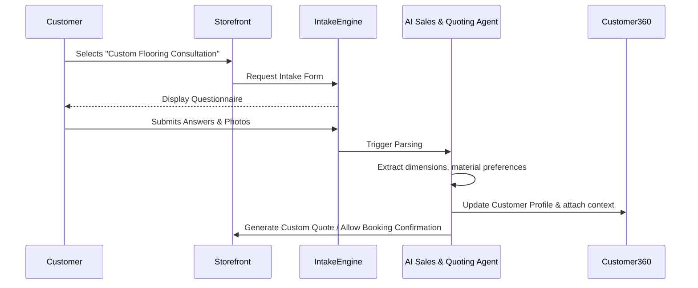

# [Architecture] Autonomous Client Intake Questionnaire Engine

## Title
Architect and Implement Autonomous Client Intake Questionnaire Engine

## Problem Statement
Small business owners in service industries, such as Leo (Music Tutor) or Carlos (Handyman), often need detailed information from clients before confirming a booking or generating a quote. For example, Carlos needs to know the exact dimensions of a room and the type of material a client wants for a flooring project. Leo might need to know a new student's skill level and musical interests. Currently, OHC requires users to capture this via back-and-forth emails, direct messages, or external form builders (e.g., Typeform, Google Forms), which breaks the "10-minute setup" flow and requires manual data entry into the OHC CRM/booking system. This disjointed process leads to lost leads, incorrect quotes, and wasted time.

## Research Report
**Findings & Competitive Analysis:**
- **Typeform / Jotform:** Excellent form builders but require separate subscriptions, complex integrations (Zapier), and are completely disconnected from the actual product/service catalog and booking engine.
- **Shopify:** Primarily built for eCommerce. Custom intake forms for services or complex custom orders require 3rd-party apps with high friction and additional costs.
- **Squarespace / Wix:** Offer basic embedded forms, but the data is just sent as an email, requiring manual entry into the booking system or CRM.
- **The Gap in OHC:** OHC lacks a native, zero-config way to attach structured intake questionnaires to services or bookings. By leveraging the AI Swarm, OHC can automatically generate these forms based on the service type and automatically parse the responses directly into the Customer360 profile and the quoting engine.

## Design Doc

### Architecture Diagram

### UI Wireframes & Mobile UX Flow (375px first)
**Screen 1: Auto-Generation (Merchant View)**
- **Trigger:** Carlos creates a new service: "Custom Flooring Install".
- **AI Action:** The Operations Agent suggests: "Would you like me to create an intake form for this to get room dimensions and material preferences?"
- **Action:** Carlos taps "Yes".
- **Design:** The AI instantly generates a 3-question form. Carlos sees a clean, translucent glass card with the questions. He can tap to edit or add a "Photo Upload" requirement.

**Screen 2: Customer Intake (Customer View)**
- **Design:** Highly conversational, Typeform-style flow, but fully native within the OHC checkout/booking process.
- **Flow:** One question per screen with large, easy-to-tap buttons for multiple choice. Native integration with the mobile camera for photo uploads.

**Screen 3: AI Processing & Review (Merchant View)**
- **Notification:** "New Intake from Sarah for Custom Flooring."
- **Review Card:** The AI Sales Agent summarizes the submission: "Sarah wants hardwood flooring for a 200 sq ft room. I've drafted a quote for $1,200 based on your pricing history."
- **Action:** Large "Review Quote & Send" button.

### AI Agent Integration Points
- **Operations Agent:** Automatically generates relevant questionnaire templates based on the title and description of the service being created.
- **Sales & Quoting Agent:** Parses the structured and unstructured responses from the intake form to automatically draft accurate quotes, eliminating manual calculation.
- **Customer Success Agent:** Updates the `Customer360` profile with preferences (e.g., "Prefers eco-friendly materials") extracted from the questionnaire.

### Key Design Decisions
- **Native Integration:** Questionnaires are first-class citizens linked directly to `SERVICE_PRODUCT` entities, not isolated forms.
- **AI Parsing:** The value isn't just collecting data; it's the AI agents automatically acting on that data (drafting quotes, updating CRM) without the owner reading every line.
- **Multi-Tenant Isolation:** All form templates, submissions, and uploaded photos must be strictly isolated by `tenant_id`.

## Implementation Prompt
**Context:** You are an Implementer agent. Your task is to build the Autonomous Client Intake Questionnaire Engine.
**User Journey (CUJ):** A merchant creates a service and attaches an AI-generated intake questionnaire. A customer attempts to book the service, is presented with the questionnaire, and submits it (including a photo). The AI parses the submission and drafts a quote for the merchant to approve.
**Acceptance Criteria:**
1. Create the database schemas for `QuestionnaireTemplate`, `Question`, `IntakeSubmission`, and `SubmissionAnswer` with strict tenant isolation.
2. Implement the API endpoints to create/update questionnaires and submit answers.
3. Integrate the AI Sales Agent to parse incoming submissions and extract structured data (mock this logic for now if full LLM integration is complex).
4. Build the mobile-first (375px) customer-facing form UI using OHC design tokens.
5. Ensure photo uploads are handled securely and associated with the correct submission.

## Priority
P1

## Estimated Scope
Large
