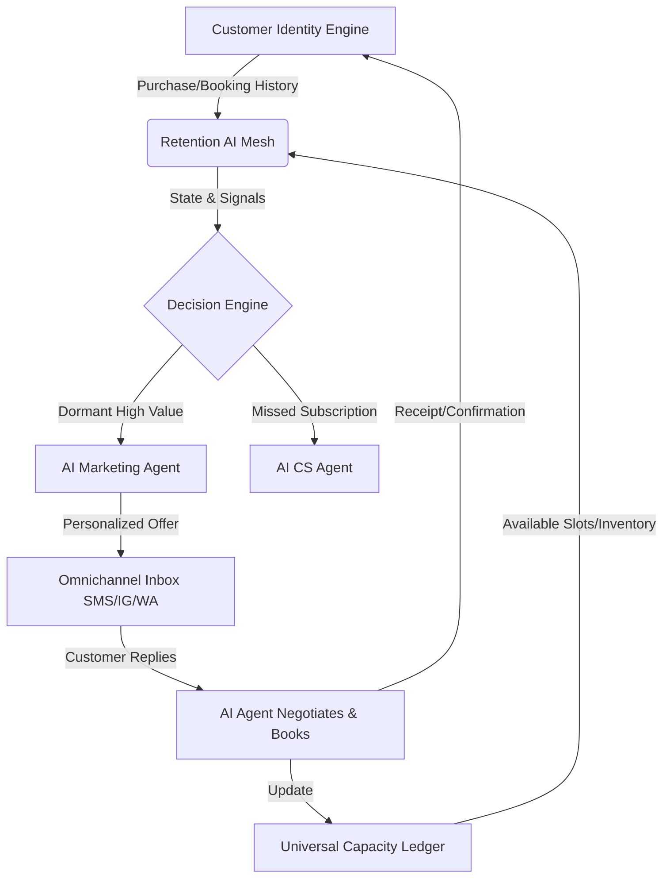

# [Architecture] Autonomous Client Retention & Winback Engine

## Title
Architectural Gap: Missing Autonomous Client Retention and Winback Engine

## Problem Statement
Small business owners, like Leo the music tutor or Maya the baker, lose significant revenue because they are too busy delivering their services to follow up with inactive clients. They do not have the time to track who hasn't booked in 3 months, nor the expertise to craft the right re-engagement message or offer. They need an invisible, zero-touch system that automatically identifies dormant clients, generates personalized check-ins or targeted offers (like a discount on the next lesson or a special holiday cake pre-order), and books them directly back into the calendar or storefront—all without the business owner lifting a finger.

## Research Report
- **Competitive Landscape**:
  - **Shopify/Wix**: Offer basic automated email flows (e.g., "We miss you" emails triggered by time delays). These are often generic, require manual setup of rules, and end up in promotions folders.
  - **Mindbody/Boulevard**: Have retention features, but they are highly verticalized and often require the business owner to configure complex "smart marketing" campaigns.
- **OHC Ecosystem Gap**: Currently, OHC handles booking, purchasing, and initial onboarding beautifully. However, we lack a continuous, stateful relationship engine that works post-purchase. The CRM exists but acts passively as a record.
- **The Opportunity**: Build an "AI Customer Success" department for the small business. This engine continuously monitors the `Universal Capacity & Inventory Ledger` and the `Customer Identity Resolution Engine`. When a high-value customer deviates from their normal booking/buying frequency, the AI agent proactively engages them via their preferred channel (SMS/WhatsApp/Instagram) with context-aware messaging.

## Design Doc

### Architecture Diagram

### UI Wireframes & Screen Flow (375px First)
1. **The "Grandmother Test" View**:
   - **Dashboard Card**: "🌟 Magic Re-engagement Active". Shows a simple stat: "$450 recovered this month."
   - **Interaction**: A simple toggle "Let AI check in with old customers?" (ON/OFF).
2. **Advanced Settings (Hidden by default)**:
   - Sliders for maximum discount authorization (e.g., "Allow up to 15% discount for winbacks").
   - Tone selector for AI (Friendly, Professional, Urgent).
3. **The Customer View (Mobile)**:
   - Receives an SMS: "Hey Sarah! It's been a while since your last vocal lesson with Leo. I have a 3 PM slot open this Thursday, want me to lock it in for you with a 10% returning student discount?"
   - Customer replies "Yes please!"
   - AI Agent sends payment link and calendar confirmation via SMS.

### AI Agent Integration Points
- **CS/Marketing AI Agent**: Monitors the data stream, decides the optimal time to send a message based on previous interaction history, and handles the natural language back-and-forth negotiation with the customer.
- **Operations AI Agent**: Approves the temporary discount code generation based on the owner's pre-set boundaries.

### Key Design Decisions
- **Passive Monitoring vs Active Rules**: We chose continuous passive monitoring by the AI instead of asking users to set "if X days since last visit" rules. This removes the configuration burden from the user.
- **Omnichannel Delivery**: The winback message must go out on the channel the user last interacted with (e.g., Instagram DMs for Maya's bakery, SMS for Leo's students) to maximize conversion, rather than defaulting to email.
- **Zero-Touch Closing**: The AI must be able to complete the booking/sale in-thread via the `Omnichannel Inbox` without redirecting the customer to a generic web portal.

## Implementation Prompt
**To the Engineering Swarm:**
Implement the `Autonomous Client Retention & Winback Engine`.
- **Goal**: Create a background service that identifies dormant customers and re-engages them via the Omnichannel Inbox.
- **Core User Journey (CUJ)**:
  1. System detects a user hasn't made a purchase/booking in 1.5x their standard cadence.
  2. System drafts a context-aware message (e.g., referencing their last purchase) and sends it via their preferred channel.
  3. System parses the response and auto-completes the booking/sale if the user agrees.
- **Acceptance Criteria**:
  - Must seamlessly integrate with the existing `Omnichannel Inbox` and `Customer Identity` models.
  - Must provide a simple ON/OFF toggle in the UI with a "recovered revenue" metric card.
  - Multi-tenant isolation must be strictly enforced so AI agents only use the specific tenant's history and inventory to craft offers.
  - The feature must be fully manageable from a 375px mobile screen.

## Priority
`P1` (High)

## Estimated Scope
Large
