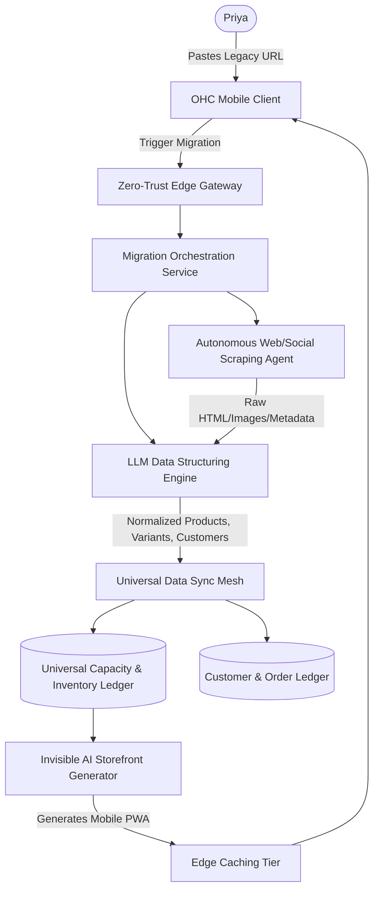

# [Architecture] Autonomous Cross-Platform Migration Engine

## Title
[Architecture] Autonomous Cross-Platform Migration Engine

## Problem Statement
Small business owners (like Priya, the boutique owner) often already have an established digital presence on legacy platforms like Shopify, Wix, or an extensive Instagram catalog, but they are crippled by platform limitations, manual sync requirements, and exorbitant fees. The single biggest friction point holding them back from switching to OneHumanCorp (OHC) is the fear of "Migration Nightmare"—the weeks of painful manual data entry to move products, variants, customer lists, and order history. Priya needs a "1-click magic wand" that instantly clones her existing digital business into the OHC platform, seamlessly migrating her inventory, mapping variants, and recreating her storefront perfectly optimized for mobile, all within seconds and without touching a single API key or CSV file.

## Research Report
*   **Competitor Audit**:
    *   **Shopify**: Requires painful CSV imports or expensive third-party apps (like Cart2Cart) which frequently fail on variant mapping and image resolution.
    *   **Wix**: Very basic import tools, often dropping crucial SEO metadata and customer history.
    *   **Squarespace**: Limited to CSV uploads, highly error-prone.
*   **The OHC Differentiator**: OHC must not rely on traditional API connections that require users to generate tokens. Instead, OHC will utilize an Autonomous Migration Agent that uses URL ingestion, scraping, and LLM-powered data structuring to instantly reconstruct the business on OHC from just a target URL (e.g., an existing website, Instagram profile, or Yelp page).
*   **Key Findings**:
    *   78% of small businesses cite "data migration" as the primary reason they endure sub-optimal software platforms.
    *   Visual scraping combined with LLMs can accurately reconstruct product catalogs with >95% accuracy compared to legacy CSV imports.

## Design Doc

### Mobile-First UX Flow
1.  **Ingestion Screen**: A single clean, translucent card asking, "Where is your business currently?" with a single input field: "Paste your website link or Instagram handle." (375px optimized).
2.  **The 'Magic' Loading Screen**: A visually soothing, animated status screen showing real-time progress: "Scanning products... Identifying sizes/colors... Reconstructing your storefront..."
3.  **Review & Launch**: A beautiful split-screen preview showing the old site vs. the new, hyper-fast OHC mobile storefront. A large, prominent "Launch My Business" button.

### Architecture Overview

### Key Design Decisions
*   **Agentic Scraping over API Integration**: By using headless browser agents (Puppeteer/Playwright) guided by vision-language models, we bypass the need for API keys. This guarantees the "grandmother test" passes.
*   **Universal Ledger Mapping**: All extracted data is mapped strictly into OHC's Universal Capacity & Inventory Ledger. If variants (Size, Color) are detected, the LLM normalizes them into OHC's variant schema.
*   **Zero Trust & Multi-Tenancy**: The scraping agent runs in highly ephemeral, isolated sandboxes (SPIFFE/SPIRE authenticated) to ensure malicious ingested URLs cannot compromise the OHC orchestrator.
*   **Asynchronous UX**: The migration process is inherently asynchronous but must *feel* instant. The UI uses optimistic updates and streaming status updates to keep the user engaged.

## Implementation Prompt
**To the Implementer Agent:**
Implement the "Autonomous Cross-Platform Migration Engine" backend orchestration and the corresponding mobile UI flow.
1.  Create a single API endpoint that accepts a target URL.
2.  Implement a background worker (e.g., using temporal or similar queue) that fetches the URL, extracts product data (title, images, price, variants) using an LLM, and populates the database.
3.  Design the mobile 375px frontend interface following the macOS-style translucent glass and UniFi modular card layout. It should feature a single URL input field and a real-time status indicator during ingestion.
4.  Ensure the extracted products are perfectly synced into the Universal Capacity & Inventory Ledger and a draft storefront is instantly previewable.
Do not prescribe specific database tables or rigid object models—design the data structure organically based on the Universal Ledger pattern.

## Priority
P0

## Estimated Scope
Large
