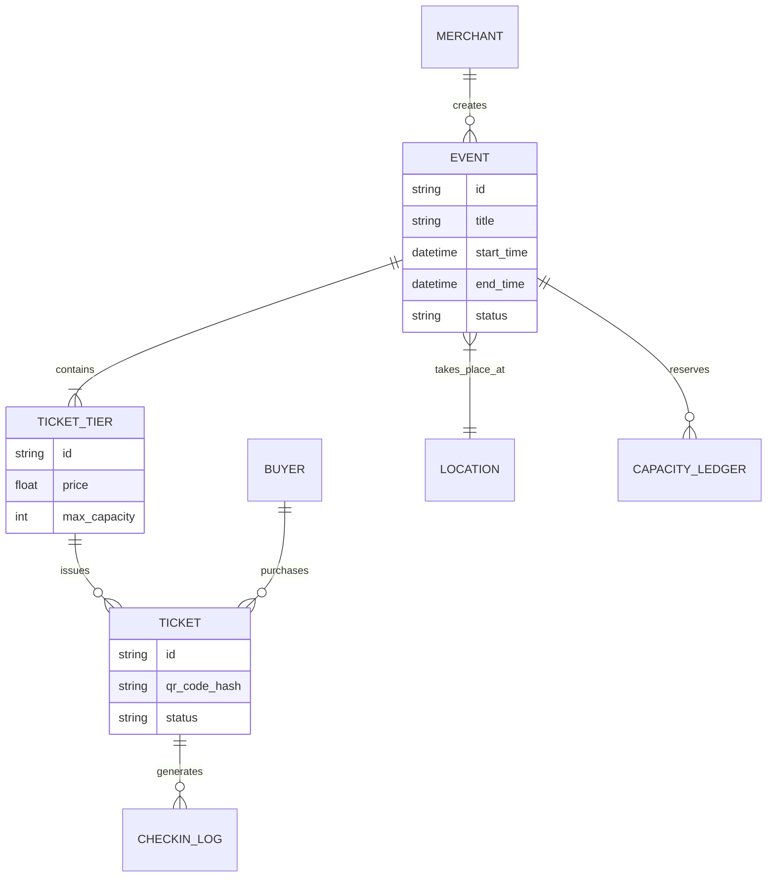
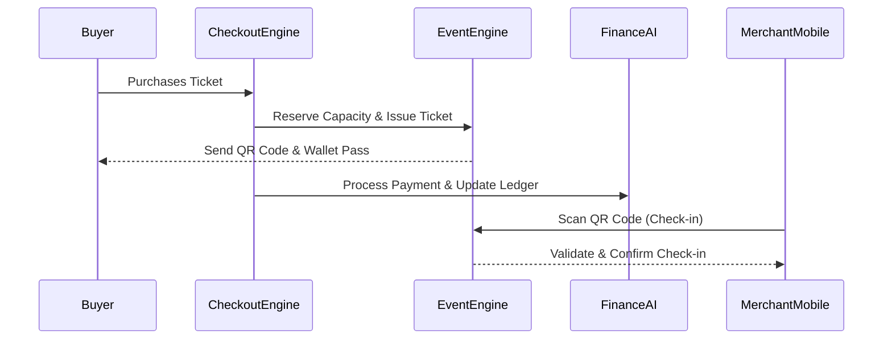

# Autonomous Event Ticketing & Pop-Up Engine

## Problem Statement
Small business owners like Maya (baker), Priya (boutique owner), and Leo (music tutor) frequently host pop-up shops, workshops, and ticketed events to grow their brand and revenue. Currently, they are forced to duct-tape external platforms like Eventbrite or use clunky third-party plugins just to sell a ticket. This results in disjointed inventory, fragmented customer data, high ticketing fees, and a poor check-in experience. They need a simple, unified, mobile-first way to sell tickets, manage capacity, and check-in attendees seamlessly without touching code or reading a manual.

## Research Report
- **Competitor Analysis:**
  - **Shopify:** Relies almost entirely on paid third-party apps for ticketing, which introduces subscription fatigue and complicated onboarding.
  - **Wix & Squarespace:** Offer native tools, but they are often gated behind higher-tier plans and the management interfaces are heavily desktop-optimized, alienating mobile-first users.
  - **Eventbrite:** Charges significant per-ticket fees and effectively "owns" the customer relationship, preventing merchants from fully utilizing their own CRM for follow-up marketing.
- **User Pain Points:**
  - "I use Eventbrite for my cake decorating classes, but I have to manually update my inventory for class supplies on my main site."
  - "I want to sell a workshop ticket and just scan people in using my phone, but the plugins are too hard to set up."
  - "I need an easy way to manage a 3-day pop-up schedule, but my calendar app doesn't talk to my store."
- **The OHC Opportunity:** Deliver a native, zero-config event ticketing engine that unifies inventory, calendar, and CRM. Completely invisible complexity, managed by AI agents, with a beautiful mobile-first check-in experience.

## Design Doc

### Architecture Diagram

### UI Wireframes & Mobile UX Flow (375px first)
- **Visual Language:** macOS-style Translucent Glass materials combined with clean Ubiquiti UniFi modular dashboard card layouts.
- **"Create Event" Flow (Merchant):**
  - **Step 1:** Tap "New Event" from the floating action button.
  - **Step 2:** A clean, single-column card layout to input Event Name, Date/Time, and Location.
  - **Step 3:** Add Ticket Tiers (e.g., General Admission, VIP). Each tier is a modular card with price and capacity inputs.
- **"Buyer Wallet" (Buyer):**
  - After purchase, the buyer receives an SMS/Email with a link.
  - The link opens a high-performance web app (no download required) displaying a beautifully rendered digital ticket with a scannable QR code and "Add to Apple/Google Wallet" buttons.
- **"Check-In Scanner" (Merchant Operations):**
  - A full-screen camera view on the merchant's phone.
  - Real-time offline-first scanning. Upon successful scan, a satisfying haptic feedback pulse triggers, and a large translucent green checkmark overlay appears with the attendee's name.

### AI Agent Integration Points
- **Operations AI:** Monitors event capacity in real-time. If an event is 90% full, it nudges the merchant to consider opening another time slot or increasing capacity.
- **Marketing AI:** Automatically tags attendees in the CRM. Post-event, it drafts a personalized "Thank you for attending" email/SMS with a discount code for their next purchase.
- **Finance AI:** Seamlessly splits ticketing revenue, handling any refunds automatically based on the invisible contract terms established at event creation.

### Key Design Decisions
- **Mobile-First Check-In:** The scanner must work flawlessly on low-end Androids and iPhones, prioritizing speed and haptic feedback.
- **Offline-First Capabilities:** Event check-ins must function even if the venue (e.g., a basement pop-up) has poor cell service, syncing state once reconnected.
- **Zero-Config Wallet Integration:** Buyers should not need to download a separate app. Standard OS wallet integrations are generated instantly.

## Implementation Prompt
**Objective:** Implement the Autonomous Event Ticketing & Pop-Up Engine.
**Customer User Journey (CUJ):**
1. Maya the baker opens the OHC app and creates a "Vegan Cake Decorating Workshop" in under 60 seconds.
2. A customer purchases a ticket and receives a beautiful digital pass.
3. At the event, Maya opens her phone camera via the OHC app, scans the customer's QR code, and instantly checks them in.
**Acceptance Criteria:**
- Merchant can create, edit, and cancel events via mobile UI.
- Buyers can purchase tickets and add them to native mobile wallets.
- Mobile check-in scanner accurately validates QR codes (offline capable).
- Inventory and capacity deduct automatically upon purchase.

## Priority
`P1`

## Estimated Scope
Large
