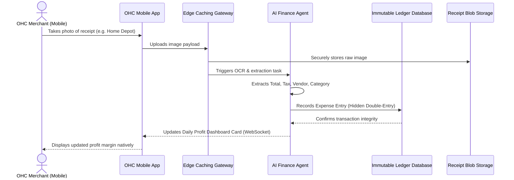

# [Architecture] Autonomous Expense & Profit Tracking Engine

## 1. Title
**Autonomous Expense & Profit Tracking Engine: Zero-Click Financial Clarity for Mobile First Solopreneurs**

## 2. Problem Statement
For OneHumanCorp (OHC)’s core personas—like **Carlos (handyman, 42)** and **Fatima (food cart, 50)**—tracking expenses and understanding true profit margins is a manual, anxiety-inducing chore. They buy supplies (lumber, ingredients) using personal or mixed accounts, lose paper receipts, and often only discover they are losing money at the end of the month. Existing accounting tools (like QuickBooks or Xero) are designed for accountants, requiring technical financial knowledge (ledgers, reconciliation, charting) and desktop interfaces. Our users need a "Zero-Click" mobile-first experience where an AI Finance Agent automatically extracts expenses from receipt photos, categorizes bank transactions invisibly, and instantly shows real-time profit on their phone, passing the "grandmother test" of simplicity.

## 3. Research Report
### Competitive Landscape
*   **QuickBooks/Xero:** Extremely powerful but overwhelming for micro-businesses. Requires desktop setup, charting accounts, and understanding double-entry bookkeeping.
*   **Shopify/Wix:** Excellent for top-line revenue tracking but lack built-in, automated expense tracking and deep profit margin analysis without expensive app integrations.
*   **Expensify:** Good for receipt scanning, but meant for employee reimbursement, not integrated holistic business profit tracking.

### Market Data
*   **60%** of solopreneurs mix personal and business finances due to the friction of setting up dedicated accounting systems.
*   **Top reason** for small business failure is cash flow mismanagement, heavily exacerbated by delayed expense tracking.
*   Users strongly prefer a simple "Money In vs. Money Out" daily dashboard over complex P&L statements.

## 4. Design Doc
### Key Design Decisions
*   **Receipt-First Mobile UX:** The primary entry point for expenses is simply taking a photo of a receipt or forwarding an email. The AI Finance Agent extracts vendor, amount, date, and tax autonomously.
*   **Invisible Ledger:** The underlying data model will use a strict double-entry ledger for integrity, but this complexity is entirely hidden from the user behind a simple "Profit Insights" dashboard card.
*   **AI Auto-Categorization:** The Finance Agent learns from user behavior to automatically categorize recurring expenses without asking, maintaining strict multi-tenant data isolation.
*   **Real-time Profit Margin Alerts:** If a specific service or product (e.g., Carlos's bathroom remodel) is trending below target margins due to supply costs, the AI proactively alerts the user via a plain-language mobile notification.

### Architecture Diagram (Mermaid.js)

### Mobile UX Flow (375px Viewport)
1.  **Dashboard Card:** A clean, macOS-style Translucent Glass card at the top of the app shows "Today's Profit: +$145.00" in green.
2.  **Quick Action:** A persistent floating '+' button opens the camera instantly to snap a receipt.
3.  **Processing State:** A subtle shimmer effect on the profit card indicates the AI is processing the receipt.
4.  **Completion:** The profit number ticks down automatically with a soft haptic feedback, and a small toast says "Added $45.00 from Home Depot". No manual entry forms unless the AI is uncertain (fallback only).
5.  **Insights View:** Tapping the profit card opens a simple pie chart of "Where your money went this week" (e.g., Supplies, Fuel).

### AI Agent Integration Points
*   **Finance Department Agent:** Hooks into the image upload pipeline to perform vision-based extraction (OCR). It also cross-references historical data (Memory Layer) to predict the expense category.
*   **Advisory Department Agent:** Hooks into the Ledger to periodically scan for margin compression (e.g., "Ingredient costs are up 15% this month, consider raising cake prices").

## 5. Implementation Prompt
**To the Implementer:**
Design and implement the `Autonomous Expense Engine` backend and mobile UI components.
Your outcome must allow a user to upload a photo of a receipt, have the AI automatically extract the total and category, and update a real-time Profit Dashboard.
- Build the `Receipt Upload & Vision Processing` pipeline.
- Create an `Invisible Ledger` data structure that ensures strict transactional integrity and multi-tenant isolation, without exposing accounting terminology to the frontend.
- Implement the Mobile UI (375px optimized) showing the Translucent Glass dashboard card for "Daily Profit" and the camera flow.
- Guarantee that processing a receipt updates the frontend via WebSockets in under 3 seconds.
- Ensure Zero Trust rules are applied so users can only access their own receipts and ledgers.
Do NOT prescribe the exact database technology (e.g., Postgres vs Mongo) or the exact vision model, but ensure the architecture supports the described user journey and performance targets.

## 6. Priority
`P1`

## 7. Estimated Scope
Large
