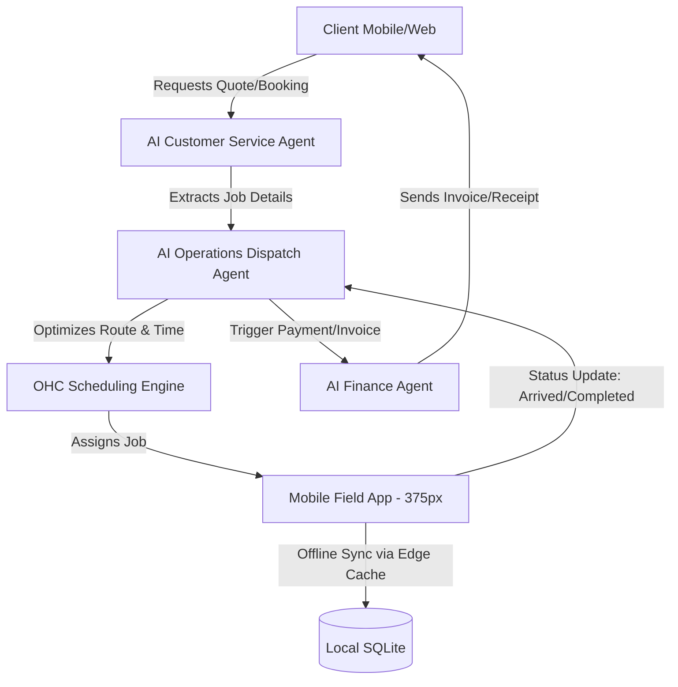

# [architecture] Autonomous Field Service & Mobile Dispatch Engine

## Title
Architect and Implement the Autonomous Field Service & Mobile Dispatch Engine

## Problem Statement
Carlos (42, handyman) runs his business purely from his Android phone. Currently, he loses hours every week trying to map out his route, confirm appointments with clients who aren't responding, and figure out who still owes him money. He frequently shows up to jobs only to realize he doesn't have the right parts because the client's problem description was vague. He needs an intelligent dispatch system that talks to his clients, quotes the job, schedules the routing, and tells him exactly where to go and what to bring—all without him ever opening a laptop or looking at a spreadsheet.

## Research Report
The field service market is heavily dominated by legacy software tailored for desktop use and large fleets:
- **ServiceTitan**: Extremely powerful but requires a dedicated office manager to operate. Far too complex and expensive for a solo operator like Carlos.
- **Jobber / Housecall Pro**: Better suited for small teams, but still heavily reliant on web dashboards. The mobile apps feel like stripped-down versions of the desktop experience rather than native, mobile-first operations hubs.
- **OHC Opportunity**: We can leapfrog these platforms by combining our Zero-Config philosophy with an AI-first approach. Instead of a dispatch board that Carlos has to manage, our AI Operations Department acts as his invisible office manager. The platform automatically schedules, routes, and dispatches based on geolocation, while the AI communicates with clients to gather job requirements before Carlos arrives.

## Design Doc

### Architecture Diagram

### UI Wireframes & 375px Screen Flow
**Screen 1: The "Day Overview" Hub (375px)**
- **Theme**: macOS Translucent Glass over a dynamic, time-of-day contextual background.
- **Components**:
  - Top Card: "Next Job" - A high-contrast, modular Unifi-style card showing the immediate next destination, ETA, and a single massive "Start Route" button.
  - Scrollable List: Timeline of the day's remaining jobs. Each item expands gently when tapped to reveal the AI-summarized job notes (e.g., "Leaky pipe under sink. Need 1/2 inch PVC.").
- **Grandmother Test**: No tiny tabs or dense menus. Just "Where am I going next?" prominently displayed.

**Screen 2: The "Active Job" View**
- **Theme**: Clean, distraction-free modular dashboard card.
- **Components**:
  - Client details and quick-action buttons: Call, Message, Map.
  - "Job Scope" auto-generated by the AI agent based on client chat history.
  - Action Toggle: Swipe-to-complete (like answering a call on iOS), which instantly triggers the Finance Agent to send the invoice and the CS Agent to ask for a review.

### Mobile UX Flow
1. **Morning Briefing**: Carlos opens the app and sees his optimized route for the day, intelligently batched by neighborhood.
2. **En Route**: Taps "Start Route" which opens navigation and triggers the AI to text the client ("Carlos is 15 minutes away!").
3. **On-Site**: The app operates offline-first. Carlos views the AI-gathered notes, fixes the issue, and takes a photo of the completed work.
4. **Completion**: Swipes to finish the job. The app syncs data when connectivity resumes.
5. **Invisible Handoff**: The AI Finance Agent automatically invoices the client using the card on file, completely invisible to Carlos.

### AI Agent Integration Points
- **AI Customer Service Agent**: Engages inbound leads via SMS or Instagram, asks troubleshooting questions to scope the job, and books the time slot.
- **AI Operations Agent**: Monitors the daily schedule, dynamically adjusts routes if a job runs late, and sends automated ETA updates to clients.
- **AI Finance Agent**: Listens for the "Job Completed" event from the mobile app and immediately generates and dispatches an localized invoice or processes the stored deposit.

### Key Design Decisions
- **Mobile-First & Offline-Capable**: Field workers often lose signal in basements or rural areas. The mobile app must aggressively edge-cache the day's jobs and allow offline state mutations, syncing back to the ledger via a resilient background job queue.
- **Zero Trust Isolation (SPIFFE/SPIRE)**: Strict multi-tenant boundaries ensure that Carlos's client details, location data, and financial ledgers are cryptographically isolated from Maya's bakery data.
- **No Implementation Prescription**: The exact data schemas for the route optimizer or the queueing mechanism are left to the implementation swarm. The focus is purely on the user journey and architectural boundaries.

## Implementation Prompt
**Objective**: Build the Autonomous Field Service & Mobile Dispatch Engine for solo operators.
**CUJ (Critical User Journey)**: A service professional opens their mobile app, views an AI-optimized daily route, completes jobs using an offline-capable interface, and relies on background AI agents to handle client ETA notifications and post-job invoicing.
**Acceptance Criteria**:
- The UI must render perfectly on a 375px viewport using the Translucent Glass and modular dashboard card design system.
- The "Next Job" and "Active Job" views must pass the "grandmother test" (understandable and actionable within 30 seconds).
- The system must function gracefully without an internet connection, queuing state changes for later sync.
- AI agents must seamlessly trigger actions (notifications, invoicing) based on the mobile client's state changes.
- Ensure strict multi-tenant isolation for all job and customer data.

## Priority
P1

## Estimated Scope
Large
