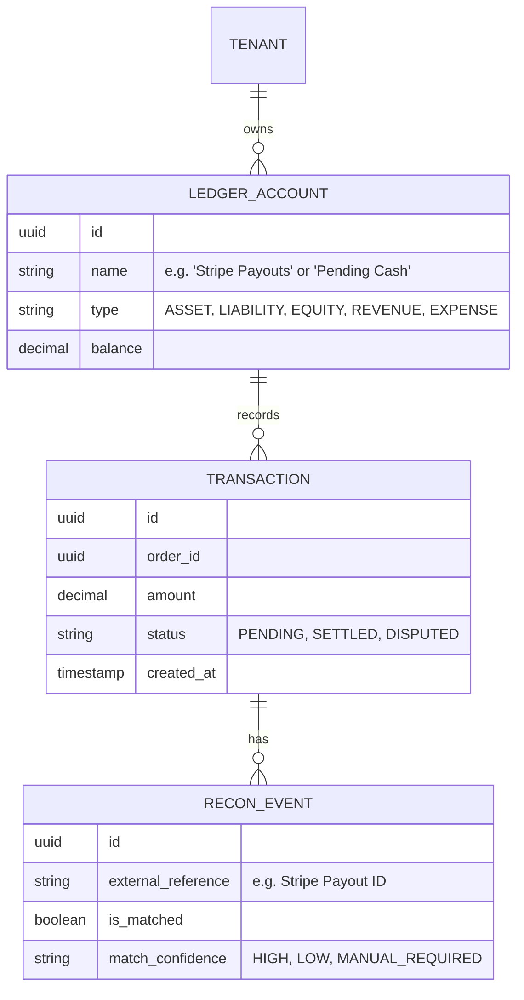

# Title: [Architecture] Autonomous Financial Recon & Audit Trail Engine

## Problem Statement
Small business owners face a major burden when trying to reconcile their bank accounts, payment gateways (like Stripe or PayPal), and their internal sales data. For non-technical users like Maya or Carlos, identifying missing payouts, matching bulk deposits to individual orders, or handling disputes (chargebacks) requires matching up data across 3 different systems. Currently, this process is entirely manual or requires expensive third-party tools (like QuickBooks or Xero), introducing complexity and friction. There is a missing capability for a true real-time, autonomous reconciliation engine that matches multi-channel transactions.

## Research Report
* **Competitor Audit**:
  * **Shopify**: Provides payout reports, but matching external bank deposits back to specific orders is often convoluted. Chargeback management exists but requires manual evidence submission.
  * **Wix**: Basic financial reporting, but lacks true double-entry ledger reconciliation natively.
  * **QuickBooks/Xero**: Industry standards, but they are separate systems that require complex syncs, often breaking or requiring accountant intervention.
* **OHC's Opportunity**: We can architect an `Autonomous Financial Recon Engine` that functions as a background agent. It continually ingests webhook data from payment providers and matches it against the OHC `Universal Capacity Ledger` and order data, automatically flagging discrepancies or handling straightforward chargeback defenses invisibly.

## Design Doc
### Business Journey Mapping
1. **Activation**: OHC automatically provisions a secure ledger for the tenant.
2. **Operations**: Carlos completes a handyman job, and the payment is processed. The transaction is recorded in OHC.
3. **Reconciliation**: Two days later, a bulk payout hits Carlos's bank. The `Financial Recon Engine` automatically matches the bulk amount to the 15 individual OHC transactions that comprise it, marking them as `RECONCILED`.
4. **Exception Handling**: If a chargeback occurs, the engine automatically pulls the signed quote and GPS check-in data from Carlos's job, assembling and submitting the defense to Stripe without Carlos having to lift a finger.

### Data Model & Invariants

### Mobile-First UX Flow (375px First)
* **Zero Jargon**: Hide all accounting terms (Debits, Credits, Chart of Accounts) behind an "Advanced Mode".
* **Dashboard Card**: A "Money Flow" card simply shows "Pending Payouts: $450" and "Arriving Tomorrow: $200".
* **Alerts**: If a mismatch occurs, the owner gets a simple 1-tap notification: "We found a $5 discrepancy from your weekend market sales. Tap to review."

### Zero Trust & Security
* **Isolation**: All financial data is strictly partitioned by `tenant_id` via PostgreSQL Row Level Security (RLS).
* **Immutability**: Transactions cannot be deleted or modified; corrections are made via offsetting entries.

## Implementation Prompt
**Goal**: Implement the core `Autonomous Financial Recon Engine` to automate the matching of payment gateway payouts to internal orders.

**Core User Journey (CUJ)**:
A bulk payout from Stripe arrives via webhook. The engine must query the internal `TRANSACTION` records, match the individual transactions that sum to the bulk payout amount (accounting for fees), and mark those specific orders as `RECONCILED`.

**Acceptance Criteria**:
1. Create the immutable ledger data model supporting Debits/Credits but exposed via a simplified API.
2. Implement an background worker (via the High Performance Agentic Background Job Queue) to process incoming `payout.paid` webhooks.
3. The worker must successfully match the payout to internal orders and create a `RECON_EVENT`.
4. Ensure strict multi-tenant isolation and SPIFFE/SPIRE authentication for the background worker.

## Priority
P1

## Estimated Scope
Medium
