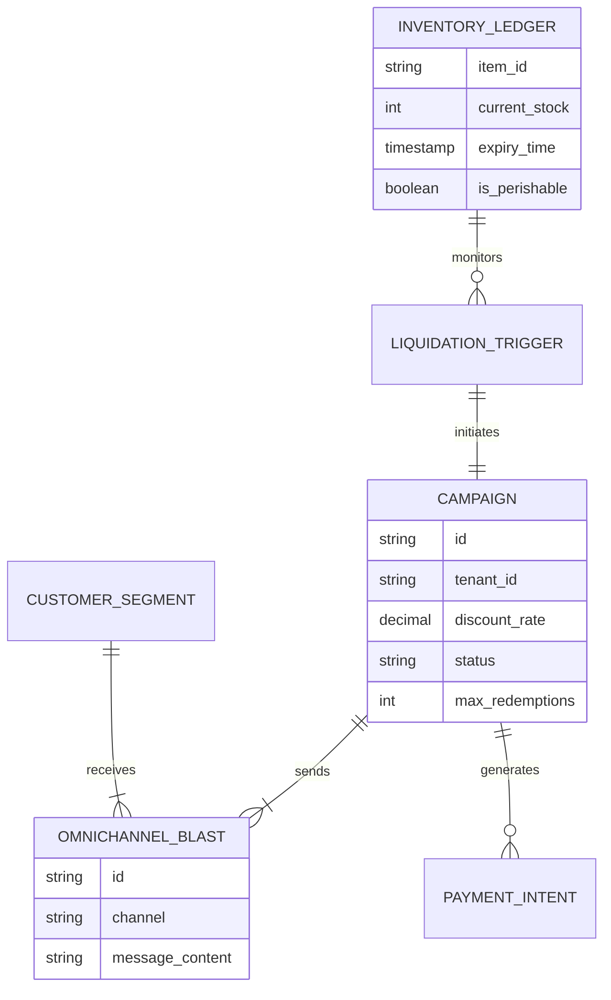
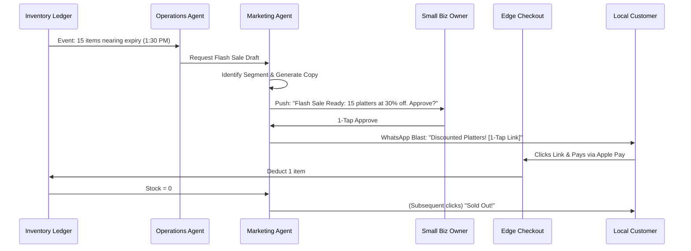

# [architecture] Autonomous Flash Sale & Inventory Liquidation Engine

## Title
Autonomous Flash Sale & Inventory Liquidation Engine

## Problem Statement
For small business owners dealing with perishable goods or time-sensitive inventory—like **Fatima (food cart, 50)** with leftover halal pre-orders at the end of the lunch rush, or **Maya (baker, 28)** with unsold morning pastries—excess stock means lost revenue and wasted food. Currently, liquidating this inventory requires manual intervention: identifying what's left, calculating a discount, drafting a promotional message, and blasting it out on social media or WhatsApp. It's a high-friction process that most owners skip because they are too busy operating their business. They need an invisible, autonomous engine that monitors inventory risk, intelligently drafts a flash sale offer, and blasts it to loyal customers via SMS or WhatsApp with a 1-tap checkout link, requiring only a single lock-screen approval from the owner.

## Research Report
Current SMB platforms and marketing tools fail to provide autonomous, inventory-driven liquidation out-of-the-box:
*   **Shopify + Klaviyo:** Highly capable but complex. Requires the user to manually set up inventory triggers, create customer segments, design email/SMS templates, and manage the campaign. Far too advanced for Fatima's daily use.
*   **Wix/Squarespace:** Focuses on static coupons. Lack native SMS blasts tied directly to real-time inventory levels.
*   **Square Marketing:** Offers text marketing, but campaigns are manually triggered and not proactively suggested based on real-time perishable inventory data.

**OHC's Opportunity:** By deeply integrating the Universal Capacity and Inventory Ledger with the Omnichannel AI Inbox and Marketing Agent, OHC can proactively turn potential waste into instant revenue. The system will autonomously detect slow-moving or end-of-day perishable stock, draft a targeted SMS/WhatsApp blast to previous customers, and execute the sale with a 1-tap Apple/Google Pay link—all triggered by a single "Approve" button on the owner's phone.

## Design Doc

### Business Journey Mapping (Fatima the Food Cart)
1.  **Detection:** At 1:30 PM, the *Operations Agent* detects that Fatima has 15 unsold Halal Chicken platters remaining from her daily prep.
2.  **AI Department Coordination:**
    *   *Inventory Agent* flags the 15 platters as "perishable/liquidation-risk".
    *   *Marketing Agent* drafts a geo-targeted WhatsApp campaign to customers who have ordered lunch in the past 30 days.
    *   *Pricing Agent* applies a 30% "End of Lunch" discount and generates 1-tap payment links.
3.  **Owner 1-Tap Approval:** Fatima receives a push notification: "15 Chicken Platters left. Send 30% off Flash Sale to 40 locals? [Approve] [Edit]". Fatima taps Approve.
4.  **Activation/Blast:** The engine blasts the WhatsApp message. Customers see: "Hungry? Fatima has 15 Chicken Platters left for $7! Tap to claim yours before they're gone: [Link]".
5.  **Conversion:** Customers tap the link and pay instantly via Apple/Google Pay.
6.  **Fulfillment:** Inventory automatically decrements, and Fatima's KDS (Kitchen Display System) dings with the new pickup orders. The campaign halts autonomously when stock hits zero.

### Architecture Diagram

### Mobile UX Flow (375px Viewport)
1.  **The Notification:** A rich push notification surfaces proactively: "Action Recommended: Liquidate 15 Chicken Platters".
2.  **The Approval Card:** Tapping the notification reveals a translucent, glassmorphic card.
    *   **Context:** "You have 15 Chicken Platters expiring in 2 hours."
    *   **The Offer:** "Send WhatsApp blast to 40 recent customers: 30% off ($7.00)."
    *   **Actions:** A massive primary "Send Blast" button and a smaller "Edit" button.
3.  **The Live Tracker:** Once approved, the card transforms into a live "Flash Sale Active" widget showing real-time inventory count (e.g., "10 left... 4 left... Sold Out") and revenue recovered.

### Performance & Offline Targets
*   **Edge Caching:** The 1-tap checkout link must be edge-cached to handle sudden bursts of traffic from the SMS blast without hitting the central database for every page load.
*   **Concurrency Handling:** The checkout engine must strictly enforce inventory invariants to prevent overselling during high-concurrency flash sales (e.g., 40 people clicking a link for 15 items).
*   **Zero Trust:** The Marketing Agent operates within strict tenant boundaries, only accessing customer segments and inventory belonging to the specific business.

## Implementation Prompt
**To the Implementer Swarm:**
Implement the Autonomous Flash Sale & Inventory Liquidation Engine. This capability empowers the Operations and Marketing Agents to proactively detect slow-moving or perishable inventory and automatically orchestrate a targeted flash sale campaign.

**Acceptance Criteria:**
*   The engine autonomously triggers based on predefined inventory rules (e.g., time-to-expiry or low velocity).
*   The Marketing Agent successfully drafts personalized, geo-targeted SMS/WhatsApp messages using customer history.
*   The system generates highly concurrent, edge-cached 1-tap checkout links that strictly enforce inventory limits to prevent overselling.
*   The business owner experience is entirely mobile-first, requiring only a single lock-screen approval to launch the campaign.
*   Campaigns must gracefully and automatically close the moment inventory reaches zero, updating the checkout link to display a "Sold Out" state.
*   Strict multi-tenant data isolation must be enforced for all generated campaigns and customer segments.
*   Do not prescribe specific database schemas or API endpoints; design the internal system details to meet these requirements.

## Priority
P1 (High) - Major revenue recovery mechanism for food/beverage and retail personas.

## Estimated Scope
Medium
