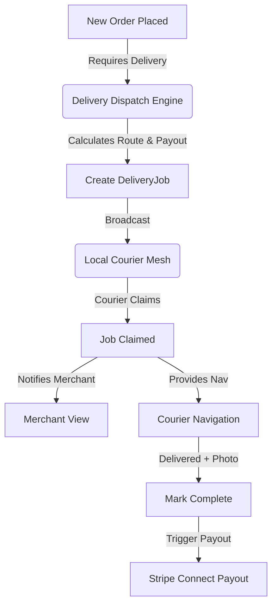

# Research Report: Autonomous Fractional Local Delivery Network (AFLDN)

## Problem Statement
Small business owners like Maya (the baker) and Fatima (the food cart operator) struggle with last-mile local delivery. Third-party apps (UberEats, DoorDash) charge exorbitant commissions (up to 30%), eating entirely into SMB margins. Managing in-house drivers is too complex (coordinating schedules, routing, payments) for a non-technical owner. They need a zero-commission, flat-fee, or fully autonomous way to offer local delivery to their customers, seamlessly integrated into the OHC order flow.

## Research Report
- **Market Gap:** Shopify offers local delivery settings, but leaves the *execution* entirely to the merchant (routing apps, hiring drivers). Wix and Squarespace similarly just offer "shipping zones." DoorDash/UberEats own the network but extract punitive fees.
- **The Opportunity:** OHC can pioneer a "Fractional Delivery Mesh." Imagine a collective of local independent couriers (or just local teenagers with bikes/cars) who can sign up via a localized OHC portal. When Maya gets a cake order for Friday, OHC's Operations Agent automatically broadcasts a delivery bounty to the local mesh.
- **Competitive Advantage:** OHC brings the demand (the merchants) and the software (routing, payouts via Stripe Connect) without charging the 30% take rate. Merchants can even bring their *own* dedicated drivers into the mesh, and OHC handles the routing and payment calculation automatically.

## Design Doc
### Architecture
The system requires three core components:
1.  **Merchant Config:** Delivery zones (polygons or radius), fee structures (flat, distance-based, or passed to customer), and driver fleet preference (Own Fleet vs. Open Local Mesh).
2.  **Delivery Dispatch Engine (DDE):** A background processor that monitors new orders. If an order requires delivery, the DDE creates a `DeliveryJob`, calculates the optimal route (via Google Maps API or OSRM), and determines the payout.
3.  **Courier Interface (PWA):** A simple, mobile-optimized view for couriers to view available `DeliveryJobs`, claim them, view navigation, mark picked up, and mark delivered (with photo proof).

**Mermaid Diagram:**

### UX Flow (Mobile-First 375px)
*   **Merchant Side:** A toggle in Settings -> Delivery. "Enable Local Delivery." Set radius (e.g., 5 miles). Set fee ($5).
*   **Courier Side (PWA):** A minimalist list of available jobs in their area. "Pick up Cake at Maya's (0.5m) -> Deliver to 123 Main St (2.1m) - $7.00". One-tap "Claim".
*   **Customer Side:** Checkout shows "Local Delivery ($5)" option if their address falls within the merchant's radius.

### AI Agent Integration
*   **Operations Agent:** Monitors the `DeliveryJob` status. If a job isn't claimed within X minutes of the required pickup time, the agent alerts the merchant proactively via push notification.
*   **Customer Success Agent:** Automatically texts the customer: "Hi! Carlos is on his way with your order. Track him here: [Link]".

## Implementation Prompt
Implement the Core Data Model and Dispatch Logic for the Autonomous Fractional Local Delivery Network.
1.  Create PostgreSQL tables for `delivery_zones` (linked to `tenant_id`), `delivery_jobs`, and `couriers`.
2.  Implement the gRPC/REST API endpoints for merchants to configure delivery settings and for couriers to claim/update jobs.
3.  Implement the background worker (Delivery Dispatch Engine) that listens for new eligible orders, calculates distance/payout, and creates the `delivery_jobs`.
4.  Ensure Stripe Connect payout integration for when a job is marked completed.
5.  Build the Courier PWA view (Flutter) with a list of available jobs and a detail view with a "Claim" button.

## Priority
P1

## Estimated Scope
Large
