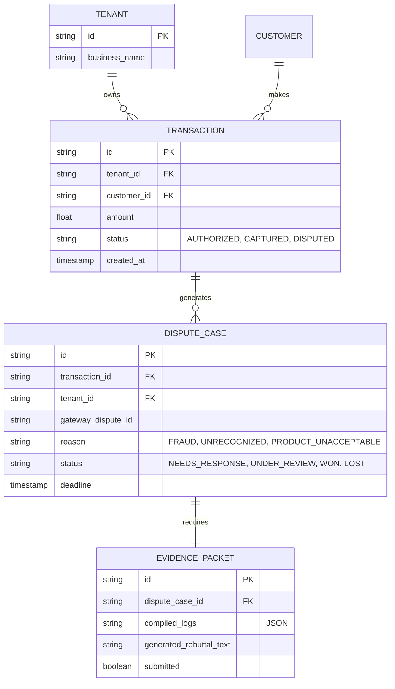

### Title
[Architecture] Autonomous Fraud & Dispute Resolution Engine

### Problem Statement
For small business owners like Priya (Boutique) and Maya (Baker), dealing with chargebacks and fraudulent orders is a massive source of anxiety and lost revenue. When a dispute occurs, platforms like Stripe or Shopify present a highly technical interface demanding complex "evidence packets" (shipping logs, customer communications, IP logs). Non-technical owners lack the time and expertise to compile this, leading to lost disputes and penalties. They need an invisible shield that automatically evaluates transaction risk and, when a dispute happens, autonomously gathers evidence and fights it on their behalf without requiring legal or technical knowledge.

### Research Report
**Market Gap & Competitor Audit**
*   **Stripe/Shopify:** Offer fraud detection (e.g., Stripe Radar), but dispute resolution is highly manual. The merchant must gather and upload evidence (PDFs, screenshots) manually.
*   **Wix/Squarespace:** Rely entirely on underlying payment gateways, offering no integrated platform-level defense.
*   **Specialized Tools (Signifyd, Chargehound):** Enterprise-focused, expensive, and require complex API integration. Unsuitable for micro-businesses.

**OHC's Differentiator: The AI Teammate**
OHC can uniquely solve this by leveraging our unified data architecture. Because OHC controls the entire journey (Customer Success DMs, Operations shipping logs, Finance ledgers), our AI Agent Departments can autonomously compile the full context of a transaction to defend against chargebacks instantly.

### Design Doc

#### 1. Architectural Overview & AI Coordination
*   **Finance Dept (The Auditor):** Continuously monitors the `TransactionLedger`. Detects incoming dispute webhooks from payment gateways.
*   **Customer Success Dept (The Ambassador):** Automatically queried to provide all chat history (IG DMs, WhatsApp) related to the disputing customer to prove communication and intent.
*   **Operations Dept (The Manager):** Automatically queried to provide fulfillment proof (shipping labels, delivery photos, event attendance records).
*   **Legal Dept (The Defender - New Sub-Agent):** Synthesizes data from CS and Ops to generate a comprehensive, gateway-formatted `EvidencePacket`. Submits it via API on behalf of the merchant.

#### 2. Mobile UX Flow (375px First)
*   **Notification:** A gentle, plain-language notification: *"A customer disputed a $50 charge. We've gathered the shipping receipt and chat logs to fight it. Review & Submit?"*
*   **Review Screen:** A simple card interface showing the generated evidence summary.
*   **Action:** A single large button: "Submit Evidence". No PDFs to upload, no forms to fill out.

#### 3. Data Model & Invariants

#### 4. Technical Integrity & Security
*   **Multi-Tenant Isolation:** Strict partitioning by `tenant_id` at the database and application level. The Legal Agent must authenticate via SPIFFE/SPIRE, and can only access the `Transaction`, `Communications`, and `Fulfillment` tables for the specific `tenant_id` associated with the webhook.
*   **Performance:** Generating the evidence packet should happen asynchronously via a background queue. The mobile review screen must load the cached packet in <150ms.
*   **Zero Trust Boundaries:** Internal agents (The Defender) querying other departments (The Manager) must use internal, short-lived JWTs mapped to the specific `tenant_id`.

### Implementation Prompt
Implement the Autonomous Fraud & Dispute Resolution Engine backend and mobile UI.
1. Create background workers that listen for `chargeback.created` events from our payment gateways.
2. Implement the `Legal Agent` logic to cross-reference the OHC global unified inbox and order fulfillment ledgers to auto-generate an `EvidencePacket`.
3. Design a mobile-optimized (375px) UI component in the Activity Feed that alerts the user and allows them to approve the auto-generated response with 1 tap.
4. Ensure all database queries enforce strict multi-tenant isolation by `tenant_id`. Do not prescribe specific frameworks or SQL schemas.

### Priority
P1

### Estimated Scope
Large
