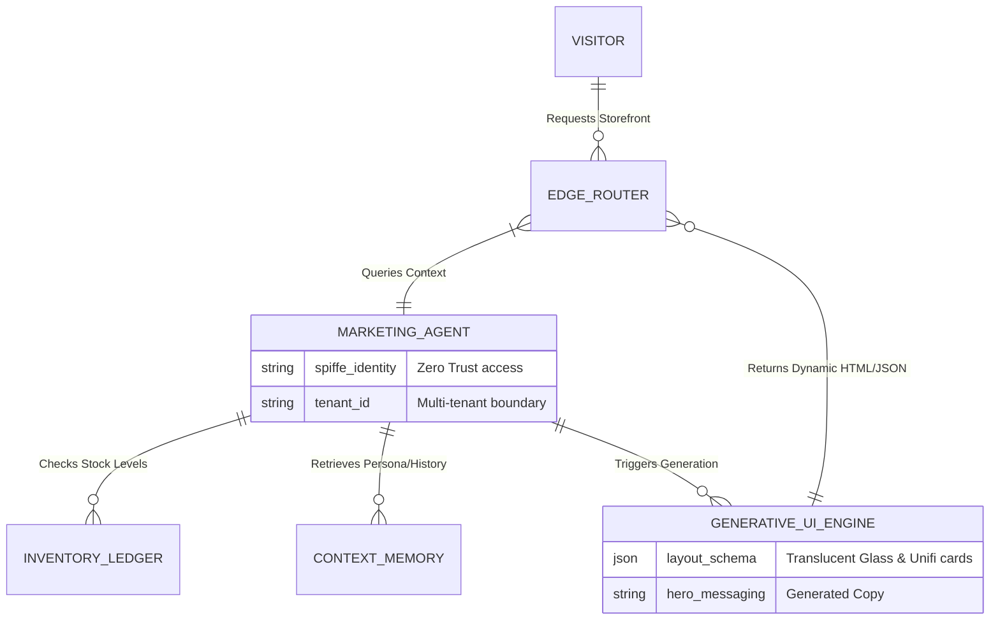

# Title
Autonomous Generative Merchandising Engine

## Problem Statement
Small business owners like Priya (Boutique) and Maya (Baker) struggle to keep their digital storefronts engaging and relevant. Currently, they must manually re-arrange product layouts, update featured items based on seasons or time of day, and craft specific landing pages for different customer segments. This static approach leads to low conversion rates because a morning coffee customer sees the same layout as an evening custom cake buyer. They need an intelligent, dynamic storefront that autonomously acts like an elite merchandiser—adapting the layout, product order, and messaging in real-time based on inventory levels, time of day, and the visitor's intent, without requiring the owner to touch a drag-and-drop builder.

## Research Report
*   **Current Architecture Limits:** Platforms like Shopify and Wix rely on static templates. Merchants spend hours adjusting layouts or rely on expensive, rigid "personalization" plugins that require complex rule configuration. OHC currently provides a fast setup, but the resulting storefront is static.
*   **Competitor Analysis:**
    *   *Shopify:* Strong merchandising tools, but completely manual. Merchants must create specific collections and rules. Third-party apps (e.g., Nosto) offer AI personalization but are costly and complex to integrate.
    *   *Wix/Squarespace:* Basic layout control. No real-time AI adaptation based on inventory or context.
*   **Discovery:** The core gap is the absence of an invisible "merchandising brain." OHC's architecture, heavily reliant on a multi-tenant edge-caching layer and the AI Agent Departments, is perfectly positioned to deliver a **Generative Merchandising Engine**. This engine will utilize the Marketing Agent to dynamically compile the storefront UI on the edge for each visitor, prioritizing high-margin items, hiding low-stock items automatically, and adjusting hero messaging based on contextual signals (time, location, referral source).

## Design Doc

### Architecture Diagram

### Mobile UX Flow (375px)
*   **Visitor View (Morning vs. Evening):**
    *   *Morning:* A visitor accesses Maya's bakery link at 8 AM. The Generative UI automatically surfaces a clean, full-width Unifi-style card featuring "Fresh Morning Pastries" and a quick "Pre-order Coffee" button.
    *   *Evening:* At 6 PM, the same link dynamically shifts its layout. The hero image changes to "Custom Cake Consultations," bringing booking calendar slots to the top of the feed and pushing breakfast items down.
*   **Merchant View (Command Center):**
    *   Maya does not configure rules. She simply sees an Activity Feed notification from the Marketing Agent: *"I've highlighted Custom Cakes for the evening traffic since your weekend slots are opening up."* with a simple [View Store] or [Revert] action button.

### Key Design Decisions & Invariants
*   **Edge Generation:** To guarantee sub-100ms load times, the Generative UI Engine must operate at the edge, utilizing heavily cached component fragments rather than generating the entire DOM from scratch on every request.
*   **Zero-Config Rule Engine:** The system must not expose a complex rules builder (e.g., "IF time > 5PM THEN show Cakes"). The Marketing Agent autonomously infers these rules based on business type and past conversion data.
*   **Visual Excellence:** All generated layouts must adhere strictly to the OHC visual mandate: macOS-style Translucent Glass materials and Unifi modular dashboard cards.
*   **Tenant Isolation:** The context memory and inventory lookups must be strictly scoped to the `tenant_id` to prevent data leakage.

### AI Agent Integration Points
*   **Marketing Agent:** The core brain of the operation, deciding *what* to show based on external context and internal business goals.
*   **Operations Agent:** Feeds real-time inventory signals to the Marketing Agent to ensure sold-out items are automatically demoted or hidden.

## Implementation Prompt
Implement the Autonomous Generative Merchandising Engine. Build the `GenerativeUIEngine` module that interfaces with the `MarketingAgent` and `InventoryLedger` to dynamically construct and re-order storefront components (hero sections, product grids, booking widgets) based on real-time visitor context (time, location) and stock levels. The output must be standard OHC UI fragments adhering to the Translucent Glass and Unifi card design systems. Ensure the generation process is heavily optimized for edge caching to maintain sub-100ms response times. Enforce strict `tenant_id` scoping for all memory and inventory reads. The merchant experience should require zero manual configuration, relying solely on autonomous operation and 1-tap notifications in the Activity Feed.

## Priority
P0

## Estimated Scope
Large
