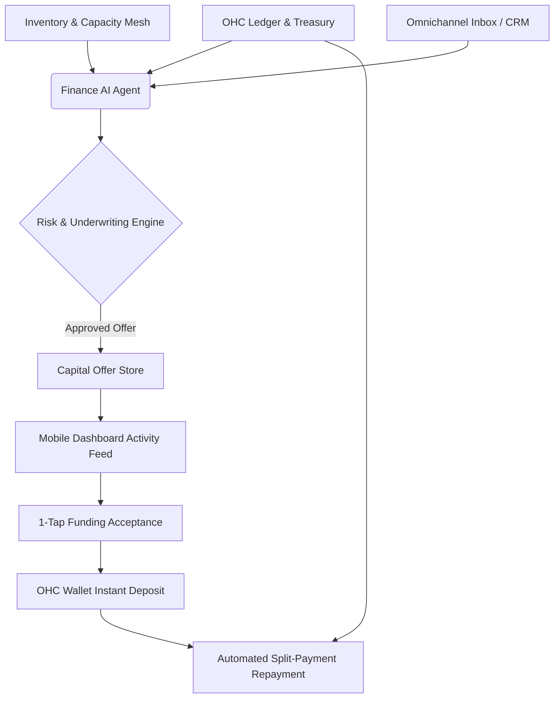

# [Architecture] Autonomous Growth Capital & Revenue-Based Financing Engine

## 1. Title
**Autonomous Growth Capital & Revenue-Based Financing Engine: Zero-Application Funding**

## 2. Problem Statement
For small business owners like **Maya (baker)**, **Carlos (handyman)**, and **Fatima (food cart operator)**, accessing growth capital is incredibly painful. When Maya needs $5,000 to buy a commercial mixer to fulfill a sudden influx of large wedding orders, she has to pause her business, gather months of bank statements, fill out complex loan applications at a traditional bank, and wait weeks for a decision based on an arbitrary personal credit score.

Legacy platforms (Shopify Capital, Square Loans) have started addressing this by offering revenue-based financing, but they often present static offers that the user must manually discover and apply for. They do not dynamically anticipate the need for capital based on predictive AI modeling of upcoming inventory needs, seasonal trends, or a sudden spike in booking requests. These owners need an invisible financial partner that understands their real-time cash flow and inventory constraints, proactively offering instant, zero-application capital exactly when it is needed to unblock growth, and paying it back invisibly through a percentage of daily sales.

## 3. Research Report
### Market Gap & Competitor Analysis
*   **Shopify Capital / Square Loans / Stripe Capital**: These are the gold standards for embedded lending. They use historical platform revenue to pre-qualify merchants for cash advances, which are paid back automatically via a percentage of daily sales. However, the experience is largely reactive: the merchant must check their dashboard to see if an offer exists and manually accept it.
*   **Traditional Banks (Chase, BofA)**: Require extensive paperwork, personal guarantees, high credit scores, and weeks of underwriting. Completely incompatible with the speed of micro-merchants.
*   **The OHC Opportunity**: OHC possesses a deeper, more holistic view of the business than just payment processing. Because OHC integrates inventory, calendar bookings, and AI agent interactions, we can *predict* capital needs. For instance, if the AI Booking Agent notices Carlos is booked out 3 months in advance and rejecting jobs, the Capital Engine can proactively offer a micro-loan to hire a temporary apprentice, displaying exactly how the ROI works out based on his current lead volume.

## 4. Design Doc

### Architecture Diagram (Mermaid.js)

### UI Wireframes & Screen Flow Description (375px First)
*   **The Proactive Nudge (Activity Feed)**: A sleek, macOS-style translucent card appears in the main dashboard feed.
    *   *Headline*: "Unlock Growth: $5,000 available for a commercial mixer."
    *   *Contextual Note*: "Based on your recent order spikes, upgrading equipment could increase your weekly revenue by 30%."
*   **The Offer Detail Sheet (Bottom Sheet)**: Tapping the card slides up a smooth bottom sheet.
    *   *Hero Number*: **$5,000.00** instantly deposited to OHC Wallet.
    *   *Terms Breakdown*: Clean, jargon-free list. "Pay a flat fee of $400. We will automatically deduct 10% from your future daily sales until $5,400 is paid off."
    *   *Interactive Slider*: A sleek slider allowing the user to adjust the funding amount from $1,000 up to their maximum approved limit, instantly recalculating the flat fee and repayment percentage.
*   **The 1-Tap Action**: A prominent, pill-shaped primary button: "Accept & Fund Instantly". Tapping it requires FaceID/TouchID verification.
*   **Post-Acceptance**: A celebratory micro-interaction (confetti/sparkles) and an immediate notification that funds are available to spend via their virtual OHC Debit Card.

### Mobile UX Flow
1.  **Discovery**: User logs in and sees a contextual, highly relevant funding offer in their feed, triggered not randomly, but by a specific business event (e.g., low inventory on a best-selling item).
2.  **Evaluation**: User reviews the transparent, simple terms (no interest rates, just a flat fee + daily repayment percentage) on a single screen without scrolling through dense legal text.
3.  **Execution**: User adjusts the slider if needed, authenticates via biometrics, and the funds are instantly available in their OHC Wallet.
4.  **Repayment Tracking**: A small, persistent progress ring on their Wallet tab shows the repayment status, updating incrementally with every new sale.

### AI Agent Integration Points
*   **Finance Agent (The CFO)**: Monitors daily cash flow, revenue velocity, and seasonality to determine the maximum safe offer amount and repayment percentage.
*   **Operations Agent (The Manager)**: Signals the Finance Agent when inventory is critically low but sales velocity is high, or when the calendar is fully booked, suggesting the business needs capital to expand capacity.
*   **Underwriting Engine (Background)**: Continuously evaluates the merchant's OHC transaction history (Zero-Trust basis, relying only on on-platform data) to update pre-qualified offer limits nightly.

### Key Design Decisions
*   **Revenue-Based Financing (RBF) over Traditional Loans**: RBF aligns our success with the merchant's. If they have a slow day, they pay less. There are no compounding interest rates, just a transparent flat fee.
*   **Event-Driven Offers**: Offers are not just static banner ads; they are contextual nudges tied to specific operational bottlenecks (e.g., "You are turning away catering orders. Here is $2k to buy more supplies").
*   **Instant Wallet Deposit**: Funds must be instantly usable via the OHC Treasury virtual card, enabling immediate purchasing without waiting for ACH transfers to external banks.
*   **Zero-Application**: The underwriting happens invisibly in the background. If an offer is presented, it is already fully approved. The user never fills out a form.

## 5. Implementation Prompt
Implement the Autonomous Growth Capital Engine. Create the backend services necessary to analyze merchant transaction history and operational data to generate pre-qualified Revenue-Based Financing offers. Define the data models for `CapitalOffer` and `CapitalAdvance`. Expose a secure, mobile-first API for retrieving active offers and accepting an advance. Implement the background job that listens for incoming sales and autonomously routes the agreed-upon repayment percentage to a dedicated repayment ledger account before depositing the remainder into the merchant's available balance. Ensure all financial calculations are precise and handled idempotently. Do not prescribe specific external banking APIs; design the internal abstraction layer that interfaces with the OHC Treasury system.

## 6. Priority
`P1`

## 7. Estimated Scope
Large