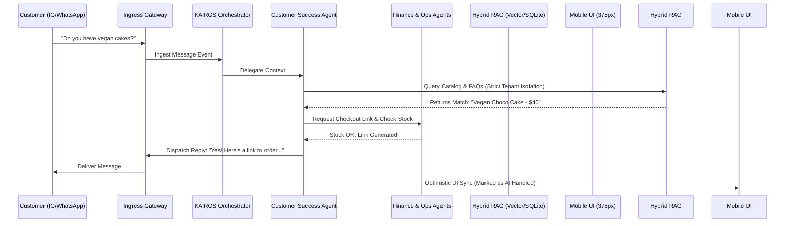
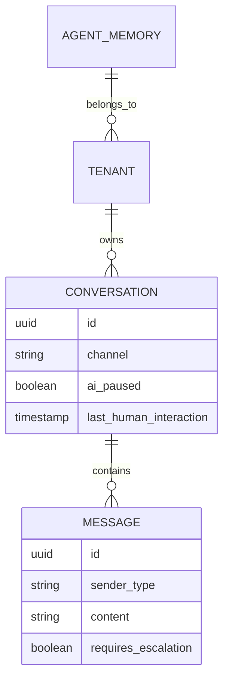

# Title
Autonomous Inbox Handler: The Omnichannel Customer Success Engine

## Problem Statement
Small business owners like Maya (baker) and Carlos (handyman) lose sales because they cannot respond instantly to Instagram DMs or SMS inquiries while actively working, driving, or sleeping. Customers expect immediate answers to questions like "Do you do vegan cakes?" or "What's your hourly rate?". While a unified inbox aggregates messages, it still requires manual typing. OHC needs an invisible AI engine that autonomously negotiates, answers FAQs from the catalog, and captures leads seamlessly 24/7.

## Research Report
- **Codebase & Competitor Audit**: Traditional platforms (Shopify Inbox, Wix Chat) offer simple "Away" messages or rigid decision-tree chatbots that require explicit programming. They lack multi-tenant autonomous AI capable of executing actions across different channels.
- **The Gap**: OHC currently lacks a background job capability that connects the `unified_inbox` to a proactive Customer Success AI capable of instantly answering, quoting, and converting leads based on real-time inventory and availability.
- **Data & Market Validation**: 80% of SMB social media messages are variations of "Is this available?", "How much?", or "Can you accommodate a custom request?" An autonomous agent can resolve these instantly or intelligently escalate complex requests, dramatically increasing conversion rates without human intervention.

## Design Doc

### Architecture Diagram

### Business Journey Mapping
- **Acquisition & Activation**: Customer discovers Maya on Instagram and DMs her. The AI instantly replies with availability, activating the lead immediately instead of waiting 6 hours for Maya to finish baking.
- **Revenue & Retention**: AI generates a payment link seamlessly within the chat. Customer pays; AI sends a thank-you note and loyalty points, closing the loop. Maya only sees a "You received a $40 payment" notification.

### Data Model & Invariants

- **Invariants**:
  1. `ai_paused` must be set to TRUE for a configurable TTL (e.g., 2 hours) the moment `sender_type == 'HUMAN_OWNER'`, ensuring the AI never talks over the business owner.
  2. Strict multi-tenant isolation: An agent querying `AGENT_MEMORY` must include a cryptographically signed tenant context (via SPIFFE/SPIRE).

### AI Department Coordination
- **Customer Success (CS) Agent**: Triage, intent classification, and direct reply generation using tone-matched memory.
- **Operations Agent**: Called by CS to verify real-time inventory limits before confirming a product is available.
- **Finance Agent**: Called by CS to generate secure payment links injected directly into the chat response.

### Mobile-First UX Flow (375px)
- **Unified Inbox Feed**: Thread list with a clean Glassmorphism backdrop. Threads actively handled by AI have a subtle purple "✨ Sparkle" badge. Threads needing Maya's attention have a red "Needs Human" badge.
- **Thread Detail**: AI messages are distinctively styled (e.g., subtle bordered bubbles). Bottom input bar includes a prominent "Take Over" button.
- **Performance targets**: The list must load in under 1.5s on a 4G connection. Interactions must be instant via optimistic UI rendering.

### Zero Trust & Security
- **Data Segregation**: Vector embeddings for past conversations and catalogs are strictly partitioned.
- **Identity**: The KAIROS Orchestrator uses short-lived tokens to grant the Customer Success Agent read-only access to the catalog and write access only to the specific conversation thread.

## Implementation Prompt
**To Implementer Agent:**
Build the Omnichannel Autonomous Support Engine within the KAIROS framework.
1. Implement the background listener in the unified inbox service to forward inbound events to the KAIROS Orchestrator.
2. Develop the Customer Success AI role, including its RAG capabilities to query the local SQLite/Vector catalog ensuring strict multi-tenant isolation.
3. Implement the `ai_paused` state invariant: if the human owner replies, suppress the agent for that thread for 2 hours.
4. Coordinate the Customer Success agent with Finance/Ops to generate and append payment links for purchase intents.
5. Update the mobile UI (`InboxView`) to render AI messages using the OHC design system (Glassmorphism, 44x44px touch targets) and include the "✨ Sparkle" and "Needs Human" badges.

## Priority
P0

## Estimated Scope
Large
