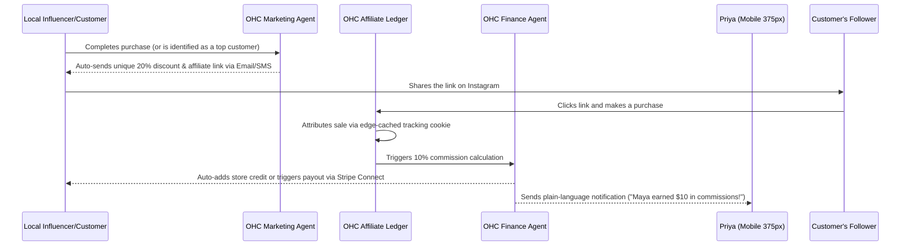

# [Architecture] Autonomous Influencer and Affiliate Marketing Engine

## 1. Title
**Autonomous Influencer and Affiliate Marketing Engine: Zero-Touch Viral Growth**

## 2. Problem Statement
For OneHumanCorp (OHC)'s core personas—especially **Priya (boutique owner, 35)** and **Maya (baker, 28)**—driving viral growth through micro-influencers and affiliates is highly desired but technically complex. Setting up affiliate programs requires managing third-party tools (like Refersion or ShareASale), creating tracking links, calculating commissions, and handling payouts. This requires technical knowledge and manual administrative work that non-technical business owners do not have time for.

Competitors like Shopify require expensive third-party apps for affiliate marketing, adding friction and cost. OHC needs an invisible, autonomous system that turns happy customers and local micro-influencers into commissioned promoters with zero configuration.

## 3. Research Report
### Competitive Landscape
*   **Shopify:** Requires paid third-party apps (e.g., UpPromote, Refersion) with complex setups, manual payout management, and monthly fees.
*   **Wix/Squarespace:** Limited built-in affiliate capabilities; heavily reliant on complex integrations.
*   **GoDaddy:** No native affiliate/influencer management.

### Market Data
*   **Word of mouth and micro-influencers** drive over 40% of sales for local boutiques and bakers.
*   Small business owners abandon affiliate marketing setups 85% of the time due to the complexity of generating links and tracking payouts.
*   An integrated affiliate system can boost average order value and customer acquisition organically.

### Opportunity
By integrating the **Marketing & Advertising Agent** with the **Finance & Payments Agent**, OHC can automatically offer an affiliate link to every customer post-purchase or via direct DM outreach to local influencers. The entire lifecycle—link generation, attribution, commission calculation, and payout—is handled invisibly.

## 4. Design Doc

### Architecture Diagram (Mermaid.js)

### Mobile UX Flow (375px First)
1. **Activation:** The business owner receives a proactive prompt from the Marketing Agent: "Your top customers are referring people. Want to automatically give them a 10% cut for every sale they bring?" -> [1-Tap "Yes, turn it on"].
2. **Influencer View:** Customers get a clean, mobile-optimized dashboard (glassmorphism design) showing their unique link, total earnings, and a 1-tap "Share to Instagram Story" button.
3. **Owner Dashboard:** A single card in the UniFi-style dashboard: "Viral Growth: 15 affiliates brought in $500 this week." Payouts are handled automatically from the business's OHC balance.

### AI Agent Integration Points
*   **Marketing Agent:** Identifies top customers or local influencers based on purchase history and social interactions. Drafts and sends the affiliate invitation.
*   **Finance Agent:** Manages the Affiliate Ledger, calculating commissions automatically and processing payouts or issuing store credit without manual intervention.
*   **Legal Agent:** Auto-generates standard affiliate terms and conditions.

## 5. Implementation Prompt
**For the Implementer Agent:**
Implement the core data model and API endpoints for the Autonomous Affiliate Marketing Engine.
- Create the PostgreSQL schema for `affiliate_links`, `affiliate_ledgers`, and `affiliate_payouts` with strict multi-tenant isolation (`tenant_id` RLS).
- Implement a gRPC/REST endpoint to generate an affiliate link for a specific customer.
- Implement the tracking middleware that captures the affiliate code from the URL and attributes the session.
- Add an event listener to the order completion pipeline that checks for an affiliate attribution and creates a pending ledger entry.
- Ensure all new API endpoints are fully covered by unit tests (100% coverage).
- Write a Playwright E2E test (`viral_affiliate_marketing.spec.ts`) demonstrating a customer signing up as an affiliate, sharing a link, a second user buying via that link, and the commission appearing in the owner's dashboard.

## 6. Priority & Scope
*   **Priority:** P1 (High)
*   **Estimated Scope:** Medium
