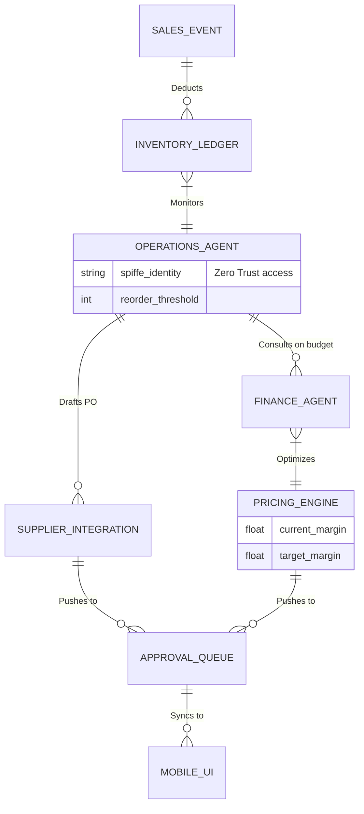

# [architecture] Autonomous Inventory Procurement and Pricing Engine

## Title
Autonomous Inventory Procurement and Pricing Engine

## Problem Statement
Small business owners like Priya (boutique owner) and Fatima (food cart operator) struggle immensely with inventory management and pricing strategy. They frequently run out of popular items, resulting in lost sales, or over-order unpopular items, tying up critical cash flow. Additionally, adjusting prices dynamically based on fluctuating raw material costs, local demand, or competitor pricing is practically impossible for them, as it requires constant manual monitoring and complex spreadsheet work. They need an invisible, intelligent system that monitors stock levels, autonomously drafts purchase orders to suppliers before stock runs out, and proactively suggests pricing adjustments—all manageable via a simple mobile interface.

## Research Report
*   **Shopify:** While offering robust basic inventory tracking, Shopify relies heavily on expensive third-party apps (like Stocky) for demand forecasting and automated procurement. Dynamic pricing also requires complex third-party apps and technical configuration.
*   **Wix:** Provides standard inventory tracking and low-stock alerts. However, it lacks the capability to autonomously negotiate or draft purchase orders with external suppliers, and it does not offer out-of-the-box dynamic pricing based on market conditions.
*   **Squarespace / GoDaddy:** Focused on simple e-commerce. They offer basic low-stock email notifications but no intelligent forecasting, autonomous procurement, or dynamic pricing features.
*   **OneHumanCorp (OHC) Differentiation - "Invisible Autonomy":** OHC eliminates the need for third-party inventory apps. By leveraging the **Operations Agent** and **Finance Agent**, the system continuously monitors sales velocity, predicts stockouts, drafts procurement orders via email/API to known suppliers, and suggests profit-maximizing price adjustments. The business owner simply taps "Approve" on their phone.

## Design Doc

### Architecture Diagram

### UI Wireframes & 375px Baseline
**Core Layout: macOS-style Translucent Glass + Ubiquiti UniFi Modular Dashboard Cards**
*   **Global Viewport:** 375px width (Mobile First). No horizontal scrolling.
*   **App Bar:** Blurred glass top nav with the business logo and a quick toggle: `[AI: Active / Paused]`.
*   **Action Feed (The Queue):**
    *   A vertically scrolling list of actionable cards.
    *   Each card features a frosted glass background (`rgba(255, 255, 255, 0.05)` with `backdrop-filter: blur(10px)`).
*   **Procurement Card:**
    *   Title: "Low Stock Alert: Vegan Vanilla Frosting"
    *   Body: "Current stock: 2 days remaining. AI drafted a reorder of 10 units from Supplier X for $50."
    *   Buttons: A prominent green "Approve Order" button and a secondary "Edit" button.
*   **Pricing Optimization Card:**
    *   Title: "Price Adjustment Suggestion"
    *   Body: "Demand for 'Summer Floral Dress' is up 40%. Suggest raising price from $45 to $52 to maximize profit margin."
    *   Buttons: "Apply New Price" and "Dismiss".

### Mobile UX Flow
1. **Notification:** Priya receives a push notification: "✨ AI drafted a reorder for Summer Floral Dresses. Tap to review."
2. **Review:** She opens the OHC app. The top card in her feed shows the drafted purchase order, including the total cost and predicted delivery date.
3. **Action:** She taps "Approve Order" (1 second). The Operations Agent dispatches the email/API call to her supplier and logs the expected expense with the Finance Agent.
4. **Pricing Context:** Later in the week, another card suggests a price increase due to high demand. She taps "Apply New Price," instantly updating her storefront and any connected POS systems.

### AI Agent Integration Points
*   **Operations Department:** Tracks sales velocity across all channels (online, in-store). Uses historical data to predict when stock will hit zero and drafts purchase orders before the threshold is breached.
*   **Finance Department:** Ensures that drafted purchase orders do not exceed the available cash flow. Analyzes profit margins and triggers the Pricing Engine to suggest adjustments.
*   **Communications Department:** Handles the actual sending of emails or SMS to suppliers if API integration is not available, negotiating delivery times if necessary.

### Key Design Decisions (Why, not How)
*   **Human-in-the-Loop for Capital Expenditure:** While the AI does all the heavy lifting (monitoring, predicting, drafting), the business owner must explicitly approve any action that spends money (procurement) or changes customer-facing pricing. This builds trust.
*   **Unified Action Feed:** Instead of burying inventory alerts in a complex dashboard, procurement and pricing suggestions are surfaced in a simple, actionable feed.
*   **Zero-Trust Isolation:** Procurement actions involve supplier financial details and sensitive business margins. The `OPERATIONS_AGENT` must use SPIFFE identities to guarantee cross-tenant isolation.

## Implementation Prompt
**To the Implementer Swarm:**
Your goal is to build the "Autonomous Inventory Procurement and Pricing Engine" so users like Priya and Fatima can manage stock and optimize prices with simple 1-tap approvals on their mobile devices.

**Customer User Journey (CUJ):**
1. The user connects their product catalog and adds basic supplier contact info.
2. The system continuously monitors inventory levels as sales occur.
3. When stock is predicted to run out within a configurable window (e.g., 7 days), the Operations Agent drafts a purchase order.
4. The system surfaces a card in the mobile UI asking for approval.
5. Upon approval, the order is dispatched to the supplier.
6. Periodically, the Finance Agent evaluates sales velocity and suggests a price increase/decrease via a similar approval card.

**Acceptance Criteria:**
*   **Mobile Parity:** The UI must be implemented flawlessly for a 375px viewport using the described Translucent Glass aesthetics.
*   **Event-Driven Ledger:** Inventory deduction and threshold monitoring must be event-driven, not reliant on slow batch cron jobs.
*   **Agent Integration:** The system must hook into the background AI Orchestration engine (LangGraph) to draft the orders and price changes.
*   **Isolation Guarantee:** Implement strict multi-tenant boundary checks so a tenant can only access their own inventory ledger and supplier details.
*   **Simplicity:** Hide complex forecasting algorithms, reorder point math, and supplier routing logic behind the clean "Action Feed" UI. Keep developer terms hidden.

## Priority
P1

## Estimated Scope
Large
