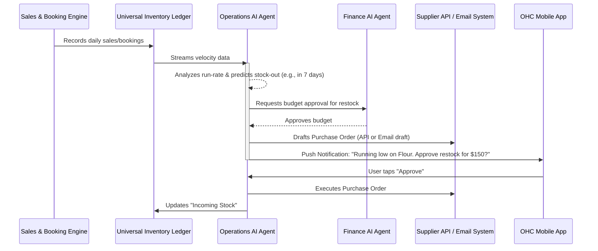
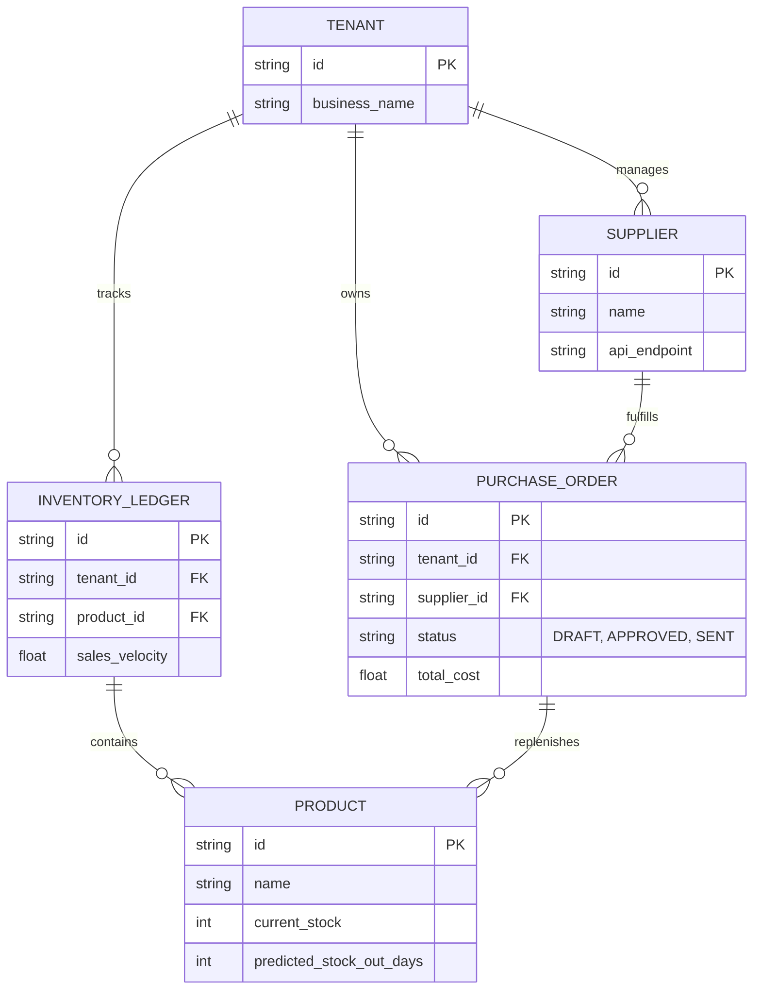

# 🔬 Research Brief: Autonomous Inventory Replenishment Engine

## Title
Autonomous Inventory Replenishment & Supply Chain Prediction Engine

## Problem Statement
For OneHumanCorp (OHC) core personas selling physical goods—like Priya (boutique owner) and Fatima (food cart operator)—inventory management is a constant source of stress. They manually track stock, guess when they will run out based on "gut feeling," and often discover they are out of crucial ingredients or top-selling products only when a customer tries to buy them. This leads to lost sales, rushed (and expensive) wholesale orders, and disappointed customers. Small business owners don't want to look at spreadsheets or configure complex "reorder point" rules; they want the system to invisibly monitor their stock and automatically reorder supplies *before* they run out.

## Research Report
*   **The Industry Standard:** Platforms like Shopify and Wix offer basic inventory tracking. When a product reaches a user-defined threshold (e.g., 5 units left), it sends an email alert. The merchant must then manually log in, calculate how many to buy, contact their supplier, and create a purchase order. Enterprise ERPs (NetSuite) offer predictive purchasing, but are far too complex for micro-businesses.
*   **The OHC Advantage:** OHC has complete visibility into sales velocity, seasonal trends, and upcoming bookings (e.g., if Maya has 5 large cake orders next week, OHC knows she needs more flour *now*, even if her current stock is technically above the threshold).
*   **The Solution:** We can build an autonomous "Operations & Supply Chain" AI agent that acts as an invisible inventory manager. It analyzes real-time sales velocity, seasonality, and upcoming commitments to predict stock-out dates. When a stock-out is imminent, the agent automatically drafts a restock order from the merchant's preferred supplier and presents it for a 1-tap approval.

## Design Doc

### Architecture Diagram

### Mobile UX Flow (375px Viewport)
*   **Notification:** The merchant receives a standard iOS/Android push notification: *"Based on recent sales, you will run out of 'Vegan Chocolate' in 4 days. Tap to approve a restock order for $120."*
*   **Dashboard Card:** A clean, Translucent Glass card appears on the main dashboard under the "Operations" tab.
    *   It shows: Item (Vegan Chocolate), Current Stock (2 lbs), Predicted Stock-Out Date (Friday), Supplier (Wholesale Co).
*   **Action View:** Tapping the card opens a simple view with two options:
    *   `[Approve Order - $120]` (Primary Action)
    *   `[Modify Quantity]` (Secondary Action)
*   **The "Grandmother Test":** There are no complex charts or "reorder threshold" settings visible. The system simply says "You need this, here is how much it costs, click here to buy it." All complexity is handled by the agent.

### AI Agent Integration Points
*   **Operations Department Agent:** The core engine. It continuously monitors the `Universal Capacity and Inventory Ledger` and applies predictive models to sales velocity.
*   **Sourcing/Procurement Agent:** Responsible for maintaining the relationship with the supplier. It knows whether to send an API request (to modern suppliers) or an AI-drafted email (to local/traditional suppliers).

### Zero Trust & Security
*   **Strict Multi-Tenant Isolation:** The Operations Agent operates with temporary SPIFFE/SPIRE credentials scoped exclusively to the tenant's inventory ledger and approved supplier list.
*   **Approval Gates:** The agent is given read access to inventory, but *write* access to execute external payments or binding purchase orders requires explicit merchant approval (the 1-tap confirmation), preventing runaway spending.

## Implementation Prompt
Implement the core Autonomous Inventory Replenishment predictive engine.

*   **Acceptance Criteria 1 (Prediction):** Implement a background worker that periodically analyzes sales velocity data from the Inventory Ledger to calculate predicted stock-out dates for physical products.
*   **Acceptance Criteria 2 (Drafting):** When a product's predicted stock-out date falls within a configurable lead time (e.g., supplier takes 3 days to deliver, stock-out is in 4 days), the system must autonomously generate a draft Purchase Order.
*   **Acceptance Criteria 3 (Visibility & Action):** The system must surface the drafted PO to the mobile UI and dispatch a push notification for merchant review.
*   **Acceptance Criteria 4 (Execution):** Upon merchant approval via the API, the system must transition the PO to a 'sent' state and update the inventory ledger to reflect 'incoming' stock. Ensure all data access is strictly partitioned by `tenant_id`.

## Priority
P1

## Estimated Scope
Medium

### Data Model & Invariants

### Performance & Offline Targets
*   **Performance:** Background calculation of predicted stock-out dates should complete within 500ms per tenant to scale efficiently. PO generation logic should execute within 1 second.
*   **Offline Support:** The mobile app must aggressively cache the current inventory snapshot. If the user approves a PO while offline, the action must be queued locally and automatically dispatched when connectivity is restored via background sync.
