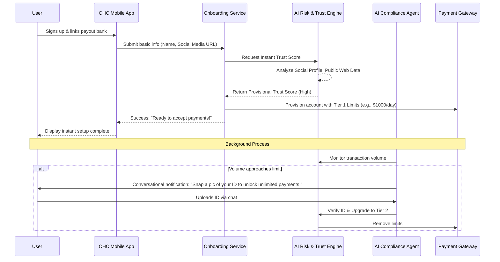

# Title: Autonomous KYB/KYC & Instant Underwriting Engine

## Problem Statement
Small business owners—like Maya the baker, Carlos the handyman, and Fatima the food cart operator—need to start accepting payments immediately when they set up their business. Traditional payment gateways require lengthy Know Your Business (KYB) and Know Your Customer (KYC) procedures. These often involve uploading multiple documents, waiting days for manual review, or suffering sudden "funds frozen" events. To deliver OneHumanCorp's promise of "zero → live business in under 10 minutes," we need an invisible, instant underwriting engine that securely handles compliance and risk without blocking the user's ability to make their first sale.

## Research Report
- **Competitor Analysis**:
  - **Stripe & Square**: They utilize tiered verification. They allow instant onboarding with very low limits based on basic personal data, delaying full verification until transaction volume hits a certain threshold. However, their risk models often result in abrupt account holds that confuse non-technical users.
  - **Shopify Payments**: Streamlined but still requires significant upfront data entry.
- **The OHC Opportunity**: Traditional models rely only on traditional financial data. OHC can leverage our AI agents to perform real-time, non-traditional underwriting. For example, by analyzing Maya's Instagram cake photos or Carlos's Google Local Services reviews, an AI agent can instantly build a "Provisional Trust Score" that grants immediate, safe payment processing limits while legal KYB completes invisibly in the background.

## Design Doc

### Architecture Diagram

### UI Wireframes & Mobile UX Flow (375px viewports)
- **Zero-Friction Bank Connection**: The user enters their bank account or debit card for payouts. No other complex forms are presented.
- **The "Ready to Earn" Card**: A beautiful, translucent glass card appears with a satisfying success animation. Text: *"You're ready to accept payments! Your instant limit is $1,000/day."*
- **Deferred Compliance Inbox**: If higher limits are needed, the user receives an inbox message from their AI Compliance Assistant: *"Hey Maya, business is booming! Tap here to take a quick photo of your ID so we can remove your payment limits."* The camera opens immediately upon tapping.

### AI Agent Integration Points
- **Legal & Finance Department**: An agent tasked with instantly scraping and cross-referencing public data (social media, local directories) to generate the initial Provisional Trust Score.
- **Compliance & Operations Agent**: An agent that monitors transaction velocity and converses directly with the user via the unified OHC inbox to gather KYB/KYC documents (like an ID scan or utility bill) only when strictly necessary, rather than blocking the initial onboarding.

### Key Design Decisions
- **Tiered, AI-Scored Limits**: We prioritize instant activation over complete initial verification. The AI Trust Score allows us to take on calculated, small risks to ensure the 10-minute "live business" SLA.
- **Conversational Verification**: Traditional KYC forms are intimidating. We replace them with contextual, conversational prompts triggered only when business volume requires it.
- **Grandmother Test Passed**: The user never sees words like "Underwriting", "KYC", or "Compliance." They only see "Ready to earn" and "Unlock higher limits."

## Implementation Prompt
**To the Implementer Agent:**
Build the Autonomous KYB/KYC and Instant Underwriting Engine. The engine must provide an API that accepts minimal user input (e.g., name, business type, social media link) and instantly returns a Provisional Trust Score alongside an initial transaction limit tier.

Design the backend to support asynchronous, background coordination with the AI Compliance Agent. The system should emit events when a user's transaction volume approaches their provisional limit, which triggers the Compliance Agent to request further documentation via the unified inbox. Do not prescribe specific database schemas or API endpoints—design a robust, multi-tenant capable service that integrates seamlessly with our existing payment and agent queue architectures.

**Acceptance Criteria:**
- A new user can complete onboarding and be provisioned to accept payments within 10 minutes.
- The system automatically assigns a capped, instant payment limit based on a fast AI evaluation of basic inputs.
- Background jobs effectively trigger conversational document collection when transaction thresholds are met.
- Full multi-tenant isolation is maintained for all generated trust scores and uploaded compliance documents.

## Priority
P0

## Estimated Scope
Large
