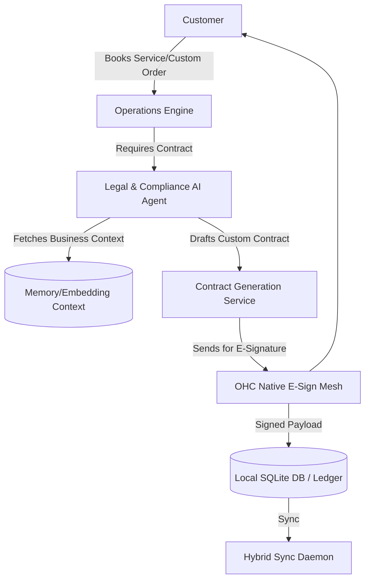

# Title: Autonomous Legal & Compliance Protector Engine

## Problem Statement
Small business owners like Maya (baker, 28) and Carlos (handyman, 42) lack the legal background to create terms of service, privacy policies, or standard contracts for custom orders and bookings. Existing solutions involve hiring expensive lawyers, using generic templates that don't fit their specific business models, or simply ignoring the risk. When disputes happen (e.g. chargebacks, deposit refunds, liability issues), they are fully exposed and easily lose revenue. They need an invisible legal assistant ("The Protector") that proactively drafts custom policies, manages electronic signatures for bookings/deposits, handles GDPR/cookie consent without being annoying, and monitors compliance automatically, all from their phone.

## Research Report
*   **Competitor Analysis**:
    *   **Shopify**: Provides basic generic policy generators but no integrated contract signing for custom orders or service agreements. Leaves owners exposed to chargebacks.
    *   **Wix/Squarespace**: Offers static legal page templates. No dynamic, transactional protection for deposits or service liabilities.
    *   **LegalZoom/RocketLawyer**: Too expensive, disconnected from the core business workflow, and not designed for mobile-first, transaction-level use.
    *   **GoDaddy**: Extremely basic boilerplate text.
*   **The OHC Differentiator**: OHC embeds the "Legal & Compliance" AI Department ("The Protector") directly into the transaction lifecycle. It automatically generates bespoke contracts and policies based on the business type, syncs with operations to require signatures for high-risk bookings/deposits, and auto-generates liability disclaimers. Zero external tools, 100% mobile native.

## Design Doc

### High-Level Architecture

### Mobile UX Flow (375px)
1.  **Trigger**: Carlos creates a new custom service quote for "$500 Plumbing Repair".
2.  **AI Intervention**: The Legal & Compliance Agent detects a high-value custom service and suggests adding a standard liability and deposit contract.
3.  **Approval (Mobile Screen)**: Carlos sees a glassmorphic card: "Add standard repair contract? [Preview] [Yes] [No]". He taps "Yes".
4.  **Customer Flow**: The customer receives an SMS link to the quote, which includes a native, 375px-optimized e-signature block at the bottom before they can pay the deposit.
5.  **Completion**: The signed contract is cryptographically stored and linked to the transaction.

### AI Agent Integration Points
*   **Operations & Finance Sync**: The Operations Agent flags non-standard orders (e.g., custom cakes, high-value bookings) to the Legal Agent. Finance Agent holds deposits until the Legal Agent confirms signature.
*   **Onboarding Sync**: During the 10-minute AI interview, the Legal Agent captures the business category (e.g., food, construction) to pre-generate appropriate terms of service and privacy policies.

### Key Design Decisions
*   **Native E-Sign**: Avoid third-party integrations like DocuSign. We will build a lightweight, cryptographically secure native e-signature component optimized for mobile touchscreens.
*   **Proactive Not Reactive**: The agent must suggest protection *before* the transaction is finalized, rather than providing a library of templates the user must discover.
*   **Zero Jargon**: Contracts must be generated in plain, enforceable language, and summarized for the owner ("This means if they cancel within 24 hours, you keep the $50").

## Implementation Prompt
**Objective**: Implement the Legal & Compliance Protector Agent module and its interaction with the quoting/booking flow.
**User Journey (CUJ)**:
1. Maya (baker) receives a custom cake request via DM.
2. She generates a quote for $200.
3. The Legal Agent automatically intercepts the quote generation and appends a "Custom Order Non-Refundable Deposit Agreement" tailored to perishable goods.
4. Maya reviews a plain-English summary of the contract on her mobile app and taps "Approve & Send".
5. The customer views the quote on their phone, signs using a touch-signature pad, and pays the deposit.
6. The signed contract is saved to the transaction ledger.
**Acceptance Criteria**:
- The Legal Agent correctly categorizes the transaction risk and generates an appropriate contract text via LLM.
- The mobile UI displays a clear, plain-language summary card to the business owner for 1-tap approval.
- The customer-facing UI includes a responsive (375px) signature component that blocks payment until signed.
- Signatures are securely stored and associated with the specific tenant and order ID.
- Must include full Playwright E2E tests validating the owner approval and customer signature flow.

## Priority
P1

## Estimated Scope
Medium
