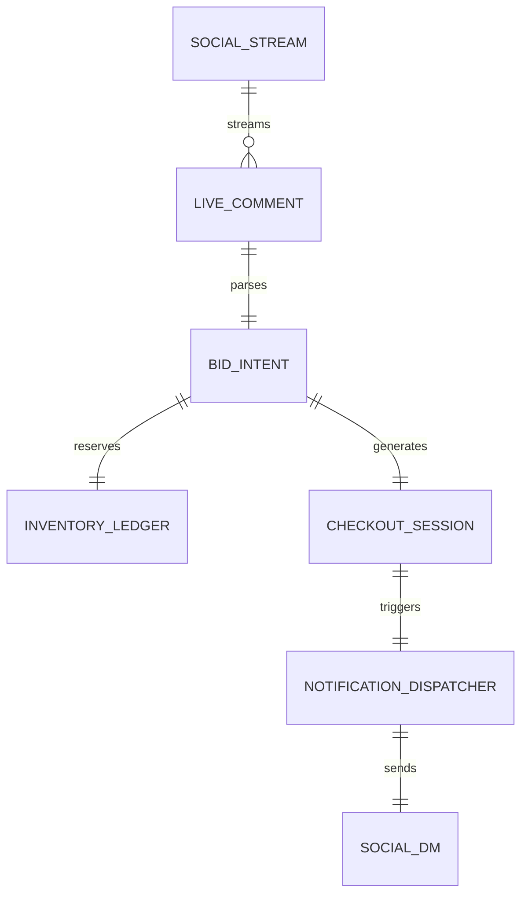

### Title
[Architecture] Autonomous Live Commerce and Social Bidding Engine

**Problem Statement:**
SMBs like Maya (baker) and Priya (boutique owner) frequently use Instagram Live or TikTok Live for "drop" events and real-time sales. Currently, tracking who commented "mine" first, collecting payments from spontaneous bidders, and updating inventory manually during a livestream is a chaotic, error-prone nightmare. They lose revenue because they cannot enforce immediate checkout or seamlessly track commitments made via social video streams.

**Research Report:**
- Competitors (Shopify, Wix) treat social selling as static integrations (link-in-bio). None provide real-time stream listener capabilities out of the box without expensive third-party apps like CommentSold.
- CommentSold proves the model but is incredibly expensive and complex to configure for micro-businesses.
- The OHC Autonomous Live Commerce Engine will act as an invisible, real-time "auctioneer and cashier" during live events, intercepting comments across platforms (Instagram/TikTok), reserving inventory, and instantly DMing secure, one-click checkout links to winning bidders.

**Design Doc:**
- **Architecture Diagram:**

- **UI Wireframes (375px):**
  - **Live Dashboard Card:** A simple, real-time card showing "Active Livestream", with metrics: "Current Viewers", "Bids Captured", "Revenue Generated".
  - **Item Focus Toggle:** A quick swipe-able list of inventory items. Tapping an item marks it as the "Active Item" for the AI to listen for in comments.
  - **Auto-Checkout Settings:** Toggle for "Enforce 5-minute checkout timer".
- **Mobile UX Flow:**
  1. User starts a livestream on Instagram.
  2. Opens OHC app, taps "Start Live Sale Mode".
  3. Swipes to select the currently featured product on stream.
  4. The AI Sales Agent listens to the stream's comments via Graph APIs.
  5. When a customer comments "Buy [Item] [Size]", the agent instantly reserves the item and sends a DM with a checkout link.
  6. The OHC app updates the seller's dashboard with a real-time feed of successful checkouts and remaining inventory.
- **AI Agent Integration Points:**
  - **Sales Agent (Listener):** Real-time NLP parsing of livestream chat to identify purchase intent, handling misspellings and variations.
  - **Operations Agent:** Enforcing inventory lock and releasing un-purchased carts if the checkout timer expires.
  - **CS Agent:** Instantly replying to stream viewers who missed out (e.g., "Sorry, the M is sold out! Would you like an L?").
- **Key Design Decisions:**
  - Zero-Trust Multi-tenant Isolation: Social API tokens must be strictly isolated per tenant using the core SPIFFE/SPIRE architecture to prevent cross-stream comment leakage.
  - Offline/Latency Mitigation: Intent parsing happens asynchronously; if the social API lags, the timestamp of the comment dictates the winner, ensuring fairness even if the webhooks are delayed.
  - The UI must hide the webhook and API complexity entirely. It just feels like a "magic" button that turns on sales tracking during a stream.

**Implementation Prompt:**
Implement the backend architecture for the Autonomous Live Commerce Engine. This requires creating the robust webhook ingest layer for social media comments, integrating the real-time AI parser to determine purchase intent, and connecting to the core inventory ledger to reserve stock instantly. Also, build the 375px mobile UI dashboard that allows a merchant to set an "Active Item" during a live stream and view real-time checkout metrics. The system must gracefully handle concurrent bids and enforce strict multi-tenant boundaries for social auth tokens. Do not prescribe specific database schemas or API signatures; design for high scale and fault tolerance.

**Priority:** P1
**Estimated Scope:** Large
