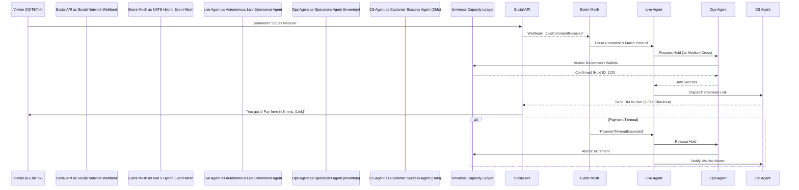
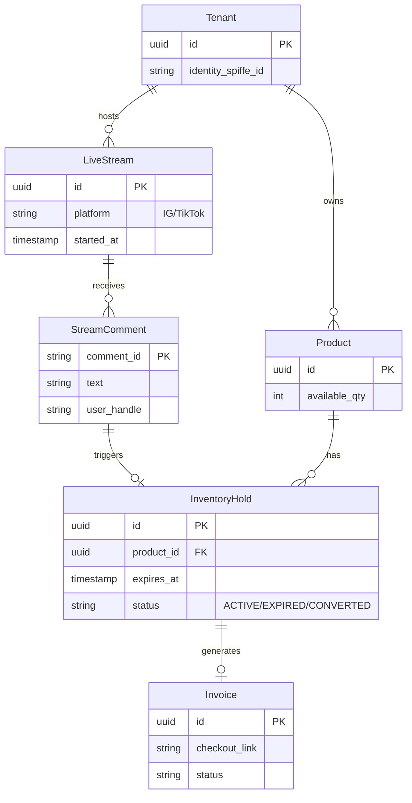

# [architecture] Autonomous Live Commerce Engine

## Problem Statement

Small business owners like **Priya (boutique owner)** and **Maya (baker)** increasingly rely on live social commerce—hosting "drops", flash sales, and product showcases via Instagram Live or TikTok Live. The current process is highly manual and error-prone. They go live, showcase an item, and tell viewers to "comment SOLD to buy."

However, during a fast-paced live stream, they cannot simultaneously entertain, read hundreds of comments, manually tally inventory, and send individual invoices to buyers via DMs. This leads to:
1.  **Lost Revenue:** Buyers drop off before receiving an invoice hours later.
2.  **Overselling:** Priya accidentally sells 15 dresses when she only has 10 in stock because she can't track real-time claims.
3.  **High Friction:** Attempting to force viewers out of the stream to find a link in bio disrupts the viewing experience and hurts conversion rates.

They need an invisible, zero-touch system that automatically listens to their live stream, reserves inventory in real-time, instantly DMs a secure 1-tap checkout link to winning buyers, and automatically manages waitlists for oversold items—all without the business owner ever touching their phone.

## Research Report

*   **Current Architecture Limits:** OHC handles asynchronous social commerce (static DMs and posts) well through the Omnichannel AI Inbox but lacks a high-frequency, real-time event pipeline for synchronous Live Stream commenting and auction/drop logic.
*   **Competitor Analysis:**
    *   *Shopify/Wix:* Lack native live selling tools. Merchants are forced to stitch together expensive third-party apps (like CommentSold, starting at $149/mo + commission) which are complex to configure and require migrating inventory out of the core platform.
    *   *TikTok Shop/Instagram Shop:* Native integrations exist, but they heavily tax the merchant (high platform fees) and lock the customer data inside the social walled garden. The merchant loses the direct relationship.
*   **The Gap:** There is no platform that provides a built-in, zero-configuration Live Commerce Agent that allows merchants to keep 100% of their margins, own their customer data, and process sub-second "comment-to-checkout" flows seamlessly across any social channel.

## Design Doc

### Architecture Diagram

### Entity-Relationship Diagram

### Mobile UX Flow & UI Wireframes (375px First)

**The "Grandmother Test" Design:**
The entire setup process for the merchant must be zero-configuration.

1.  **Activation Screen:** A single card in the OHC Dashboard.
    *   *UI:* A clean glassmorphic card. Headline: "Live Drop Mode." Button: [Enable for Next Stream].
    *   *Interaction:* When toggled, the agent scans the active catalog and asks, "Which items are you dropping today?" Maya taps 3 cakes.
2.  **During the Stream (Invisible):**
    *   The merchant goes live natively on IG/TikTok. The OHC App can be minimized or running in the background.
    *   *Optional Dashboard View:* If the merchant opens OHC during the stream, they see a highly simplified, high-contrast dashboard showing:
        *   "Vegan Cake: 8/10 Claimed"
        *   "Revenue Pending: $160"
        *   "Revenue Collected: $40"
3.  **The Viewer Experience:**
    *   Viewer comments "SOLD Vegan Cake".
    *   Within 2 seconds, they receive an Instagram DM with an Apple Pay / Google Pay embedded checkout link. Zero login required.

### AI Agent Integration Points

*   **Autonomous Live Commerce Agent (New):** Acts as the orchestrator. Subscribes to the high-velocity `LiveCommentReceived` topic on the NATS Event Mesh. Uses lightweight NLP to extract intent ("sold", "buy", "grab") and variants ("size M", "red").
*   **Operations Agent:** Manages the high-concurrency inventory locking. Must support atomic transactions in the `Universal Capacity Ledger` to prevent overselling during massive traffic spikes.
*   **Customer Success Agent:** Handles outbound DMs, manages the tone of voice (e.g., Priya's agent sounds chic, Carlos's sounds professional), and handles waitlist notifications if items sell out.
*   **Finance Agent:** Monitors the generated checkout links and emits `InvoicePaid` events back to the Event Mesh to finalize the order and convert the inventory "Hold" into a "Sale".

### Key Design Decisions

1.  **Strict Multi-Tenant Isolation & Zero Trust Identity:** Live stream webhooks from Meta/TikTok are high-volume. The ingress pipeline must guarantee that tenant A's viral stream does not consume worker resources allocated to tenant B. We will utilize tenant-partitioned ring buffers on the edge. Furthermore, all internal agent-to-agent communication (e.g., Live Agent talking to Ops Agent) will strictly utilize **SPIFFE/SPIRE** for Zero Trust secure workload identity authentication, guaranteeing data isolation boundary integrity.
2.  **Sub-Second Edge Processing:** To capture impulse buys, the "comment-to-DM" roundtrip must be under 2 seconds. The NLP parsing for intent extraction must occur at the edge, avoiding heavy LLM roundtrips for simple "SOLD" commands.
3.  **Optimistic Inventory Locking:** To handle concurrency, inventory is locked the millisecond the comment is parsed. If the user doesn't complete the 1-tap checkout within a configurable window (e.g., 5 minutes), the lock expires, and the item is automatically offered to the next user in the waitlist queue.

## Implementation Prompt

**Task for Implementer Agent:**
Implement the core event pipeline and inventory locking mechanism for the Autonomous Live Commerce Engine.

1.  Create the ingestion handlers to receive and normalize webhook payloads from Instagram Live and TikTok Live.
2.  Implement the parsing logic to extract product intent from rapid-fire comments.
3.  Build a highly concurrent, optimistic locking mechanism interfacing with the `Universal Capacity Ledger` to temporarily reserve inventory upon a valid "SOLD" claim.
4.  Wire up the outbound DM trigger to the Customer Success Agent, including the expiring 1-tap checkout link.
5.  Ensure all operations are strictly isolated by Tenant ID and include chaos testing for high-concurrency webhook spikes (e.g., simulating 1,000 comments/second).

**Acceptance Criteria:**
*   A simulated live comment successfully triggers an inventory hold within 500ms.
*   Overselling is structurally impossible; concurrent requests beyond available inventory automatically roll over to a Waitlist state.
*   Holds automatically expire and release inventory back to the pool if no payment event is received within the TTL.

## Metadata
*   **Priority:** P1
*   **Estimated Scope:** Large
