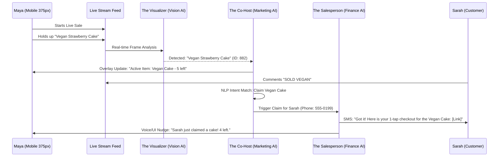
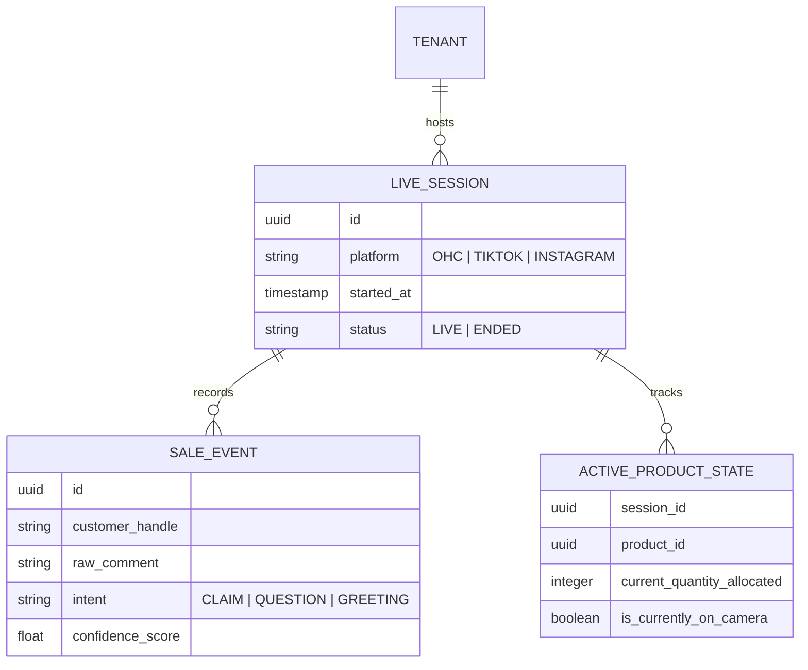

# [Architecture] Autonomous Live-Stream Commerce & Interactive Video Host Engine

## 1. Title
**The Co-Host: Autonomous Live-Stream Commerce & Interactive Video Host Engine**

## 2. Problem Statement
Small business owners like **Maya (baker)** and **Priya (boutique owner)** are missing out on the high-conversion world of live-stream selling (TikTok Live, Instagram Live, OHC Storefront Live) because it is operationally exhausting. A single-person operation cannot simultaneously film themselves, monitor a high-velocity chat for "SOLD" keywords, manage inventory levels in real-time, send payment links, and answer repetitive customer questions.

They suffer from "Live-Sale Paralysis": they want the revenue of a live event but cannot afford a 3-person production team. Current platforms treat live-streaming as a passive video player. OHC needs an active "AI Co-Host" that handles the logistics of the sale in real-time, allowing the owner to focus entirely on their products and personality.

## 3. Research Report
### Market Landscape & Competitor Analysis
*   **CommentSold**: The industry leader for boutiques. Highly successful but requires a complex desktop setup, manual product mapping, and expensive monthly subscriptions. It is a "tool," not a "teammate."
*   **TikTok Shop / Instagram Shopping**: Robust built-in tools but siloed. If Priya sells out of a dress on TikTok Live, her OHC web store and in-person POS might not update instantly, leading to overselling.
*   **Whatnot / Popshop Live**: Marketplace-specific apps. They own the customer, and the merchant is just a vendor.
*   **The OHC Opportunity**: OHC can provide a **Platform-Agnostic Co-Host**. By utilizing Vision AI and a unified event mesh, the OHC Co-Host can "listen" to streams across platforms (or OHC's native PWA streamer), identify products shown on camera, and automate the "Comment-to-Cart" pipeline.

### Core Gaps Identified
1.  **Context Gap**: Existing tools don't know what the merchant is holding.
2.  **Concurrency Gap**: Owners can't talk and type DMs at the same time.
3.  **Inventory Gap**: Lag between "Live Claim" and "System Update" causes "Broken Promises" to customers.

## 4. Design Doc

### Architecture Diagram (Mermaid.js)

### Data Model & Invariants

**Key Invariants:**
*   **Inventory Locking**: When a customer comments "SOLD," the inventory is "soft-locked" for 15 minutes. If they don't pay, the AI Co-Host automatically announces: *"The Vegan Cake is back in stock!"*
*   **Zero-Jargon Overlay**: The merchant UI shows "Live Stats" in plain language: "5 claims, 2 paid, $150 earned."
*   **Privacy**: Customer DMs are handled via OHC's secure identity mesh, never exposing private phone numbers in the public chat.

### Mobile UX Flow (375px First)
1.  **Merchant Streamer View**:
    *   **Top**: Small translucent glass card showing "Live: 42 Viewers | $450 Pending".
    *   **Center**: Full-screen camera feed with a "Smart Frame" that highlights the product being detected.
    *   **Bottom**: A rolling "Activity Feed" showing claims: *"Sarah claimed 'Summer Dress' 10s ago"*.
    *   **AI Nudge**: A soft-glowing pill at the bottom: *"3 people asked about sizing. Tap to have me reply 'True to size'."*
2.  **Customer Buying View**:
    *   **Overlay**: A glassmorphic "Product Card" pops up at the bottom of their stream the moment Maya holds the item.
    *   **Action**: A single button: `[ 🛒 Claim with 1-Tap ]`.

### AI Agent Integration Points
*   **The Visualizer (Vision AI)**: Continuously analyzes the video stream to identify products from the OHC Catalog.
*   **The Co-Host (Marketing/CS)**: The "Face" of the AI in the chat. Answers FAQs, manages the "Hype" (e.g., *"Only 2 left, get yours now!"*), and greets users.
*   **The Salesperson (Finance)**: Monitors chat for purchase intents, sends the checkout links, and handles the inventory "Soft-Lock" logic.

## 5. Implementation Prompt
**Task for Implementer Agent:**
Build the foundational services for the "Autonomous Live-Stream Commerce Engine."

**User Journey (CUJ):**
1. Maya starts a live session from the OHC Mobile App.
2. She holds a product up to the camera. The Vision AI service must identify the product and update the `ACTIVE_PRODUCT_STATE` in the session.
3. A test user (Sarah) submits a chat message "SOLD".
4. The Co-Host service must parse this intent, check the `INVENTORY_LEDGER` via the Operations Agent, and if available, trigger the Salesperson Agent to send a Stripe Payment Link via SMS.
5. The Merchant's "Live Dashboard" must update in real-time (<200ms) to show the new claim.

**Acceptance Criteria:**
*   **Real-Time State**: Implement a `LiveSession` state manager that tracks the "On-Camera" product and current claims.
*   **Vision-Inventory Bridge**: Create a service that maps image embeddings (from the video feed) to the `tenant_id`'s product catalog.
*   **Intent Parser**: Implement a lightweight NLP service to identify "CLAIM" intents in noisy chat data.
*   **Handoff to Payments**: Integrate with the existing `Smart Ledger` and `Stripe` services to generate session-scoped payment links.
*   **Mobile Merchant UI**: Build the 375px "Streaming Dashboard" using macOS Translucent Glass styling and UniFi card layouts.

## 6. Priority
**P1** (High - This transforms OHC from a store-builder into a high-performance growth engine for solo creators).

## 7. Estimated Scope
**Large** (Requires real-time video processing, NLP, and inventory locking logic).
