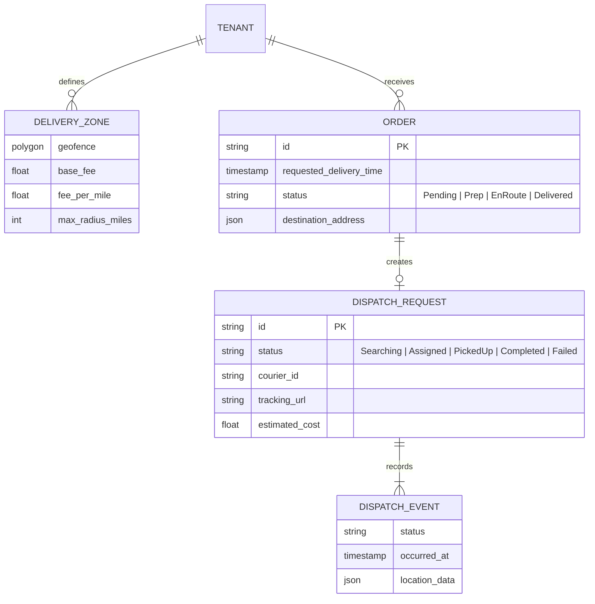
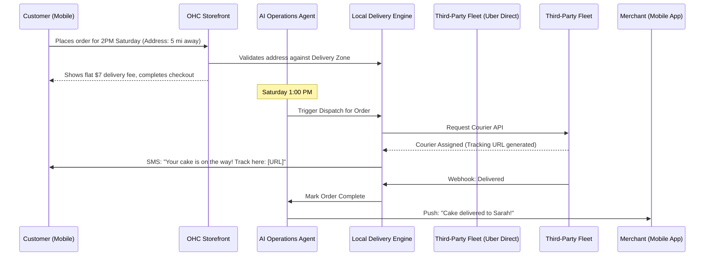

# Title: Autonomous Local Delivery & Dispatch Engine

## Problem Statement

Small business owners selling physical goods and food (like Maya the baker and Fatima the food cart owner) often struggle with local delivery logistics. They rely on third-party apps (Uber Eats, DoorDash) that take exorbitant commissions (up to 30%), or they manually coordinate deliveries using disjointed tools (spreadsheets, text messages with gig drivers, personal driving). This results in lost margins, poor customer experience (no tracking links, late deliveries), and high stress. They need a zero-configuration, autonomous system that instantly calculates local delivery zones, seamlessly dispatches drivers via integrated low-cost fleets (e.g., Uber Direct, DoorDash Drive, local courier APIs), and provides real-time SMS tracking to the customer—all while keeping the business owner completely insulated from the logistical complexity.

## Research Report

### Competitive Analysis

- **Shopify Local Delivery:** Allows merchants to draw delivery zones and manage their own drivers via a specialized app. It is entirely manual and lacks integrated third-party dispatch out-of-the-box.
- **Wix Restaurants / Orders:** Basic delivery zone setup, but relies heavily on manual dispatch or complex third-party integrations (Deliverect) which are expensive and fail the "grandmother test".
- **Uber Eats / DoorDash Marketplaces:** Easy to use but destroy merchant margins (20-30% fees) and own the customer data.
- **Square On-Demand Delivery:** Good integration with Uber/DoorDash white-label delivery, but often requires complex POS setup and lacks deep AI-driven pre-order scheduling (e.g., Maya needing a cake delivered exactly at 2 PM next Saturday).
- **OHC (Target):** Zero-config, autonomous dispatch that leverages white-label delivery APIs (Uber Direct/DoorDash Drive/Shippo local) to offer flat-rate local delivery, maintaining merchant margins and brand ownership.

### Key Insights

- **Margin Protection:** Merchants are willing to subsidize delivery costs if they keep the customer data and avoid marketplace commissions.
- **The "Where is my order?" Problem:** 60% of customer support inquiries for local businesses are delivery status requests. AI integration is critical here.
- **Scheduling Complexity:** Food and custom goods (cakes) require strict scheduling windows, not just ASAP delivery.

## Design Doc

### Architecture Diagram

### Mobile UX Flow (375px First)

1.  **Merchant Setup (Zero-Config):** Maya opens the app. A card says: "Enable Local Delivery?". She taps it. The app asks: "How far do you deliver?" She selects "5 miles" and "Flat $5 fee". The AI automatically draws a 5-mile radius polygon around her verified business address. Done.
2.  **Customer Checkout:** Sarah buys a cake on her phone. She selects "Delivery". She enters her address. The system instantly verifies it's within the 5-mile polygon, adds $5, and lets her select a 2 PM Saturday slot.
3.  **Active Order View (Merchant):** On Saturday at 1 PM, Maya's dashboard shows a pulsing blue dot on Order #123: "Courier arriving in 15 mins". She hands the cake to the driver.
4.  **Customer Tracking:** Sarah receives a text. Tapping it opens a pristine, OHC-hosted webview with a map showing the driver's car moving towards her house.
5.  **AI Inbox Integration:** Sarah replies to the tracking SMS: "Can they leave it on the porch?". The OHC AI CS Agent intercepts it, automatically translates the instruction, and updates the courier's drop-off notes via API, replying to Sarah: "Done! I've told the driver to leave it on the porch."

### AI Agent Integration Points

- **AI Operations Agent:** Monitors prep times and requested delivery windows. Automatically triggers the dispatch API call at the exact right moment to minimize courier wait times and ensure fresh food.
- **AI Customer Success Agent:** Handles all "Where is my order?" SMS replies natively, reading the dispatch status and estimating arrival time without bothering the merchant.
- **AI Finance Agent:** Reconciles the final courier charge against the customer's delivery fee, surfacing margin reports in the simple Cash Flow widget.

### Key Design Decisions & Integrity

- **Abstracted Logistics:** The merchant never chooses between "Uber" or "DoorDash". OHC's engine automatically routes the request to the cheapest/fastest available white-label API (Uber Direct, DoorDash Drive, Relay) based on real-time rates.
- **Zero Trust Architecture:** Location data and driver details are heavily sandboxed. SPIFFE/SPIRE identity guarantees that Tenant A cannot access Tenant B's delivery tracking URLs or driver webhooks.
- **Mobile-First Offline Handling:** If the merchant is in a kitchen with poor cell service, the AI Agent still handles the background dispatch reliably.

## Implementation Prompt

Implement the Autonomous Local Delivery & Dispatch Engine.

- **Outcome:** Merchants must be able to configure simple radius-based delivery zones. Buyers must be able to validate their address at checkout and pay for delivery. The backend must integrate with a simulated third-party white-label delivery API (e.g., simulating Uber Direct) to request a courier, receive tracking URLs, and handle lifecycle webhooks (Assigned, PickedUp, Delivered).
- **CUJ (Critical User Journey):** A customer places a local delivery order. At the scheduled time, the system autonomously requests a courier via API. The system receives a tracking URL and sends it to the customer. When the courier completes the drop-off, the system marks the order delivered and notifies the merchant.
- **Acceptance Criteria:**
  - Polygon/radius geofence validation operates with <50ms latency.
  - State machine handles `Pending -> Dispatching -> EnRoute -> Delivered` seamlessly, triggered autonomously by time/agent.
  - Webhooks from the simulated fleet API are authenticated and correctly mutate order state in the multi-tenant database.
  - Tracking UI payloads are highly optimized for mobile connections.

## Priority

P1

## Estimated Scope

Large
