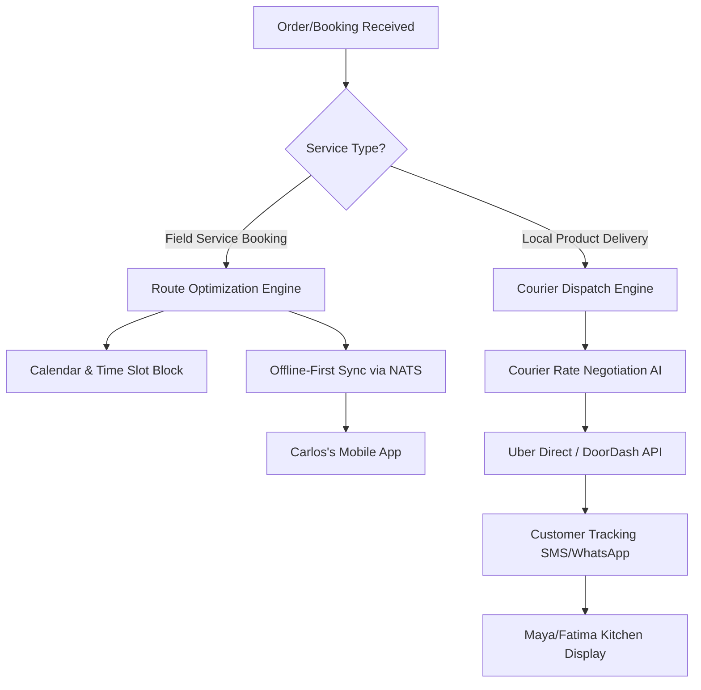

# Issue Brief: Autonomous Local Delivery & Field Dispatch Engine

## Title
Autonomous Local Delivery & Field Dispatch Engine

## Problem Statement
Small business owners serving local geographical areas—like Carlos the handyman or Fatima running a food cart—struggle immensely with logistics. Carlos spends an hour every evening mapping out his service route on Google Maps, trying to factor in travel times between jobs, often losing cellular signal in basements which breaks his map. Fatima gets bulk catering orders but has no way to deliver them efficiently without manually requesting an Uber Package delivery for each order, eating into her margins and time. They need a system that invisibly routes their day, dispatches third-party local couriers when needed, and works flawlessly even when disconnected from the internet.

## Research Report
Current SMB platforms treat local delivery and field service as an afterthought or require expensive third-party plugins (like Route4Me or Onfleet).
- **Shopify:** Primarily focuses on postal shipping. Local delivery is basic and lacks advanced routing or third-party courier dispatch integration built-in natively for zero-touch.
- **Wix/Squarespace:** Booking systems exist, but they do not automatically calculate travel times between appointments to block out calendar space, leading to double-booking or physically impossible schedules for service providers.
- **Onfleet/Routific:** Powerful, but designed for enterprise fleets, not a solo operator like Carlos.

**Opportunity:**
OneHumanCorp can dominate by integrating an offline-capable, AI-driven dispatch engine natively. If Carlos accepts a job at 10 AM, the calendar automatically blocks 9:30-10:00 AM for travel based on the previous job's location. For Maya/Fatima, if a customer selects "Local Delivery", the system automatically negotiates and dispatches a local courier (Uber Direct, DoorDash Drive, Relay) at the exact moment the food/cake is ready, with zero manual input.

## Design Doc

### 1. Architecture Diagram

### 2. UI Wireframes & Mobile UX Flow (375px First)

**Screen 1: The "Today's Route" Card (For Carlos)**
- **UI:** A macOS Translucent Glass card showing a minimal map line. Underneath, a clean UniFi-style list of stops.
- **Interaction:** One giant, thumb-friendly "Start Next Job" button. No complex routing options; the AI has already sorted the stops perfectly.
- **Offline Mode:** The entire route, customer phone numbers, and job details are cached locally. A small green "Offline Ready" indicator sits at the top right.

**Screen 2: The "Courier Dispatched" Notification (For Maya/Fatima)**
- **UI:** A simple push notification and an activity feed card: "Order #142 ready. Uber courier arrives in 4 mins. Customer notified."
- **Interaction:** If the courier is delayed, the AI Agent automatically texts the customer. The merchant does *nothing*.

### 3. AI Agent Integration Points
- **Operations Agent:** Monitors traffic and automatically reshuffles Carlos's afternoon schedule if he is running late at a morning job, texting his afternoon clients to update them on the ETA.
- **Logistics Agent:** Compares rates between local delivery networks (Uber, Lyft, DoorDash) in real-time to find the cheapest/fastest courier for Maya's cake deliveries.

### 4. Key Design Decisions
- **Offline-First Route Caching:** Field workers frequently lose signal. The day's entire route and job details must be pre-fetched and stored on device.
- **Travel Time Calendar Blocking:** The booking system and dispatch engine must be tightly coupled so travel time is treated as busy calendar time.
- **Zero-Touch Dispatch:** Merchants should never have to open a secondary app to call a driver. It happens based on order status (e.g., when Fatima taps "Order Ready").
- **Design System:** Use macOS-style Translucent Glass materials combined with clean Ubiquiti UniFi modular dashboard card layouts.

## Implementation Prompt
**For Implementer Agent:**
Implement the core data models and service logic for the `LocalDispatchEngine`.
- Define entities for `Route`, `Stop`, and `CourierDispatch`.
- Ensure multi-tenant isolation (Tenant A cannot see Tenant B's routes).
- Expose an interface that the Calendar Engine can query to calculate travel time padding between appointments.
- Define the Webhook/Event schema for third-party courier status updates (Courier Assigned, Picked Up, Delivered).
- Ensure all queries for a daily route return a payload suitable for offline edge-caching on mobile devices.
- Adhere strictly to Zero-Trust and multi-tenant security boundaries.

## Priority
P0

## Estimated Scope
Large
