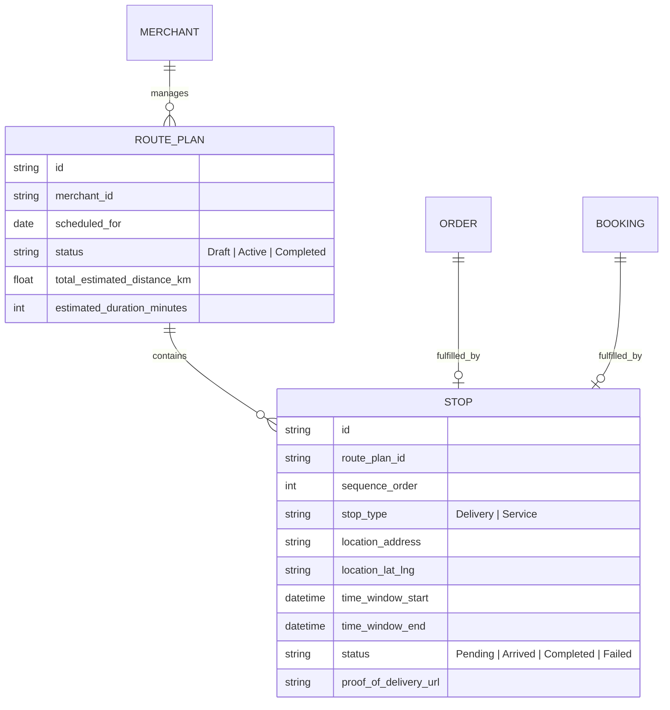

# Autonomous Local Delivery & Field Service Routing Engine

## Title
[Architecture] Autonomous Local Delivery & Field Service Routing Engine

## Problem Statement
Small business owners like Maya (the custom cake baker) and Carlos (the handyman) struggle intensely with the logistics of local delivery and field operations. For Maya, hand-delivering fragile, expensive custom cakes to multiple local addresses requires complex route planning, tracking time windows, and communicating exact arrival times to anxious customers. If she's late, the frosting might melt or the party might start without the cake. For Carlos, managing a schedule of home repairs across the city means he spends hours stringing together Google Maps routes and texting clients "I'll be there between 12 and 4," leading to a terrible customer experience.

Current platforms (Shopify, Wix) treat local delivery as a simple checkout checkbox or a flat fee, completely ignoring the operational nightmare of *executing* those deliveries or field visits. Small business owners are forced to use clunky third-party apps, manual spreadsheets, and generic GPS apps. They need a system that invisibly schedules, routes, and communicates logistics directly from the orders and bookings already living in OneHumanCorp (OHC), running flawlessly on their mobile phones while they drive.

## Research Report

**Competitor Analysis:**
- **Shopify:** Offers basic "Local Delivery" but it mostly just validates postal codes and adds a delivery fee at checkout. For actual routing, merchants must download the separate Shopify Local Delivery app, which is disconnected from multi-stop optimization AI or field service concepts (like Carlos's appointments).
- **Wix / Squarespace:** No native routing. Merchants rely purely on integrations with ShipStation (which is for mail, not local delivery) or expensive dedicated fleet management software like Routific or Onfleet, which are complex and meant for larger fleets, not a solo owner-operator.
- **Dedicated Field Service (Jobber, Housecall Pro):** Good for Carlos, but they don't do e-commerce (so Maya can't use them). They are also expensive, require significant setup, and are overkill for a solopreneur.

**The OHC Opportunity:**
OHC already unifies e-commerce (Maya) and service bookings (Carlos) into a single primitive. We have a massive opportunity to provide a unified routing engine. By introducing an Autonomous Local Delivery & Field Service Routing Engine, we solve the "last mile" problem invisibly. The AI Operations Department can pre-calculate the most efficient route based on live traffic, time-window constraints (e.g., cake must arrive before 2 PM), and service duration (e.g., plumbing fix takes 1 hour). The AI CS Department handles all proactive SMS updates to the customer ("Maya is 10 mins away with your cake!").

## Design Doc

### Architecture Diagram

### AI Agent Integration Points
- **Operations Agent (The Router):** Runs invisibly when orders/bookings are finalized. Analyzes all local delivery orders and field service bookings for a given day. Calculates the optimal traveling salesperson route, taking into account traffic APIs, delivery time windows, and required service duration.
- **Customer Success (CS) Agent (The Communicator):** Triggers automatically when the merchant marks a stop as "En Route" or "Arrived." Sends branded, plain-language SMS/WhatsApp updates to the customer with a live tracking link. If the merchant is running behind, the CS Agent proactively texts the next customers to apologize and adjust expectations.

### Key Design Decisions
1. **Unified Routing Primitive:** Deliveries (physical goods) and Field Services (time-based appointments) are treated as identical `STOP` entities in the routing engine. This allows hybrid businesses (e.g., an IT consultant who delivers a laptop and then installs it) to use a single route plan.
2. **Offline-First Mobile Parity:** The routing UI must cache the entire day's route, customer phone numbers, and delivery notes locally on the device. Drivers often lose cell service in apartment building elevators or rural areas. Proof of delivery (signatures/photos) must queue locally and sync when connectivity is restored.
3. **Zero-Trust Multi-Tenancy:** Route plans and location data are strictly isolated per merchant. Live tracking links sent to customers are ephemeral, cryptographically signed URLs that expire 1 hour after delivery completion to protect merchant and customer privacy.

### Mobile UX Flow (375px First)
*Visual Style: macOS-style Translucent Glass materials & clean Ubiquiti UniFi modular dashboard cards.*

- **Morning Briefing Screen:** When Carlos opens the app, a translucent glass card at the top reads: "You have 4 stops today. Optimal route calculated. Leave by 9:15 AM."
- **The Active Route View:** A vertical timeline of cards. Each card represents a stop.
    - Card displays: Customer Name, Address, Time Window, and a large, accessible "Navigate" button (launches Google Maps/Apple Maps).
    - Swiping a card left reveals quick actions: "Call Customer" or "Message."
- **Stop Execution (The "Grandmother Test"):**
    - Upon arriving, Carlos taps "I'm Here." The UI transitions smoothly.
    - If it's a delivery (Maya), a camera viewfinder opens immediately for "Photo Proof of Delivery."
    - If it's a service (Carlos), a prominent "Start Timer" or "Complete Job" button appears.
    - A single, giant "Mark Complete & Go to Next" button advances the route. No complex dropdowns or status menus.

## Implementation Prompt

**Role:** Implementer Agent
**Task:** Build the core backend logic and data models for the Autonomous Local Delivery & Field Service Routing Engine, and implement the mobile-first React Native (or equivalent mobile web) interfaces for the daily route execution.

**Customer User Journey (CUJ):**
1. Maya receives 3 local custom cake orders for Saturday, each with specific delivery time windows (e.g., Order 1 between 10am-12pm).
2. Saturday morning, Maya opens the OHC app. She sees an AI-generated "Route for Today" card on her dashboard.
3. The route has logically sequenced the 3 stops to minimize driving time while respecting the time windows.
4. Maya taps "Start Route." The AI CS agent automatically texts Customer 1 that Maya is on her way.
5. Maya arrives, hands over the cake, taps "Take Photo" to capture proof of delivery, and taps "Complete." The app automatically queues up navigation for Stop 2.

**Acceptance Criteria:**
- Create the data entities for `RoutePlan` and `Stop` that can map to both traditional `Orders` and service `Bookings`.
- Implement a background job (Operations AI) that can group daily stops for a merchant and generate a sequenced sequence (using a mock routing algorithm or external API integration hook).
- Implement the mobile-first UI components for the "Active Route" timeline and the "Stop Execution" screen (Photo capture / Complete button).
- Implement the event hooks that trigger the CS Agent to send notifications upon route start and stop completion.
- Ensure the UI components function when offline (queueing status updates).
- All UI must use the design system's translucent glass and modular card tokens. Do not expose any technical terms to the user.

## Priority
P1 (High)

## Estimated Scope
Large
