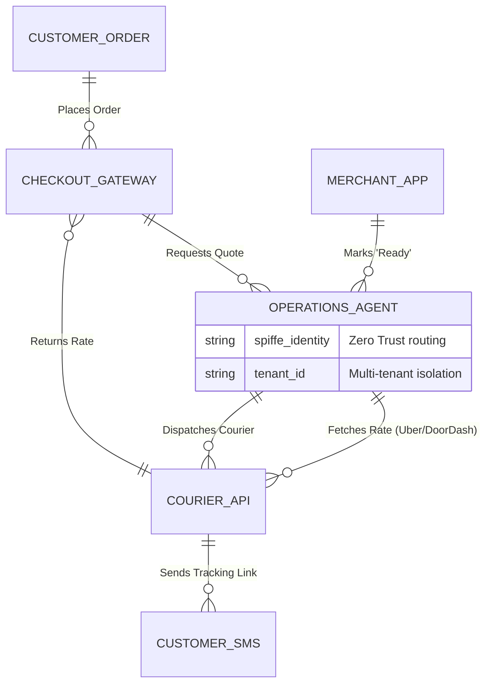

# Title
Autonomous Local Delivery & Dispatch Mesh

# Problem Statement
Small business owners like Maya (the baker taking custom orders via Instagram) and Fatima (the food cart operator taking pre-orders) struggle with offering local delivery. They either lose 30% to major delivery apps (UberEats, DoorDash) or struggle manually dispatching local couriers or their own runners. They have to juggle multiple apps, manually enter customer addresses, and manually calculate delivery fees based on distance or zones. They need a zero-config way to offer local delivery where the AI handles dispatching delivery networks (like Uber Direct or DoorDash Drive) or local runners invisibly, automatically calculating fees and providing tracking updates to the customer, all from their phone.

# Research Report
*   **Shopify Local Delivery:** Requires the merchant to manually create delivery zones, define prices, and use a separate app to route and dispatch deliveries. It is highly manual and requires the merchant to act as the dispatcher.
*   **Square On-Demand Delivery:** Requires desktop-first complex setup to integrate with DoorDash/Uber. It forces merchants to navigate clunky web interfaces and manage delivery rules manually.
*   **Wix/Squarespace:** Typically rely on third-party integrations that are difficult to set up, breaking the native flow for small businesses.
*   **OneHumanCorp (OHC) Differentiation - "Invisible Dispatch":** Instead of making the merchant act as a dispatcher, OHC deploys an **Operations Agent**. When an order comes in for local delivery, the agent autonomously quotes the delivery via APIs (Uber Direct/DoorDash Drive), adds the transparent fee to the customer's checkout, and dispatches the courier when the order is marked "Ready" by the merchant.

# Design Doc

## Architecture Diagram

## UI Wireframes & 375px Baseline
**Core Layout: macOS-style Translucent Glass + Ubiquiti UniFi Modular Dashboard Cards**
*   **Global Viewport:** 375px width (Mobile First). No horizontal scrolling.
*   **App Bar:** Blurred glass top nav with business logo.
*   **Order View (The KDS/Queue):**
    *   A vertically scrolling list of cards representing active orders.
    *   Each card has a frosted glass background (`rgba(255, 255, 255, 0.05)` with `backdrop-filter: blur(10px)`).
    *   **Badging:** A small icon indicates "Local Delivery".
    *   **Action Button:** A massive green button saying "Mark Ready & Request Courier".
*   **Advanced Settings (Hidden):**
    *   Found via swipe left on the app bar. Merchants can toggle "Auto-Dispatch" vs "Manual Approval", and set maximum delivery radius.

## Mobile UX Flow
1. **Notification:** Maya receives a push notification on her iPhone: "New Order: 1x Custom Cake. Local Delivery paid."
2. **Launch:** She taps the notification and opens the OHC app into the Order View.
3. **Action:** When the cake is done, she taps the massive "Mark Ready & Request Courier" button.
4. **Agent Action:** The Operations Agent autonomously pings Uber Direct, dispatches a driver, and texts the tracking link to the customer. The UI updates to "Courier en route (2 mins)".

## AI Agent Integration Points
*   **Operations Department:** Handles the background negotiation with third-party delivery APIs, calculates dynamic pricing based on distance/time, and manages the dispatch state machine.
*   **Customer Success (CS) Department:** Monitors the delivery. If the courier is delayed or cannot find the address, the CS agent texts the customer: "Hi, your driver is outside but having trouble finding the door. Can you guide them?" before escalating to the merchant.

## Key Design Decisions (Why, not How)
*   **Zero-Config Setup:** Non-technical merchants shouldn't need API keys or complex zone mapping. The AI handles the logistics routing invisibly.
*   **Mobile-First KDS Integration:** The dispatch action must be tied to the natural workflow of preparing an order (e.g., marking it "Ready"). No separate dispatcher view.
*   **Unified Tracking:** Customers shouldn't need to download a third-party app to track their order. OHC sends an SMS with a white-labeled tracking link.
*   **Zero-Trust Isolation:** Delivery APIs require strict tenant isolation (using SPIFFE) to ensure billing and routing don't cross boundaries.

# Implementation Prompt
**To the Implementer Swarm:**
Your goal is to build the underlying architecture and UI for the "Autonomous Local Delivery & Dispatch Mesh" so a user like Maya or Fatima can offer local delivery without manually coordinating couriers.

**Customer User Journey (CUJ):**
1. Maya toggles "Local Delivery" on her store.
2. A customer checks out. The system dynamically quotes delivery via background APIs (e.g., Uber Direct mock).
3. Maya prepares the order and taps "Ready" on her mobile app.
4. The Operations Agent dispatches the courier and sends a tracking link to the customer via SMS.

**Acceptance Criteria:**
*   **Mobile Parity:** The UI must be implemented perfectly for a 375px viewport using the described Translucent Glass aesthetics, focusing on a single "Ready" action.
*   **Agent Integration:** The system must hook into the background Operations agent to trigger a dispatch when an order is marked ready.
*   **Isolation Guarantee:** Implement strict multi-tenant boundary checks so a tenant can only view/dispatch their own orders.
*   **Simplicity:** Do not expose developer concepts (API keys, webhooks, geofences) in the core UI. Hide configuration behind an "Advanced" toggle.

# Priority
P1

# Estimated Scope
Large