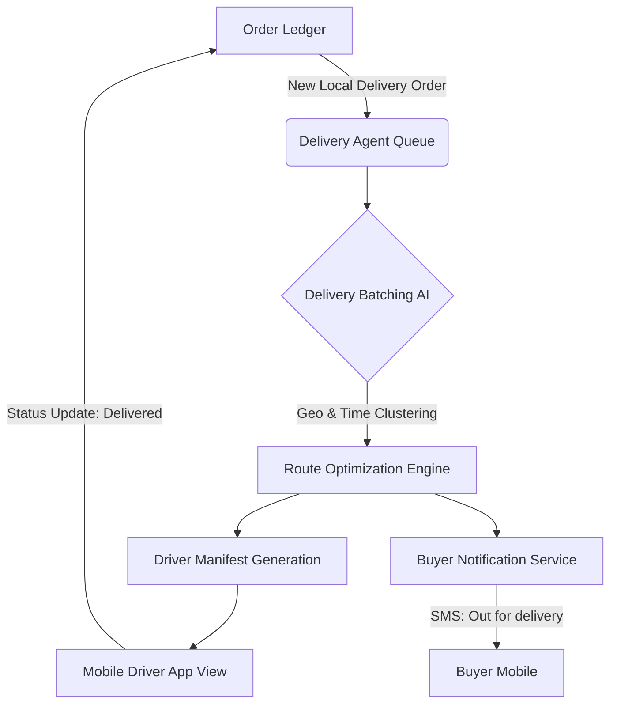

# Autonomous Local Delivery Routing Engine

## Title
Implement Autonomous Local Delivery Routing Engine

## Problem Statement
For local business owners like **Maya the baker** or **Fatima the food cart operator**, delivering physical goods locally is a massive source of operational friction. They currently have to manually text customers, punch addresses into Google Maps, figure out the most efficient driving route in their heads, and field endless "where is my order?" messages.
This breaks the OneHumanCorp promise of invisible complexity. A baker should bake; they shouldn't be acting as a full-time logistics dispatcher or a customer support agent tracking a delayed courier. We need an integrated, zero-touch system that automatically batches local orders, calculates optimal routes, generates a simple step-by-step driver view for whoever is doing the delivery (the owner or an employee), and keeps the buyer updated in real-time.

## Research Report
- **Current OHC State:** We have strong booking, pickup, and standard shipping capabilities. However, "Local Delivery" is treated either as generic shipping (which requires carrier integrations) or simple pickup, leaving a gap for point-to-point self-managed local delivery.
- **Competitor Analysis:**
  - **Shopify:** Offers local delivery as a shipping method, but their native routing app is clunky, requiring manual selection of orders and dispatching. It often pushes merchants to third-party paid apps (like Routific).
  - **Square:** Good point-of-sale integration, but local delivery dispatch is heavily reliant on integration with On-Demand delivery services (UberEats/DoorDash) which eat heavily into SMB margins. Self-delivery routing is weak.
  - **Wix:** Basic local delivery zones exist, but lacks multi-stop intelligent routing and real-time SMS buyer tracking without external apps.
- **The Gap:** There is no platform offering a truly *autonomous* local delivery agent that seamlessly sits between the ledger, the map, and the buyer's phone.
- **Opportunity:** By treating Local Delivery routing as an autonomous AI background process, OHC can own the entire post-purchase local delivery experience, drastically reducing merchant operations time and improving buyer trust.

## Design Doc

### 1. Architecture Diagram

### 2. Mobile-First UX Flow (375px Viewport)
- **Merchant Hub:** A clean, translucent card on the main dashboard reads "3 Deliveries Scheduled for Today. [Start Route]".
- **Driver View:** Upon tapping "Start Route", the interface transitions to a unified map + card stack.
  - **Top half:** Live map with the calculated optimal path.
  - **Bottom half:** Swipable cards for each stop. Each card has: Customer Name, Order #, Address (tap to navigate), Delivery Notes ("Leave at back door"), and a giant swipe-to-complete "Mark Delivered" button.
- **Buyer Experience:** No app required. Buyer receives a rich SMS link opening a branded, minimal tracking page with an ETA and a direct "Chat with Driver" interface powered by the AI unified inbox.
- **Grandmother Test:** Fatima can hand her phone to a helper. The helper taps the only button on the screen ("Start Route"), follows the map, and swipes a giant green bar when they hand over the food.

### 3. AI Agent Integration Points
- **Operations Agent:** Automatically monitors the order queue, clustering nearby addresses and time windows to generate the most efficient daily or hourly delivery manifest.
- **Customer Success (CS) Agent:** intercepts inbound buyer messages ("I won't be home, leave it on the porch") and silently updates the delivery notes in the Driver View without bothering the merchant.

### 4. Technical Integrity & Security
- **Multi-Tenant Isolation:** All geo-coordinates, routing data, and buyer details must be strictly isolated per `organization_id`.
- **Offline Capability:** The Driver Manifest must cache locally upon "Start Route". Route progression and "Mark Delivered" actions must queue locally and sync when connectivity returns, ensuring delivery operations continue in cellular dead zones.

## Implementation Prompt
**Outcome:** Build the local delivery driver manifest and routing engine.
**Core User Journey (CUJ):**
1. The AI Operations Agent identifies 3 local delivery orders.
2. The Merchant opens the OHC mobile view, sees a "Start Deliveries" card, and taps it.
3. The UI presents an optimized, offline-capable route list.
4. The Merchant completes the route, swiping to mark each as delivered. The system handles buyer ETA notifications automatically.
**Acceptance Criteria:**
- The frontend must present an offline-capable, 375px-optimized driver manifest view with clear swipe-to-complete interactions.
- A background process must automatically cluster incoming "local delivery" orders by geography and time.
- The system must trigger appropriate buyer notification webhooks/events upon route start and delivery completion.
- Multi-tenant data isolation must be strictly enforced.

## Priority
P1

## Estimated Scope
Medium
