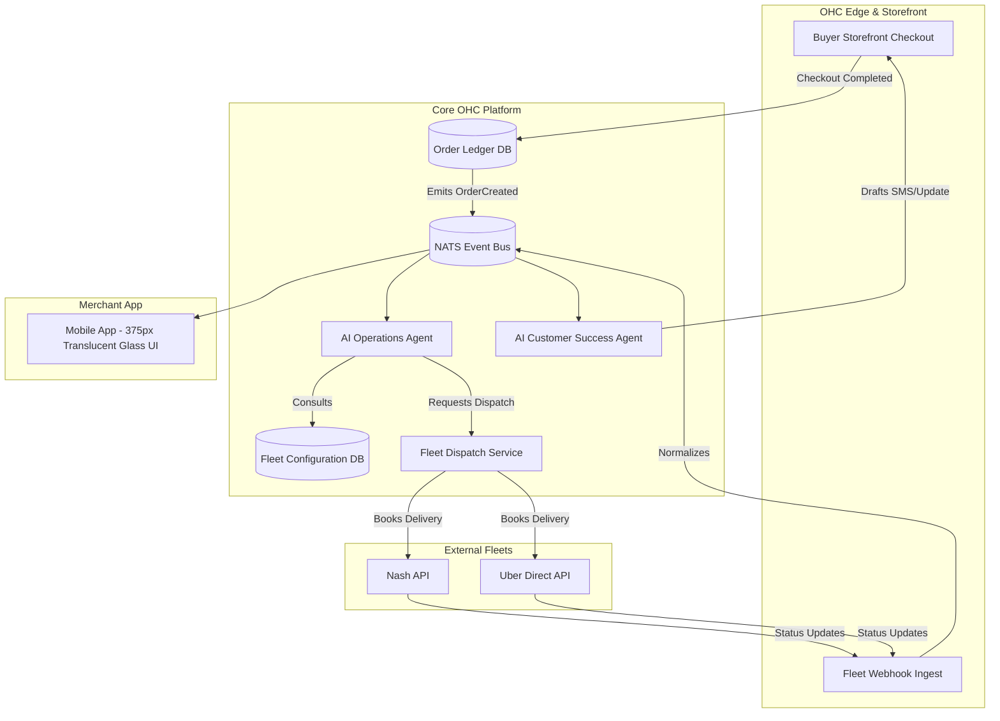
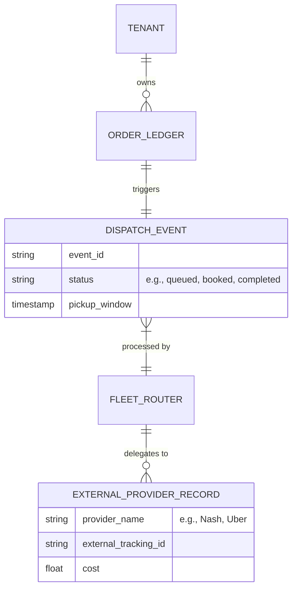
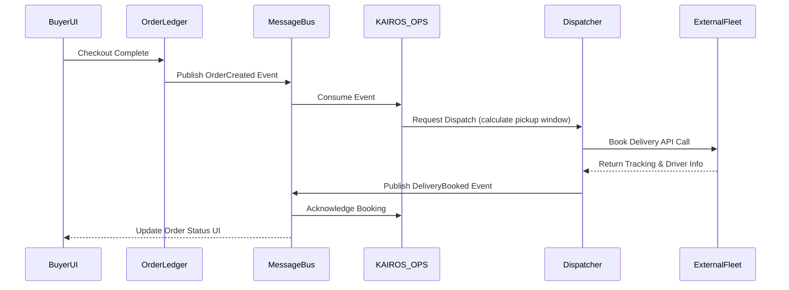

# [Architecture] Autonomous Local Fleet & Dispatch Engine

## Title
Autonomous Local Fleet & Dispatch Engine

## Problem Statement
Small business owners (like Maya the custom cake baker and Fatima the halal food cart operator) desperately want to offer same-day local delivery to compete with major platforms. However, they face a double bind: offering delivery through aggregator apps (like DoorDash, Uber Eats) forces them to surrender a 30% margin and lose ownership of the customer relationship. Conversely, building their own delivery operation requires managing drivers, optimizing routes, and dealing with complex white-label fleet APIs (like Uber Direct or Nash), which is technically impossible for them. They need an invisible, zero-touch system where they simply toggle "Offer Local Delivery" on their phone, and an AI agent automatically coordinates pricing, dispatch, and tracking in the background using a white-label fleet without requiring the owner to write code or configure API keys.

## Research Report
*   **Shopify:** Requires third-party apps (like Zapiet or Nash's Shopify plugin) to handle robust local delivery routing. These apps are often desktop-first, require complex setup, and fail the "Grandmother Test."
*   **Wix / Squarespace:** Basic support for setting delivery zones, but no native, zero-config integration with white-label fleets. Merchants still have to manually book the driver.
*   **DoorDash / Uber Eats (Aggregators):** Provides the drivers but takes up to a 30% cut of the transaction and controls the customer data.
*   **OHC Advantage:** By integrating the KAIROS Operations Agent natively with white-label delivery APIs (e.g., Nash, Uber Direct, DoorDash Drive) via the orchestration hub, OHC offers a fully autonomous dispatch solution. The merchant owns the customer, pays only a flat delivery fee (passed to the buyer), and the AI handles all logistics, exceptions, and updates invisibly.

## Design Doc

### Architecture Diagram

### UI Flow & UX (Mobile-First 375px)
*   **Visual Style:** macOS-style Translucent Glass materials combined with clean Ubiquiti UniFi modular dashboard card layouts.
*   **The "Orders" View:** A vertically scrolling feed of active orders. Orders marked for local delivery feature a small, animated "Delivery Truck" badge.
*   **Order Details Card:** When tapping an order, a frosted glass card (`rgba(255, 255, 255, 0.05)` with `backdrop-filter: blur(10px)`) displays the order details.
*   **Autonomous Dispatch Indicator:** A pulsing green spark icon indicates the KAIROS Operations Agent has dispatched the driver. A live, stylized map (using Mapbox, styled to match the dark/light mode glass theme) shows the driver's location.
*   **Exception Handling:** If a driver cancels, the AI automatically attempts to rebook. If it fails, a red pulse icon appears, and a "Human Required" chip floats above the action bar, prompting the merchant to take action.
*   **Grandmother Test:** The merchant never sees API keys, webhook URLs, or routing algorithms. They simply toggle "Local Delivery: ON" in their fulfillment settings.

### AI Agent Integration Points
*   **Operations Agent (KAIROS_OPS):** Listens to the `OrderCreated` event. Calculates the optimal pickup window based on preparation time (e.g., Maya needs 2 hours for a cake). Automatically calls the Dispatcher service to request a quote and book the driver.
*   **Customer Success Agent (KAIROS_CS):** Listens to incoming webhook updates from the fleet (e.g., "Driver arriving in 5 mins"). Automatically drafts and sends localized, friendly SMS updates to the buyer.

### Key Design Decisions
1.  **Abstracted Dispatcher Service:** The core platform should not tightly couple to a single fleet (like Uber Direct). The `Dispatcher` service must act as a normalizer, allowing OHC to intelligently route requests to the best available provider (Nash, Uber, local couriers) behind the scenes.
2.  **Event-Driven Updates:** Status updates from drivers must flow through the central NATS `MessageBus` to ensure both the mobile UI and the AI agents remain in sync instantly.
3.  **Strict Multi-Tenant Isolation:** The webhook ingest layer must cryptographically verify payloads and strictly map the external delivery ID back to the specific OHC tenant ID. Tenant A must never receive tracking updates for Tenant B.

## Implementation Prompt

**To the Implementer Swarm:**
Build the backend infrastructure for the Autonomous Local Fleet & Dispatch Engine. Your goal is to allow the OHC platform to automatically book and track local deliveries without exposing any configuration complexity to the merchant.

**User Journey (CUJ):** A buyer places a local delivery order for a custom cake from Maya's bakery. Once the payment clears, the KAIROS Operations Agent autonomously calculates the pickup time, contacts the Fleet Dispatch Service, gets a quote, books the driver, and relays the tracking link to the buyer—all while Maya simply sees the order move to "Driver Assigned" in her mobile dashboard.

**Acceptance Criteria:**
1.  **Dispatcher Service:** Implement a backend service capable of abstracting requests to a white-label fleet API (you can mock the external API connection for now, but design the interface to handle multiple providers). It must support `GetQuote`, `BookDelivery`, and `CancelDelivery`.
2.  **Webhook Ingestion & Normalization:** Create a secure endpoint to ingest webhook status updates from the external fleet (e.g., `driver_assigned`, `picked_up`, `delivered`). Normalize these into standard OHC events and publish them to the NATS bus.
3.  **Zero-Trust Multi-Tenancy:** Ensure strict tenant isolation. The dispatcher must associate every delivery with a specific `tenant_id`, and webhook ingest must correctly route updates only to that tenant's event stream.
4.  **Agent Trigger Integration:** Provide the necessary NATS event structures so the Operations Agent can trigger dispatch upon `OrderCompleted` and the Customer Success agent can react to delivery state changes.

*Note: Do not prescribe specific database schemas or internal function signatures. Focus on the service boundaries, multi-tenant isolation, and the event-driven interactions.*

## Priority
P0

## Estimated Scope
Large

### Data Model ER Diagram

### Dispatch Sequence Diagram

