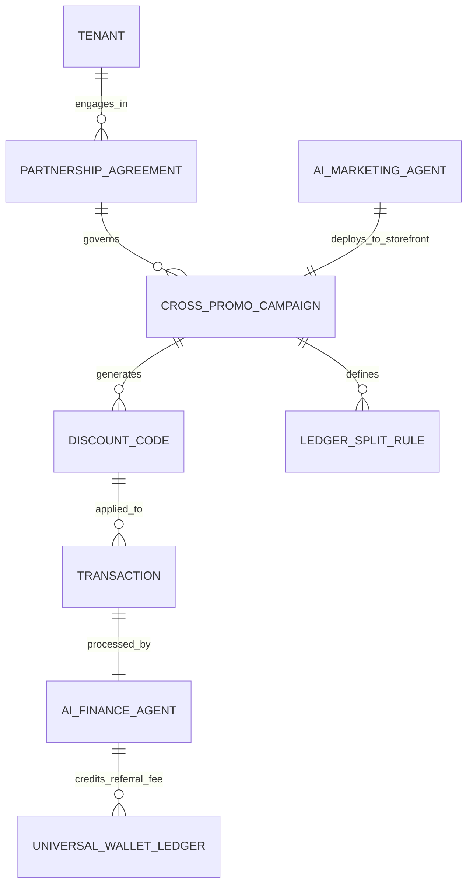

# [Architecture] Autonomous Local Partnership & Cross-Promotion Mesh

## 1. Title
Autonomous Local Partnership & Cross-Promotion Mesh

## 2. Problem Statement
**The Small Business Reality:**
For local service providers and retailers (like Maya the baker and Priya the boutique owner), the most effective marketing isn't Facebook ads—it's local partnerships. If Priya's boutique recommends Maya's custom cakes for weddings, both win. However, setting up formal cross-promotions, affiliate tracking, or split-discount codes is technically daunting. It requires negotiating terms, manually creating discount codes on each other's platforms, tracking conversions in spreadsheets, and manually transferring referral fees.

**The Non-Technical User Pain Point:**
Small business owners lack the time and technical expertise to broker and track these partnerships. They need an invisible, autonomous system that identifies symbiotic local businesses on the OHC platform, proposes a partnership, and handles all the technical implementation (discount codes, revenue share, and ledger reconciliation) with a single tap.

## 3. Research Report
**Market Context & Competitor Gaps:**
- **Shopify:** Relies on third-party affiliate apps (like Collabs or Refersion). These are designed for massive influencer networks, not hyper-local B2B partnerships. They require complex setup and external payouts.
- **Wix/Squarespace:** No native cross-promotion tools. Businesses must manually exchange promo codes and rely on the honor system.
- **The OHC Opportunity:** Because OHC hosts multiple local businesses on a unified multi-tenant infrastructure and shared `UniversalWalletLedger`, we can create a "zero-trust, zero-friction" partnership mesh. OHC's AI agents can match local businesses and autonomously deploy shared promotional campaigns.

## 4. Design Doc
### Architecture Diagram

### UI Wireframes & Mobile UX Flow (375px First)

**Screen 1: Proactive Partnership Pitch (Pulse Dashboard)**
- A translucent glass Unifi card appears on Maya's dashboard:
- *"Partnership Opportunity: Priya's Boutique (0.5 miles away) shares 30% of your customer base. Want to offer her customers a 10% discount on cakes, in exchange for a 5% referral fee?"*
- Buttons: "Review Details" | "Dismiss"

**Screen 2: Partnership Details & Approval**
- Shows the proposed terms generated by the AI Marketing Agent.
- **Terms:** "Priya's customers get 10% off Maya's Cakes. Maya pays Priya 5% of the sale. Handled automatically."
- **Action:** A prominent, single tap button: *"Accept Partnership"*. (Zero API keys or manual discount code creation required).

**Screen 3: Customer Experience (Checkout)**
- When a recognized customer of Priya's boutique checks out at Maya's store, the edge-caching storefront dynamically highlights: *"As a friend of Priya's Boutique, you get 10% off!"* The code is auto-applied.

### AI Agent Integration Points
- **AI Marketing Agent (Scout):** Continuously analyzes anonymized customer overlap and geographic proximity between tenants to propose high-conversion partnerships.
- **AI Finance Agent (Ledger):** When a transaction uses a partnership discount, the Finance Agent intercepts the payment routing, deducting the referral fee from the seller's payout and instantly crediting the partner's `UniversalWalletLedger`.

### Key Design Decisions
- **Zero-Friction Discovery:** The system must push opportunities to the merchant, rather than requiring the merchant to browse a directory.
- **Automated Ledger Splits:** Avoid external payouts or invoices. Use the native `UniversalWalletLedger` to instantly reconcile referral fees, ensuring zero financial admin for either party.
- **Privacy-Preserving Overlap Analysis:** Customer identity resolution must use hashed/anonymized identifiers to determine shared customer bases without exposing raw PII across tenant boundaries.

## 5. Implementation Prompt
**Context:** Implement the Autonomous Local Partnership Mesh.
**User Journey:** Maya accepts an AI-proposed partnership with Priya. The system automatically creates a synchronized discount code. When a customer uses the code at Maya's store, Maya receives the sale (minus discount), and Priya instantly receives a referral credit in her OHC wallet.
**Acceptance Criteria:**
1. Define a `PartnershipAgreement` and `CrossPromoCampaign` data model with strict multi-tenant validation (requiring dual opt-in).
2. Implement a background matching engine (part of the Marketing Agent) that identifies candidate pairs based on geolocation and anonymized customer graph overlap.
3. Build the checkout interceptor that identifies active cross-promo codes and triggers the Finance Agent to execute a split transaction in the `UniversalWalletLedger`.
4. Ensure the mobile UI for reviewing and accepting partnerships adheres to the Translucent Glass design system on a 375px viewport.
5. Do NOT prescribe specific DB schemas; focus on the entity relationships and ledger integrity rules.

## 6. Metadata
- **Priority**: P1 (High)
- **Estimated Scope**: Large
