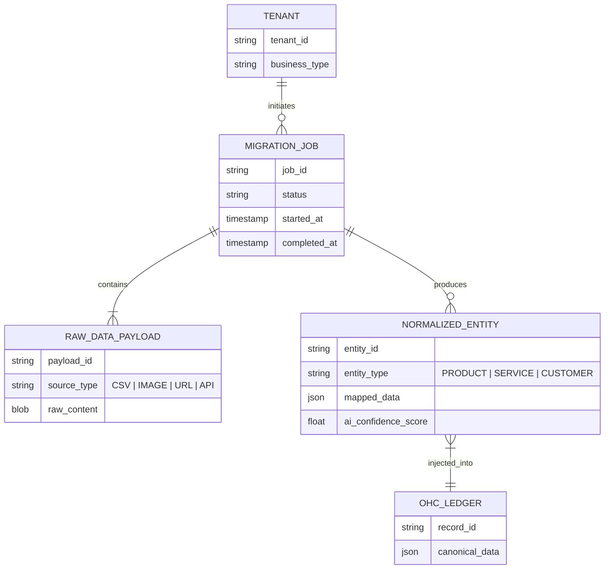
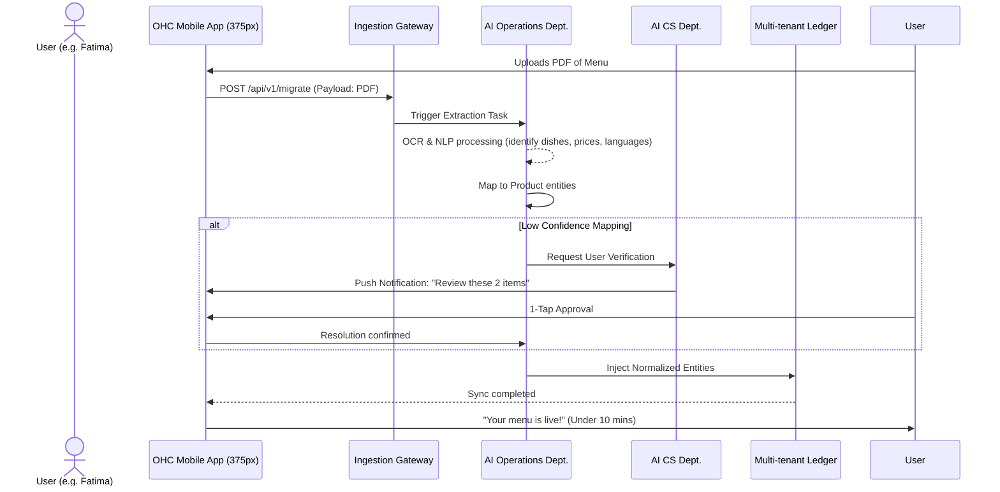

# Autonomous Magic Migration and Data Ingestion Engine

## Title
[architecture] Autonomous Magic Migration and Data Ingestion Engine

## Problem Statement
Small business owners coming to OneHumanCorp (OHC) from legacy platforms (Shopify, Wix, Square, Acuity) or completely offline workflows (paper menus, handwritten ledgers, Instagram DMs) face an immense friction barrier: data migration. Manually re-entering products, customer lists, service menus, and historical data violates our "Zero → Live in 10 minutes" mission. This manual work often leads to abandonment during the Acquisition/Onboarding phase. For example:
- **Priya (Boutique Owner):** Has 500 SKUs on Shopify and needs them in OHC instantly.
- **Fatima (Food Cart):** Only has a printed PDF menu with Arabic and English descriptions.
- **Leo (Tutor):** Keeps client appointments and notes in an Excel spreadsheet.

If they have to spend hours doing data entry, they won't use OHC. We need an invisible, AI-driven ingestion engine that takes *any* structured or unstructured data format and automates the creation of the OHC digital presence.

## Research Report
### Current Market Landscape
- **Shopify:** Provides a standard CSV import tool or relies on third-party migration apps (like Cart2Cart) that are complex, error-prone, and require mapping fields manually.
- **Wix/Squarespace:** Similar CSV-based tools. No reliable handling for unstructured data like images of menus or raw text dumps.
- **Square:** Offers CSV import for items but lacks a seamless way to pull historical customer data or service menus seamlessly from non-POS systems.

### The OHC Solution
OHC will differentiate by treating "migration" not as a developer task (mapping database fields), but as a task for an AI Operations Agent. The user simply "drops" their data (a Shopify export CSV, a photo of a menu, a link to their Instagram page), and the **Autonomous Magic Migration Engine** invisibly parses, normalizes, and injects the data into the OHC multi-tenant ledger, setting up their store instantly.

## Design Doc

### 1. High-Level Architecture Flow

1. **Ingestion Layer:** Accepts multi-modal inputs (CSV files, PDF/Image scans, Web URLs, Social Media API tokens).
2. **AI Operations Department (Parser/Extractor):** LLMs process unstructured data (OCR for images, NLP for text/web scrapes) and map it to OHC's internal domain models (Products, Services, Customers).
3. **Validation & Resolution Engine:** If confidence is low or required fields are missing, an AI Customer Success Agent triggers a simple push notification to the user for 1-tap confirmation (e.g., "Is 'Vanilla Cake' a product or a service?").
4. **Data Injection & Ledger Sync:** The normalized data is securely written into the universal ledger, ensuring Zero Trust multi-tenant isolation.
5. **Activation:** The user's store/booking page is instantly generated and populated.

### 2. Entity-Relationship Diagram (Mermaid.js)

### 3. Sequence Diagram (Mermaid.js)

### 4. Mobile UX Flow (375px Viewport)
1. **Onboarding Screen:** "Bring your existing business." Options: "Upload File (CSV/PDF)", "Take a Photo of Menu", "Connect Instagram".
2. **Loading State:** Translucent Glass card showing "AI is organizing your catalog..." with subtle, premium motion graphics.
3. **Review Card (If Needed):** Clean, card-based UI. "We found 'Custom Setup'. Is this a physical item or a service?" (Two large, easily tappable buttons: [Physical Item] [Service]).
4. **Success Screen:** Confetti animation. "Your business is ready." Button: [View My Storefront].

### 5. Key Design Decisions & Constraints
- **Zero Trust Multi-Tenancy:** All ingested data is strictly isolated via SPIFFE/SPIRE identity tokens tied to the tenant before it hits the mapping stage.
- **Asynchronous Processing:** Migration runs as a background job. The mobile client receives real-time progress via WebSocket/SSE without blocking the main thread.
- **Mobile First:** File uploads and camera integrations must be flawlessly optimized for low-end Android and iOS devices, handling dropped connections gracefully with resumable uploads.

## Implementation Prompt

**Target Agent:** Implementer / Backend Engineer

**Goal:** Implement the "Autonomous Magic Migration Engine" backend service and API layer that accepts multi-modal business data (initially focusing on CSV and Image/PDF uploads) and automates the creation of OHC catalog entities (Products/Services).

**User Journey (CUJ):**
1. As a new user (e.g., Fatima with a food cart), I want to take a picture of my printed menu during onboarding so that I don't have to manually type in all my items and prices.
2. As a transitioning user (e.g., Priya), I want to upload my Shopify CSV export so that my entire inventory is instantly available in OHC.

**Acceptance Criteria:**
- The system must provide an API endpoint to accept file uploads (CSV, JPG, PNG, PDF).
- The system must securely store the raw payload and queue an asynchronous migration job.
- The AI parsing logic must successfully extract item names, descriptions, and prices from a sample image menu and map them to OHC product entities.
- The parsing logic must handle standard e-commerce CSV formats (e.g., Shopify format) and map them to OHC product entities.
- The system must enforce multi-tenant data isolation.
- The system must provide a mechanism to query the status of a migration job and retrieve the mapped entities.
- Do NOT prescribe the specific database schema or AI library—design the interfaces and the orchestration logic.

**Priority:** P0 (Critical for activation)
**Estimated Scope:** Large
