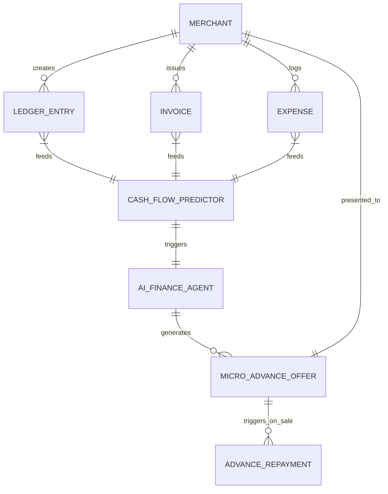

# [architecture] Autonomous Micro-Capital and Cash Flow Engine

## Title
Autonomous Micro-Capital and Cash Flow Engine

## Problem Statement
Small business owners (Maya the Baker, Carlos the Handyman, Fatima the Food Cart Operator) constantly face cash flow gaps. Maya needs to buy $300 in ingredients for a weekend wedding but won't get paid until the cake is delivered on Saturday. Carlos needs to buy $1,500 in materials for a deck build today but the client only paid a 20% deposit. Fatima needs to repair her generator but Friday's festival payout hasn't hit her bank yet.

Existing solutions like traditional small business loans take weeks and require complex paperwork. Competitor solutions (Square Loans, Shopify Capital) are often reactive, requiring the user to navigate to a dashboard, click a button, and wait for approval. We need a proactive, zero-friction system where OHC's internal ledger predicts cash flow crunches and the AI Finance Agent offers instant, revenue-based micro-advances directly in the natural workflow (e.g., when a large material expense is detected or a large invoice is sent).

## Research Report
*   **Industry Standards:** Shopify Capital and Square Loans have proven that revenue-based financing (repaid as a percentage of daily sales) is the most viable model for SMBs. However, they rely on traditional dashboard interactions.
*   **Competitor Gaps:**
    *   **Shopify Capital:** Excellent underwriting, but heavily dashboard-dependent. It feels like a separate banking product rather than an integrated workflow.
    *   **Stripe Capital:** Very API-driven (B2B focus), less tailored for the micro-merchant on their phone.
    *   **Wix Capital:** Similar to Shopify, reactive and dashboard-centric.
*   **OHC Advantage:** Since OHC manages the unified ledger, AI Inbox, and inventory, we can predict cash flow needs *before* they become emergencies.

## Design Doc

### Architecture Diagram

### Mobile UX Flow (375px First)
1. **Trigger:** Maya logs a $400 expense for "Wedding Cake Supplies" in the OHC mobile app, but her linked operating balance is only $150.
2. **Intervention:** The AI Finance Agent instantly pops a translucent glass modal (macOS style): "Looks like you're short on cash for these supplies. Since you have $800 in confirmed weekend orders, tap here to instantly advance $300 to your wallet. We'll automatically deduct 10% from your weekend sales until it's paid back (Fee: $15)."
3. **Action:** Maya taps "Advance $300". FaceID authenticates.
4. **Resolution:** Funds instantly settle in her OHC Wallet. No paperwork, no waiting.

### Key Design Decisions
*   **Proactive vs. Reactive:** The system must push offers when a cash crunch is detected (e.g., large invoice created, large expense logged), rather than waiting for the user to visit a "Capital" tab.
*   **Repayment Mechanism:** Must strictly be revenue-based financing (RBF). When the advance is active, a set percentage (e.g., 10%) of every incoming OHC sale is automatically diverted to repay the advance.
*   **Zero-Trust Identity:** The advance offer and acceptance must be cryptographically signed using the agent's SPIFFE ID and the human's OIDC mapping to ensure non-repudiation of the micro-loan.

## Implementation Prompt
Implement the underlying data structures, background job queues, and AI agent coordination for the Autonomous Micro-Capital Engine.

*   **Acceptance Criteria 1 (Ledger Analysis):** Create a background job (e.g., running every 4 hours or triggered on large ledger events) that analyzes a merchant's 30-day revenue history and upcoming confirmed bookings/invoices to calculate a `safe_advance_limit`.
*   **Acceptance Criteria 2 (Trigger Engine):** Build an event listener that detects when a merchant logs an expense exceeding their current available balance, or issues an invoice larger than 2x their daily average. This should dispatch an event to the AI Finance Agent.
*   **Acceptance Criteria 3 (Offer Generation):** The AI Finance Agent must process the event and generate a structured `MicroAdvanceOffer` entity containing the principal, flat fee, and repayment percentage.
*   **Acceptance Criteria 4 (Auto-Repayment):** Modify the core payment processing pipeline so that if a merchant has an active `MicroAdvanceOffer`, the specified percentage of the incoming transaction is automatically split and routed to the repayment ledger before the remainder settles in the merchant's wallet.
*   **Constraint:** Do not build the UI. Focus on the robust backend multi-tenant data model and the agent coordination logic. Ensure all tenant data is strictly isolated.

## Priority
P1

## Estimated Scope
Large
