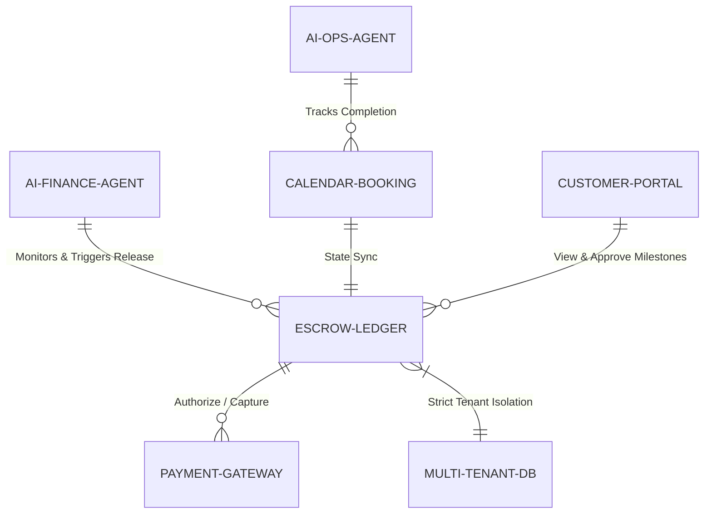

# Title: Autonomous Milestone Deposit and Escrow Ledger

## Problem Statement
Small business owners who provide services or custom products (like Carlos the handyman, or Maya the baker) face immense friction in securing their work financially. They often require a deposit to cover materials or hold a calendar spot, followed by milestone payments or a final balance on completion. Currently, they either rely on trust (which leads to no-shows and unpaid invoices), or use disparate tools (manual invoices, Venmo, disjointed calendar deposits) that require constant manual follow-up. A unified, autonomous deposit and escrow ledger is needed to automatically handle partial payments, hold funds securely, and release them based on project milestones or AI-verified completion, without the merchant ever chasing a payment.

## Research Report
*   **Current Architecture Limits:** OHC's current payment and invoicing systems treat transactions as single, atomic events. There is no native support for multi-stage payments linked to a single project or calendar booking state machine.
*   **Competitor Analysis:**
    *   *Shopify:* Built for single-transaction e-commerce. Lacks native milestone billing and service-based escrow.
    *   *Square/Stripe Invoicing:* Supports partial payments, but lacks autonomous AI-driven milestone tracking and automated follow-ups based on calendar or project state.
    *   *Upwork/Fiverr:* Excellent escrow and milestone systems, but these are closed marketplaces, not standalone tools for independent SMBs.
*   **Discovery:** We need a core Ledger extension that supports stateful, multi-phase transactions (Deposits, Milestones, Escrow). This must be deeply integrated with the Calendar (for bookings) and AI Agents (for automated follow-ups and release of funds upon completion).

## Design Doc

### Architecture Diagram

### UI Wireframes & Mobile UX Flow (375px)
*   **Customer View (Payment Link):** Customer receives a beautifully formatted Translucent Glass card via SMS/WhatsApp. It shows: Total Project Cost, Deposit Required Now (e.g., $50), and Balance Due Later. A single "Pay Deposit with Apple Pay" button.
*   **Merchant View (OHC Mobile App - 375px):**
    *   **Unified Dashboard Card:** "Active Projects" card showing Carlos's current jobs.
    *   **Project Detail Flow:** Tapping a job shows a modular UniFi-style layout. A clear timeline: [Deposit Paid ✓] -> [In Progress] -> [Balance Pending].
    *   **1-Tap Completion:** When Carlos finishes the job, he taps "Mark Complete". The AI Finance Agent instantly texts the customer for approval and automatically captures the remaining balance from the card on file. Grandmother test passed: no need to create a new invoice; just tap "Complete".

### Key Design Decisions
*   **Stateful Escrow Ledger:** Transactions are no longer just "Paid" or "Unpaid". They have states like `DEPOSIT_HELD`, `MILESTONE_1_PAID`, `BALANCE_PENDING`, `COMPLETED`.
*   **AI-Driven Collections:** The Finance AI agent handles all the awkward "following up for the balance" conversations via SMS or WhatsApp, maintaining a polite, professional tone.
*   **Strict Multi-Tenant Isolation:** The Escrow Ledger uses Zero-Trust policies (SPIFFE/SPIRE) to ensure that Maya's deposits are cryptographically isolated from Carlos's funds.

### AI Agent Integration Points
*   **Finance Agent:** Tracks the ledger state. Automatically messages the customer when a milestone is reached to authorize the next payment or notify of an auto-charge.
*   **Operations Agent:** Monitors the calendar or project board. When a task is marked done, it signals the Finance Agent to initiate the final balance collection.

## Implementation Prompt
Implement a multi-tenant Stateful Escrow Ledger capable of handling deposits and milestone payments. The system must support creating a unified `ProjectTransaction` that defines a required deposit and subsequent balance. It must expose webhooks/events for the AI Finance Agent to trigger balance captures when project state changes (e.g., from `IN_PROGRESS` to `COMPLETED`). Ensure strict cryptographic data isolation between tenants. Do not prescribe specific database schemas or payment processors (e.g., Stripe vs Adyen), but focus on the ledger invariants and state transitions. Acceptance criteria: An AI agent can create a split-payment quote, accept a deposit, and automatically capture the remaining balance 3 days later upon simulated project completion, with all states accurately reflected in the tenant's ledger.

## Priority
P0

## Estimated Scope
Large
