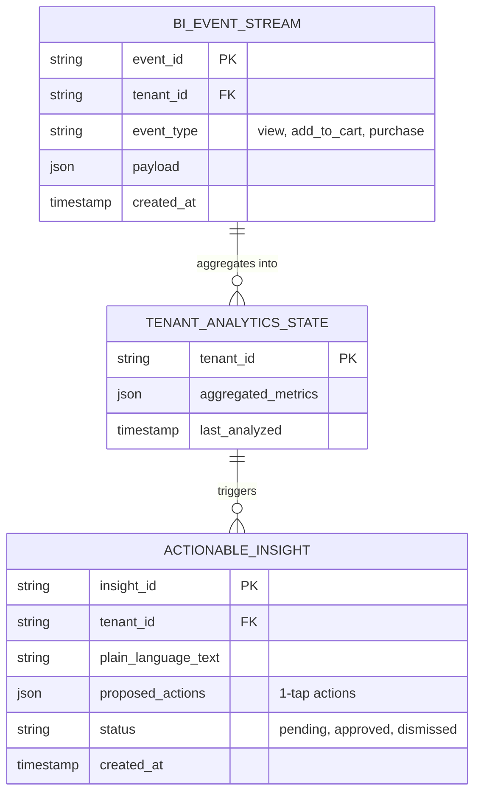

# [Architecture] Autonomous Mobile-First Business Intelligence & Actionable Insights Mesh

## Title

Autonomous Mobile-First Business Intelligence & Actionable Insights Mesh

## Problem Statement

Small business owners—like Priya (boutique owner) and Maya (baker)—do not have the time, screen real estate, or technical background to parse complex, desktop-centric analytics dashboards. They do not need raw data ("Your page views are up 12%"); they need plain-language, immediately actionable insights delivered on a 375px viewport ("Priya, your blue summer dresses are viewing well but not converting. Want me to generate a 15% discount code and email it to the 24 customers who abandoned them in their carts today?"). Existing platforms fail because they treat mobile apps as scaled-down desktop dashboards rather than proactive business assistants.

## Research Report

### Competitor Analysis

* **Shopify:** Offers highly detailed analytics, but primarily designed for desktop viewing. The mobile app shows basic metrics but lacks proactive, plain-language actionable recommendations. Users often rely on third-party apps for advanced insights.
* **Wix:** Analytics are somewhat hidden behind the main dashboard. Mobile experience is limited to high-level traffic numbers.
* **Squarespace:** Good basic traffic analytics but does not bridge the gap between "here is data" and "here is what you should do about it."

### The Gap

No major platform natively integrates an AI-driven, proactive insight engine that runs autonomously in the background, analyzing sales, inventory, and traffic data to push 1-tap actionable decisions directly to a mobile device.

## Design Doc

### Business Journey Mapping

1. **Event Ingestion:** Customer views product, adds to cart, or completes purchase.
2. **Autonomous Analysis:** Background AI agent continuously processes events against historical baselines.
3. **Insight Generation:** Agent identifies an anomaly or opportunity (e.g., high traffic, low conversion on a specific item).
4. **Plain-Language Translation:** Agent translates the data into a simple, actionable prompt ("Your 'Vegan Chocolate Cake' is getting 3x normal traffic today but 0 orders. Should I lower the price by $5 for the next 24 hours?").
5. **1-Tap Action:** User taps "Yes" on their phone; the agent automatically adjusts the price and optionally posts an update to connected social channels.

### Architecture Diagram

### Mobile UX Flow (375px First)

* **Visual Strategy:** macOS-style Translucent Glass materials combined with clean Ubiquiti UniFi modular dashboard cards.
* **The "Daily Briefing" Card:** A single card at the top of the mobile dashboard containing 1-3 critical insights. No complex charts.
* **Interaction:**
  * Insight text is large, legible, and simple.
  * Below the text, a prominent "Approve [Action]" button (e.g., "Send Discount Email").
  * A secondary "Dismiss" button.
* **Zero Developer Terms:** No mention of events, funnels, drop-off rates, or APIs.

### AI Integration Points

* **Data Analyst Agent:** Continuously runs in the background, securely querying isolated tenant data to find patterns.
* **Copywriter Agent:** Translates the findings into plain, encouraging, and actionable human language.
* **Operations Agent:** Executes the approved action (e.g., updating inventory, changing a price, triggering the Marketing Agent to send an email).

### Key Design Decisions

* **Strict Multi-Tenant Isolation:** All events and aggregated states must be strictly partitioned by `tenant_id` at the database level to ensure Zero Trust security.
* **Asynchronous Edge Processing:** Analytics processing must run asynchronously so it never impacts storefront rendering latency or checkout performance.
* **Mobile-First, Plain Language:** The system must fundamentally refuse to present raw charts without accompanying plain-language explanations.

## Implementation Prompt

Design and implement the data ingestion pipeline, background worker queue, and the API endpoints necessary to support the Autonomous Business Intelligence Mesh. The system must ingest raw business events, process them asynchronously to generate actionable insights, and expose an endpoint for the mobile app to fetch the daily briefing. Include the endpoint for the mobile app to approve or dismiss generated actions. Do not prescribe specific database technologies (e.g., Postgres vs. Mongo); design the API contracts and background worker patterns. Ensure the design strictly enforces multi-tenant data isolation.

## Priority

P1

## Estimated Scope

Large
