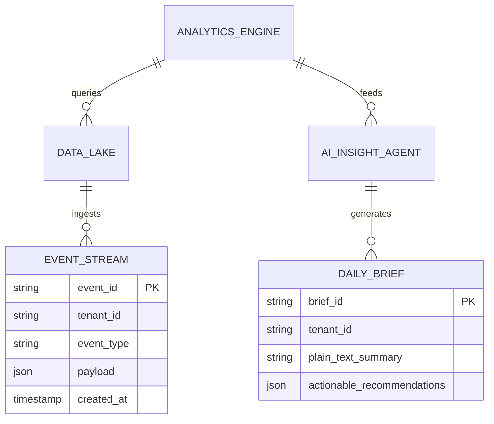
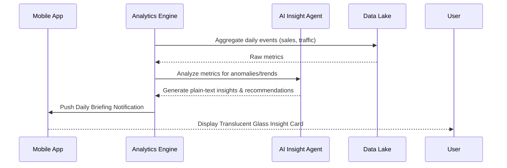

# [Architecture] Autonomous Mobile-First Analytics & Insights Engine

## Problem Statement

Small business owners like Priya (boutique owner) are currently underserved by traditional analytics platforms (like Google Analytics or Shopify Dashboards). These tools are built for desktop-wielding marketing managers and present overwhelming walls of charts, metrics, and complex filter settings. Priya needs to understand how her business is doing—sales trends, inventory velocity, and marketing ROI—while walking around her physical store or standing in line for coffee, strictly from her mobile phone. She doesn't have time to interpret a funnel drop-off chart; she needs an autonomous system that proactively tells her, in plain language, "Your summer dresses are selling 30% faster than last week, but 40% of customers are dropping off at checkout—consider offering a free shipping threshold." OHC needs a mobile-first, AI-driven analytics engine that delivers zero-friction, actionable insights directly to the user's pocket.

## Research Report

We analyzed existing data and analytics tools tailored for the SMB market to understand gaps and opportunities.

### Competitive Analysis

| Platform | Analytics Capabilities | Strengths | Weaknesses (The OHC Opportunity) |
|---|---|---|---|
| Shopify | Shopify Analytics & Reports | Comprehensive ecommerce data | Heavy, desktop-first UI. Requires user to dig for insights. Sidekick is reactive, not proactive. |
| Wix | Analytics Dashboard | Good traffic and basic sales data | Generic charts. Little actionable advice. Not optimized for 375px quick glances. |
| Google Analytics | GA4 | Extremely powerful, event-driven | Overwhelmingly complex. Requires extensive setup and training. Completely unsuited for non-technical SMB owners. |
| **OHC (Target)** | **Autonomous Insights Engine** | **Proactive plain-text insights, 100% mobile-native, Zero configuration** | **Must abstract raw data into actionable business intelligence invisibly.** |

### Key Findings
1. **Time Poverty**: SMB owners spend less than 5 minutes per day looking at analytics.
2. **Analysis Paralysis**: Presenting raw data (e.g., "Bounce rate is 65%") creates anxiety without offering solutions.
3. **The "Grandmother Test"**: If a user cannot glean the primary takeaway from an analytics screen in 5 seconds, it has failed.

## Design Doc

### Architecture Diagram

### UI Wireframes / UX Flow (375px First)

1. **The Morning Push Notification**:
   - User receives a notification at 8:00 AM: "Good morning Priya! Sales are up 15% this week. Tap for your daily briefing."
2. **The Daily Briefing View**:
   - Clean, macOS-style Translucent Glass cards.
   - **Card 1 (The Headline)**: Large, readable text. "You made $1,250 yesterday. Your new organic cotton line is driving most of the growth."
   - **Card 2 (Actionable Insight)**: "You are running low on size M in the blue variant. Tap here to reorder or ask the AI to draft an email to your supplier." (With a prominent "Draft Email" primary button).
   - **Card 3 (Marketing ROI)**: "Your recent Instagram post drove 50 visits but only 1 sale. The AI suggests tweaking the landing page."
3. **Deep Dive (Optional)**:
   - Only if the user taps "Show details" will they see a simplified, elegant sparkline chart. No complex filters or date pickers unless hidden behind "Advanced Settings."

### AI Agent Integration Points

- **The Analyst Agent**: Runs in the background (asynchronous job queue), querying the data lake for statistical anomalies (spikes in traffic, drop-offs in conversion, low inventory velocity).
- **The Translator Agent**: Takes the raw statistical findings from the Analyst Agent and converts them into friendly, plain-language text tailored to the user's specific business type and tone.
- **The Action Agent**: When the user clicks an actionable button (e.g., "Draft Reorder Email"), this agent handles the execution, maintaining context from the insight.

### Key Design Decisions
- **Push over Pull**: Insights are pushed to the user proactively via daily briefings rather than requiring the user to pull up a dashboard and hunt for answers.
- **Narrative over Numbers**: The primary interface is textual storytelling (e.g., "Sales are up because...") rather than raw charts.
- **Zero-Trust Multi-Tenancy**: The analytics engine and data lake must strictly isolate tenant data using SPIFFE/SPIRE identity propagation so cross-tenant data leakage is impossible, even at the aggregation layer.
- **Ubiquiti UniFi Aesthetic**: Dashboards use modular, widget-based cards with ample padding, high contrast, and smooth motion.

## Implementation Prompt

**To the Implementer Swarm:**
Your task is to build the "Autonomous Mobile-First Analytics & Insights Engine."

**User-Facing Outcome:**
When Priya opens her OHC app in the morning, she should not see a dashboard of charts. She should see a personalized, plain-English "Daily Briefing" generated by the AI that tells her exactly what happened yesterday and gives her 1-2 actionable recommendations (e.g., "Reorder inventory" or "Run a promotion on underperforming stock").

**Acceptance Criteria:**
1. **Event Ingestion**: System can ingest commerce and traffic events for a tenant.
2. **AI Briefing Generation**: A background process must synthesize daily events into a plain-text summary and actionable recommendations using the AI Translator Agent.
3. **Mobile-First UI Parity**: Provide an API endpoint that serves the Daily Briefing in a format ready for rendering as modular, translucent cards on a 375px mobile viewport.
4. **Strict Isolation**: Prove via testing that Tenant A cannot query or aggregate Tenant B's analytics events.

**Note**: Do not prescribe the underlying database (e.g., ClickHouse vs Postgres) or the specific LLM prompts. Focus on the API boundaries, the background job scheduling for the Daily Briefs, and the strict multi-tenant isolation.

## Priority
P1

## Estimated Scope
Large
