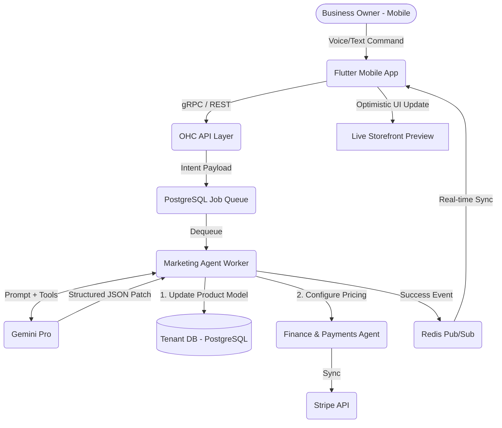

# Architecture Design: Autonomous Mobile-First Storefront Builder

## Problem Statement
Small business owners (like Maya the Baker or Fatima the Food Cart Operator) typically do not use laptops for their daily operations. They run their entire businesses from their smartphones. Legacy platforms (Shopify, Wix) mandate a desktop experience for complex store building, relegating their mobile apps to simple "dashboards." The OHC platform must invert this paradigm by enabling **100% of storefront design, management, and deployment from a 375px mobile screen** without drag-and-drop complexity.

## Proposed Architecture: The Agentic Storefront Builder

The core of this architecture is shifting from a "visual drag-and-drop editor" to a **Conversational Agentic Interface**.

### 1. The Interaction Model
Instead of navigating nested menus to edit a layout, the user interacts with the **Marketing & Advertising Agent ("The Promoter")**.
*   **User Action**: "Add a Vegan Chocolate Cake to my menu. It costs $45, requires a $20 deposit, and I need 2 days notice."
*   **Agent Action**: The agent parses the intent, updates the underlying data model (Product Entity), configures the pricing structure (Stripe Payment Intent for deposit), and instantly updates the UI state.

### 2. UI / UX Design (Mobile-First)
*   **Preview-Driven**: The main view is a 1:1 live preview of the storefront.
*   **Floating Action Bar**: A premium, translucent (Glassmorphism) floating bar at the bottom provides immediate access to the Agent Chat or quick-action cards (e.g., "Add Item", "Change Theme").
*   **Modular Cards**: Everything is rendered as large, touch-friendly cards (minimum 44x44px touch targets).

### 3. Data Flow & Agent Coordination
*   **Frontend (Flutter/PWA)**: Captures user intent (text/voice). Sends to the Backend AI Queue.
*   **Backend (Go + AI Worker)**:
    *   **LLM Provider (Gemini Pro)**: Parses the intent and generates a structured JSON patch representing the desired change (e.g., `create_product`, `update_theme`).
    *   **Orchestrator**: Validates the patch against the tenant's permissions and business constraints.
    *   **Coordination**: Notifies the **Operations Agent** (for inventory) and **Finance Agent** (for the deposit pricing model).
*   **Persistence**: PostgreSQL (Tenant-isolated). Updates trigger a real-time pub/sub event.
*   **Update UI**: The frontend receives the pub/sub event and re-renders the live preview optimistically.

## Diagrams

### High-Level Architecture

### Mobile UX Flow (375px)
1. **Home Screen**: Shows current live storefront preview.
2. **Action**: User taps the floating "Promoter Agent" bubble.
3. **Modal**: A half-screen bottom sheet slides up (Glassmorphism effect). User types/speaks: "Update my store hours to close at 5 PM on Fridays."
4. **Processing**: Agent shows a quick loading state ("Updating store hours...").
5. **Confirmation**: The bottom sheet retracts, and the live preview visibly highlights the updated hours section.

## Security & Isolation
*   All agent-driven changes are scoped via `tenant_id` at the database level (Row Level Security).
*   High-risk actions (e.g., changing bank details, deleting a whole product category) require explicit secondary confirmation via the UI ("Agent proposes deleting 5 items. Approve?").

## Next Steps for Implementation
1. Develop the baseline Flutter UI for the live-preview shell and the floating Agent action bar.
2. Implement the Backend API endpoint to accept natural language prompts for storefront mutations.
3. Wire the Gemini Pro tool function (`update_storefront_state`) to handle the JSON schema translation.
