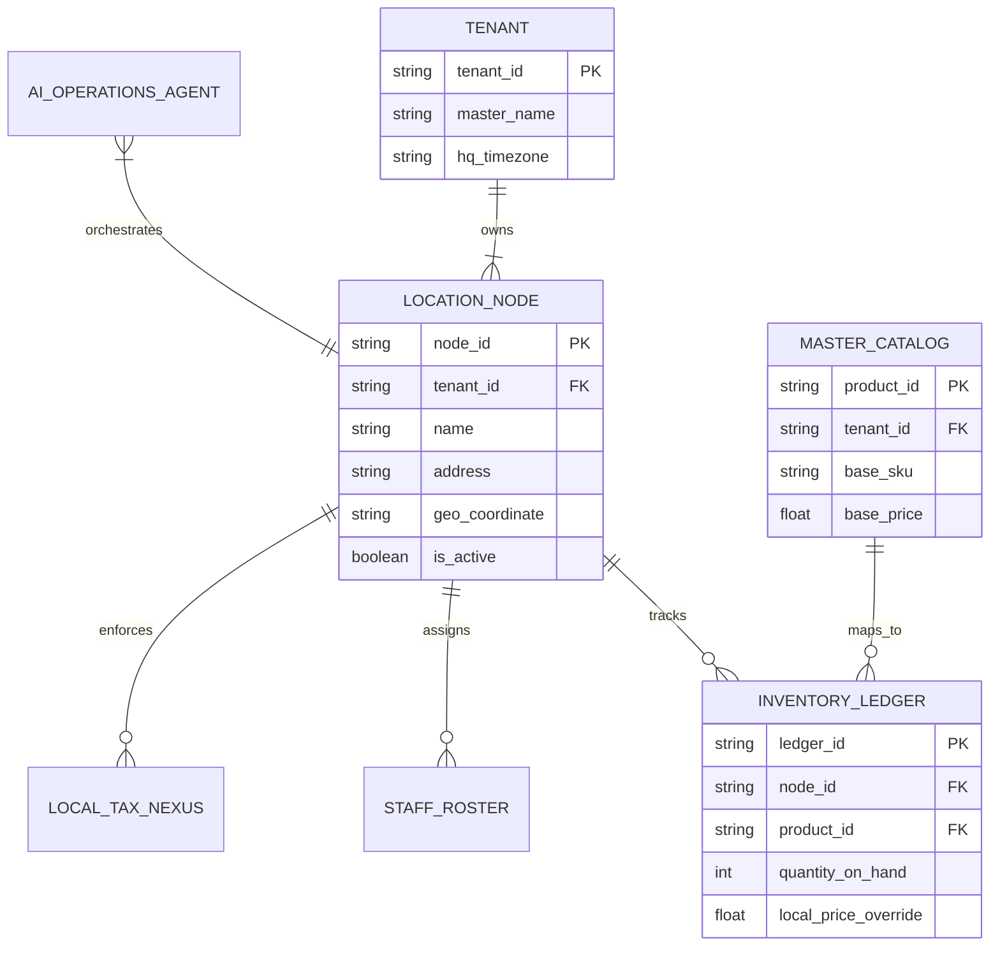

# Title: [Architecture] Autonomous Multi-Location & Franchise Topology Engine

## Problem Statement
Small business owners like Priya (Boutique owner) or Fatima (Food cart operator) inevitably hit a critical operational wall when they successfully scale and open their second location or cart. Suddenly, managing inventory, staff permissions, regional pricing, and consolidated reporting becomes a nightmare of manual spreadsheet reconciliation. Current platforms (Shopify, Square) treat each location as either a completely isolated new store (requiring a second paid account and manual syncing) or offer enterprise-grade location management that is vastly too complex for a non-technical SMB owner, failing the "grandmother test". They need a seamless, invisible engine that allows them to instantly spawn a new location, dynamically share or isolate inventory, deploy staff specifically to locations, and view an aggregated multi-node financial picture—all executed in 1-tap from their mobile device with AI agents handling the complex routing in the background.

## Research Report
*   **Shopify:** Multi-location inventory exists but is rigid. Setting up a new location requires navigating deep into desktop admin settings. It lacks an intuitive, mobile-first approach to instantly clone an existing location's configuration (staff, catalog, pricing).
*   **Square:** Handles multi-location better for point-of-sale, but the setup is still tedious and highly manual regarding staff role assignments and location-specific pricing/tax rules.
*   **Wix / Squarespace:** Extremely limited multi-location capabilities, primarily treating businesses as single entities.
*   **OneHumanCorp (OHC) Differentiation - "Autonomous Topology":** OHC treats the business as a network of nodes. The OHC AI Operations Agent observes when Priya is consistently selling out at pop-ups or splitting inventory physically. When she says, "I'm opening a second store in Brooklyn," the AI instantly spins up the new node, clones the master catalog, configures the new local tax nexus, and sets up a location-specific staff roster. The underlying multi-tenant architecture remains secure while allowing cross-node aggregation.

## Design Doc

### Architecture Diagram

### UI Wireframes & 375px Baseline
**Core Layout: macOS-style Translucent Glass + Ubiquiti UniFi Modular Dashboard Cards**
*   **Global Viewport:** 375px width (Mobile First). No horizontal scrolling.
*   **Location Switcher (App Bar):** A subtle, pill-shaped dropdown at the top center of the glass app bar showing the active location (e.g., `📍 Downtown Store`). Tapping it drops down a clean list of locations + an "All Locations (Aggregated)" view.
*   **"Add Location" Flow:**
    *   Initiated via the AI Ambassador chat: "I'm opening a new cart at 5th Ave."
    *   The AI returns a single rich card: `[Deploy New Location: 5th Ave]`.
    *   Tapping it reveals a half-sheet modal with 3 toggles:
        *   `Clone Catalog & Pricing (Yes)`
        *   `Share Current Staff (No)`
        *   `Setup Local Tax Profile (Auto-detected)`
    *   A massive `[Launch Location]` button at the bottom.
*   **Inventory Transfer:** A simple drag-and-drop or swipe interface on a product card: `Swipe Right to Transfer Stock -> [Select Location]`.

### Mobile UX Flow
1. **Trigger:** Priya tells the AI, "Set up my new Brooklyn location."
2. **Configuration Modal:** A translucent modal appears confirming the location address (fetched via native location services or text parsing). It asks if she wants to duplicate her current inventory setup or start blank.
3. **Instant Provisioning:** She taps "Duplicate." The AI Operations Agent provisions the new `LOCATION_NODE`, maps the `MASTER_CATALOG`, and establishes a zero-quantity `INVENTORY_LEDGER` for the new node.
4. **Operations Hub:** The top navigation bar now features a location selector. Selecting "Brooklyn" filters all subsequent views (Sales, Inventory, Staff) strictly to that node. Selecting "Empire View" aggregates the metrics seamlessly.
5. **Staff Allocation:** Priya goes to her Staff Mesh, taps her employee 'Leo', and checks the box for 'Brooklyn Access'.

### AI Agent Integration Points
*   **Operations Department:** Monitors inventory levels across nodes. If Brooklyn is sold out of a dress but Downtown has 10, the Operations Agent proactively suggests an internal transfer via a push notification.
*   **Finance/Compliance Department:** Automatically registers the new location's address against the `LOCAL_TAX_NEXUS` engine to ensure the correct county/city sales tax rates are applied at the new POS seamlessly.
*   **Customer Success Agent:** Routes incoming local Google Maps/Yelp reviews and inquiries to the unified inbox, tagging them with the specific location context so the AI draft replies are locally accurate.

### Key Design Decisions (Why, not How)
*   **Master Catalog vs. Local Ledger:** Products are defined once at the `TENANT` level, but quantities and price overrides exist at the `LOCATION_NODE` level. This prevents Priya from having to re-create products for every store while allowing location-specific pricing.
*   **Aggregated "Empire" View:** Small business owners need to know how the whole business is doing instantly. The architecture must support rapid aggregation queries across all nodes owned by a tenant.
*   **Zero-Trust Node Isolation:** Even though locations belong to one tenant, staff API tokens and local POS terminals must be scoped strictly to their `node_id` to prevent accidental or malicious cross-location operations.

## Implementation Prompt
**To the Implementer Swarm:**
Your objective is to architect and implement the Multi-Location & Franchise Topology Engine. The core requirement is to transition the data model from a single-store assumption to a multi-node topology anchored by a master `tenant_id`.
You must build the backend structures to support a `LOCATION_NODE` entity and migrate the `INVENTORY_LEDGER` and `STAFF_ROSTER` to relate to specific nodes rather than the global tenant. Implement the 375px mobile UI for the Location Switcher in the top app bar and the 1-tap "Clone Location" provisioning flow triggered by the AI Operations Agent. Ensure that the default view is an aggregated "Empire" view, but any specific node selection applies a strict global filter to all dashboard metrics, inventory lists, and staff views. Ensure all POS and Kiosk endpoints enforce `node_id` scoping.

**Acceptance Criteria:**
*   A user can create a new location via the mobile UI in under 30 seconds.
*   The system successfully clones the Master Catalog to the new location's ledger.
*   Staff members can be assigned to one, multiple, or all locations.
*   The dashboard seamlessly toggles between aggregated data and location-specific data.

## Priority
P1

## Estimated Scope
Large
