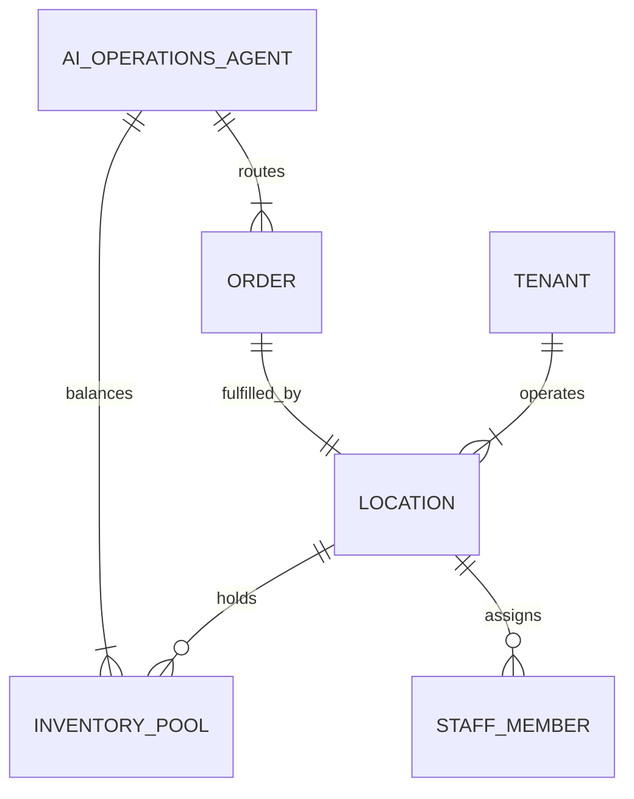

# [Architecture] Autonomous Multi-Location Mesh Engine

## Title
Autonomous Multi-Location Mesh Engine for Scaling Micro-Businesses

## Problem Statement
When a small business grows from one physical or digital location to two (e.g., Fatima opening a second food cart, or Priya opening a second boutique), the complexity doesn't double—it squares. Suddenly, they need to track inventory separately for each location, route online orders to the correct store for pickup, manage staff access per location, and analyze separate versus consolidated revenue. Existing platforms treat a second location as an "Enterprise" feature, requiring expensive upgrades, painful database migrations, and complex inventory splitting. Maya (the baker) wants to open a weekend pop-up shop while keeping her home bakery running. She needs the AI to automatically route orders to the correct kitchen based on zip code and automatically sync her total available flour across both locations, all without touching a configuration menu.

## Research Report
### Competitor Systems Audit
*   **Shopify:** Multi-location is supported, but often requires manual inventory transfers, strict location priorities, and complex rules. Advanced geospatial routing logic can be rigid unless using expensive third-party apps.
*   **Wix:** Basic location support, primarily for physical address display and simple pickup routing. Lacks deep unified inventory and staff access control per location for physical POS synchronization.
*   **Square:** Good multi-location support natively in POS, but setting up the online-to-offline connection for multiple locations (routing orders, separate catalog pricing per location) requires significant manual configuration.
*   **OHC Gap:** OHC currently assumes a single tenant operates out of a single logical space. We need a location mesh where a single tenant can spawn infinite operational nodes that intelligently share or split inventory, staff, and order routing via AI, abstracting away the database routing logic.

## Design Doc

### Architecture Diagram

### UI Wireframes & Mobile UX Flow (375px First)
*   **Screen 1: The Context Switcher (Dashboard Header)**
    *   A clean, translucent glass dropdown at the very top of the dashboard. Maya taps "Home Kitchen" to smoothly switch to "Downtown Pop-up". The entire dashboard context (orders, revenue metrics, active staff) filters instantly without a full page reload.
*   **Screen 2: Adding a Location (Conversational UI)**
    *   Maya taps "Add Location". The AI Operations Agent asks, "What's the address of the new spot?". The AI automatically clones the catalog, asks a simple question ("Are you sharing inventory between locations or tracking them separately?"), and generates a new Tap-to-Pay POS profile. Done in under 30 seconds.

### AI Agent Integration Points
*   **Operations AI:** Dynamically routes incoming orders based on proximity, inventory availability, and current location load. For example, if Food Cart 1 has a 45-minute wait, the AI autonomously routes new pre-orders to Food Cart 2, notifying the customer of the faster pickup location.
*   **Finance AI:** Provides consolidated daily briefings ("Total revenue was $1,200 across both carts") while maintaining strict sub-ledgers per location for accurate end-of-year tax reporting.

### Key Design Decisions
1.  **Location as a First-Class Primitive:** The system architecture must place the `Location` entity between the `Tenant` and operational data (orders, inventory, staff). A tenant can have many locations, and every operational event is scoped to a location.
2.  **AI-Driven Routing:** Merchants should never have to manually configure complex logic like "If zip code = X, send to store Y". The AI handles all geospatial and load-balancing routing invisibly.
3.  **Unified but Scoped Dashboards:** The UI must easily collapse into a "Global View" (consolidating all locations) or zoom into a "Single Location View" using macOS-style Translucent Glass materials and Ubiquiti-style modular cards.

## Implementation Prompt

**Implementer Agent Task:**
Implement the Autonomous Multi-Location Mesh Engine.

**Customer-User Journey (CUJ):**
1. Fatima opens her OHC app and tells her AI Assistant, "I'm opening a second food cart at the University campus today."
2. The AI provisions a new `Location` entity linked to her `Tenant`, copies her existing menu, and asks if they share ingredients or have separate stock.
3. A student orders falafel via the OHC web storefront. The AI automatically detects the student's location and routes the order to the University cart's KDS (Kitchen Display System), bypassing the downtown cart.
4. Fatima views her end-of-day report and sees a clean breakdown: total sales, University cart sales, and Downtown cart sales.

**Acceptance Criteria:**
*   Introduce the `Location` primitive and refactor core entities (Orders, Inventory, Staff) to be location-aware while maintaining strict tenant isolation.
*   Implement the AI Operations Agent routing logic to automatically assign incoming orders to the optimal location based on customer proximity, wait times, and stock availability.
*   Develop the 375px mobile UI context-switcher, allowing the user to seamlessly toggle between global and location-specific dashboard views using the defined design system.
*   Do not prescribe specific database schemas or geospatial libraries; focus on the business logic, the multi-tenancy boundaries, and AI routing capabilities.

**Priority:** P1
**Estimated Scope:** Large
