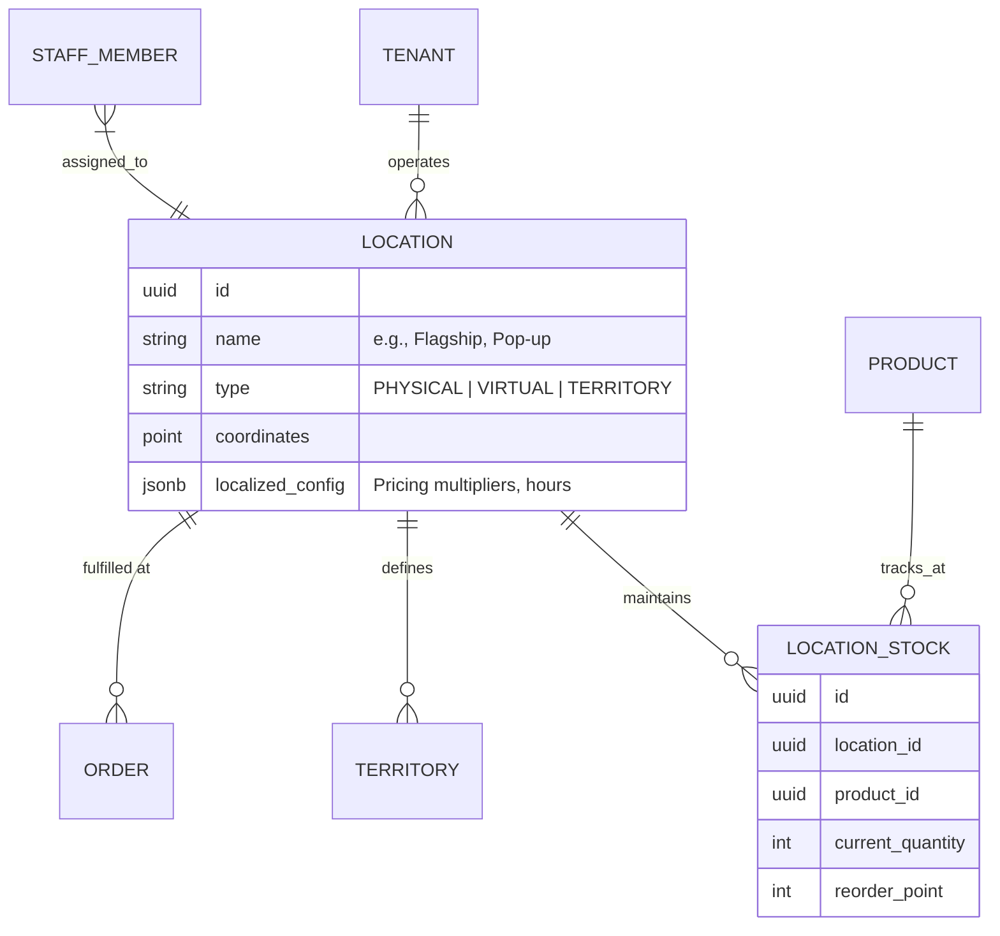

# [Architecture] Autonomous Multi-Location Mesh & Site-Specific Operations

## 1. Title
**Autonomous Multi-Location Mesh: Seamless Site Scaling for the Modern SMB**

## 2. Problem Statement
For OneHumanCorp (OHC) core personas, success often leads to physical expansion. **Maya (baker)** opens a second boutique shop across town; **Carlos (handyman)** hires an apprentice to cover a new northern territory; **Priya (boutique owner)** launches a seasonal pop-up at a local market.

The moment a business moves from "one site" to "many sites," administrative complexity explodes. Owners suffer from **"Territory Fog"**:
- **Inventory Fragmentation**: "Do I have the silk dress at the Main St shop or the Market pop-up?"
- **Logistics Friction**: Manually tracking stock transfers between locations.
- **Service Dead Zones**: Carlos double-booking himself because he didn't account for travel time between two distant territories.
- **Inconsistent Vibe**: Trying to maintain localized pricing or menus (e.g., higher prices at the airport kiosk vs. the flagship store) without manual error.

Competitors (Shopify, Square) treat "Locations" as static database rows. OHC needs an **Autonomous Multi-Location Mesh** where AI agents handle the inter-site logistics, inventory rebalancing, and territory-aware dispatching invisibly, leaving the owner with a single, unified mobile view.

## 3. Research Report
### Competitive Landscape
*   **Square / Shopify Multi-location:** Robust but manual. The user must manually initiate "Transfers," manually set "Stock at Location X," and manually toggle site-specific availability. High friction for a solo owner on a phone.
*   **ServiceTitan:** Excellent for multi-territory dispatch but enterprise-heavy, expensive, and fails the "Grandmother Test."
*   **Wix / Squarespace:** Very limited multi-site support; often requires entirely separate accounts or complex "Sub-stores" that don't share a unified ledger.

### OHC Market Advantage: The "Agentic" Mesh
1. **Predictive Inter-Site Rebalancing:** If "The Manager" (Ops Agent) sees Maya is selling out of croissants at Site A but has excess at Site B, it drafts a "Transfer Proposal" with a 1-tap courier dispatch.
2. **Territory-Aware Dispatch:** For Carlos, the AI automatically maps new leads to the correct territory and apprentice, calculating "Travel Padding" between sites.
3. **Localized Vibe:** AI automatically adjusts pricing or menu items based on the "Location Context" (e.g., adjusting for higher rent at a specific site or local event demand).

## 4. Design Doc

### Architecture Diagram (Mermaid.js)

### AI Agent Coordination
*   **The Global Manager (Operations):** Monitors aggregate health but also identifies "Outlier Sites" (e.g., "Site B is performing 40% better than Site A this morning").
*   **The Logistics Scout:** Specialized agent that uses MCP tools to find local couriers for inter-site inventory transfers.
*   **The Territory Agent:** For service businesses, manages the geofence and auto-assigns apprentices based on site proximity and travel time.

### Mobile-First UX Flow (375px First)
1. **The Location Selector:** A clean, translucent glass pill at the top of the dashboard. Tapping it reveals a beautiful site-switcher with real-time status indicators (🟢 Active, 🟡 Low Stock).
2. **The "Daily Site Briefing" Card:** Instead of one massive report, the owner sees: *"Good morning Maya. Your Main St shop is fully stocked. Your Market Pop-up needs 10 more loaves—I've already drafted a transfer from the bakery."*
3. **1-Tap Rebalance:** A card in the activity feed: *"Low stock at North Side. Rebalance 20 units from Flagship? [ Approve Transfer ]"*

### Performance & Security
*   **Zero-Trust Isolation:** Every `LOCATION_STOCK` query must include the `location_id` and be verified against the authenticated `tenant_id` context.
*   **Latency Targets:** Cross-location inventory updates must propagate to all edge terminals in < 500ms to prevent double-selling during peak rushes.

## 5. Design System Tokens (Multi-Location Context)
To ensure visual excellence and consistency with the macOS-style Glassmorphism and UniFi modular dashboard:

### Colors & Materials
- **Surface (Glass):** `background: rgba(255, 255, 255, 0.4); backdrop-filter: blur(20px) saturate(200%);`
- **Border (Translucent):** `border: 1px solid rgba(255, 255, 255, 0.2);`
- **Location Active Indicator:** `color: #00C853;` (Success Green)
- **Location Low Stock Indicator:** `color: #FFD600;` (Warning Amber)
- **Primary Action (UniFi Blue):** `background: #0055FF; color: #FFFFFF;`

### Spacing & Layout
- **Card Padding:** `16px (1rem)` for internal content.
- **Location Selector Height:** `44px` (Optimized for thumb-touch).
- **Module Gap:** `12px` between site-specific cards.
- **Horizontal Margin:** `20px` for mobile viewport (375px) edges.

### Motion & Interaction
- **Site Switching Transition:** `Cross-fade (200ms, ease-in-out)` to prevent visual jarring during context shifts.
- **Draft Card Entrance:** `Slide Up + Fade In (300ms, cubic-bezier(0.25, 1, 0.5, 1))` for "Transfer Proposals".
- **Haptic Feedback:** Medium impact on "Approve Transfer" tap.

## 6. Implementation Prompt
**Objective:** Implement the core infrastructure for the "Autonomous Multi-Location Mesh".

**Core User Journey (CUJ):**
1. Maya adds a second "Pop-up" location to her bakery via the mobile app.
2. The system creates a new `Location` entity and initializes `LocationStock` for her catalog.
3. When an item is sold at the Pop-up, only that site's stock is decremented.
4. "The Manager" agent identifies that the Pop-up is low on stock and the Flagship has a surplus, surfacing a "Transfer Draft" in Maya's activity feed.

**Acceptance Criteria:**
- **Data Model:** Implement `Location` and `LocationStock` entities with strict multi-tenant isolation.
- **Location Context:** Ensure the API can filter orders, stock, and staff by `location_id`.
- **Rebalance Trigger:** Create a service hook that identifies stock imbalances across locations based on velocity.
- **Mobile UI (375px):** Build the "Location Switcher" and the "Inter-site Transfer" approval card using OHC Glassmorphism design tokens.
- **Security:** Ensure no "Cross-Tenant" location leaks via cryptographically signed identity tokens.

## 7. Priority
`P1` (High - Critical for businesses that have moved past the initial 'solo' phase).

## 8. Estimated Scope
Large (Requires deep integration with Inventory, Orders, and AI Agent logic).
