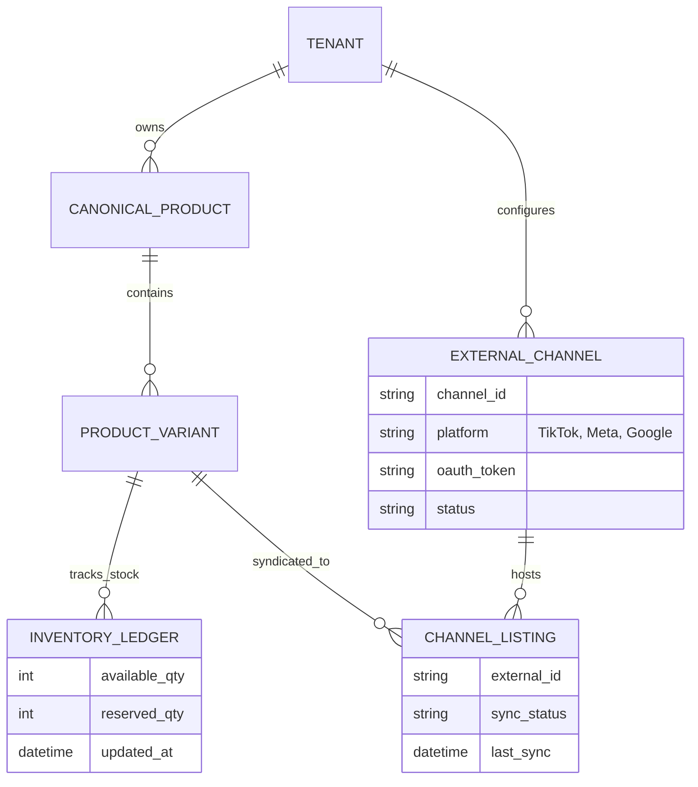
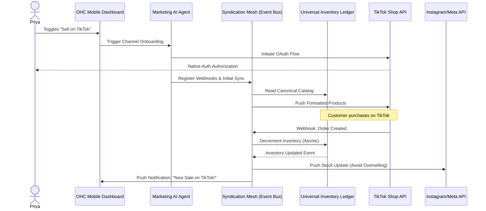

# [Architecture] Autonomous Multi-Marketplace Syndication Mesh

## Title
Autonomous Multi-Marketplace Syndication & Omni-Channel Inventory Mesh

## Problem Statement
Small business owners lose massive revenue opportunities because they cannot simultaneously manage presence across modern discovery channels. Priya (boutique owner) wants to sell her physical inventory on TikTok Shop, Instagram, and her OHC Storefront, but manually updating stock levels across three platforms leads to overselling or stale listings. Carlos (handyman) relies on local search, but integrating his OHC calendar with "Reserve with Google" or local directory services is too technical. Business owners need an invisible system that automatically syndicates their catalog, availability, and pricing to multiple marketplaces, while keeping all inventory and booking state perfectly synchronized in real-time, requiring zero manual configuration or channel-specific technical knowledge.

## Research Report
*   **Competitor Analysis**:
    *   **Shopify**: Requires multiple distinct apps for TikTok, Meta, and Google. Each has a separate, complex onboarding flow requiring API keys and strict data mapping.
    *   **Wix/Squarespace**: Limited native integrations; often rely on clunky third-party aggregators that poll data asynchronously, leading to overselling risks.
    *   **Mindbody/Calendly**: Support some Google integrations but don't bridge the gap for mixed-modality businesses (e.g., selling physical products AND services).
*   **The OHC Advantage**: Utilizing the Marketing and Operations AI Agents, OHC can dynamically format and push product/service data to external APIs. The system handles OAuth, data mapping, and webhook registration invisibly.
*   **Core Capabilities Needed**:
    1.  **Universal Data Normalization**: A canonical format for a "Sellable Entity" (product variant, time slot, digital good) that can be transformed into the specific schema required by TikTok, Meta, Google, etc.
    2.  **Real-time Event Mesh**: Instant bi-directional synchronization of stock and calendar availability.
    3.  **Conflict Resolution Engine**: Handled by the Operations Agent when race conditions occur (e.g., two bookings for the same slot on different channels within milliseconds).

## Design Doc

### Key Design Decisions
1.  **Single Source of Truth**: The OHC Universal Capacity and Inventory Ledger remains the absolute source of truth. External channels act strictly as distributed presentation layers and point-of-sale terminals.
2.  **Agent-Driven Channel Onboarding**: The Marketing Agent guides the user through connecting channels using 1-tap OAuth flows, completely hiding API configurations.
3.  **Multi-Tenant Isolation**: Each tenant's syndication pipelines are strictly isolated. A burst of traffic from Priya's TikTok viral video cannot delay Carlos's Google Reserve booking sync.
4.  **Mobile-First UX**: The UI must be dead simple: a toggle switch to "Sell on TikTok" followed by a native auth modal. No complex field mapping.

### Architecture Diagrams (Mermaid.js)

#### 1. Data Model & Invariants (Entity-Relationship)

*Invariants*: `tenant_id` must be present on all entities to guarantee Zero-Trust isolation. The `available_qty` in the `INVENTORY_LEDGER` is the single source of truth; `CHANNEL_LISTING` records only maintain external mapping, never internal stock state.

#### 2. Syndication and Synchronization Flow

### Mobile UX Flow (375px Viewport)
1.  **Channel Hub Screen (375px x 812px)**:
    - **Header**: Translucent glass-morphic app bar with "Sales Channels" title.
    - **List Cards**: Stacked Ubiquiti UniFi style modular cards (343px width, 16px margins). Each card features the platform logo (e.g., TikTok), a clear title, and a prominent native OS toggle switch on the right edge.
2.  **1-Tap Connect Flow**:
    - Tapping the toggle slides up a native bottom sheet (occupying bottom 50% of screen) triggering the OAuth flow. No redirects to clunky web views.
3.  **Invisible Mapping State**:
    - Post-auth, the card expands slightly. A shimmer/skeleton loading state appears over a single line of text: *"AI is formatting your catalog for TikTok..."*
4.  **Actionable Dashboard**:
    - The main 375px feed updates. Unified order cards now display a tiny, crisp 16x16px badge of the source platform (TikTok, Meta) in the top-right corner of the order thumbnail.

## Implementation Prompt
Implement the Autonomous Multi-Marketplace Syndication Mesh.
1.  **Acceptance Criteria 1 (Data Normalization)**: Create an abstraction layer that can translate the OHC canonical product/service model into the schemas required by at least two external platforms (e.g., Meta Commerce and TikTok Shop).
2.  **Acceptance Criteria 2 (Event-Driven Sync)**: Implement a high-performance event subscriber that listens to the `UniversalInventoryLedger` and pushes real-time stock/availability updates to connected external channels.
3.  **Acceptance Criteria 3 (Agent Onboarding)**: Develop the API endpoints that allow the Marketing Agent to securely initiate and complete OAuth flows for external channels on behalf of the tenant.
4.  **Acceptance Criteria 4 (Multi-Tenant Isolation)**: Ensure all syndication tasks and webhook processing are strictly partitioned by `tenant_id` and authenticated via internal SPIFFE/SPIRE context.

## Priority
P0 (Critical) - Omni-channel presence is table stakes for modern SMBs, but current solutions are too complex.

## Estimated Scope
Large